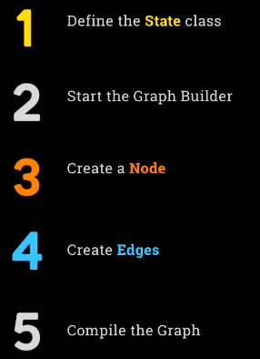

## Day 1

### LangGraph Explained: Graph-Based Architecture for Robust AI Agents

#### Introduction to Week Four and LangGraph

Welcome to week four, day one. This week marks a shift as we explore LangGraph, which approaches the universe differently. The project this week is particularly engaging, with real business value demonstrated through practical applications I've personally experienced. Although this week is shorter, we will move briskly through the material, providing briefings and opportunities to build your own LangGraph projects if it aligns with your interests.

#### Clarifying the LangChain Ecosystem

Before diving into LangGraph, it's important to clarify the distinctions among LangChain, LangGraph, and LangSmith. These three products are offered by LangChain, and understanding their relationships is essential.

##### LangChain Overview

LangChain is the foundational framework that has existed for many years. It was created to simplify bespoke integrations with various APIs, especially when switching between models like GPT and Claude, which previously required significant rework. LangChain introduced abstractions to streamline these processes.

As applications evolved to involve sequential calls to large language models (LLMs), LangChain developed the concept of chaining these calls together. It supports advanced features such as retrieval-augmented generation (RAG), prompt templates, and robust memory management, allowing memory to be stored in RAM or persisted in databases. It also includes its own declarative language, LCL, and builds engineering discipline around working with LLMs, including best practices for prompt design and tool abstraction.

LangChain enables building agent platforms through its workflows but predates the recent surge in agent-focused AI, operating at a more simplistic level. It serves primarily as glue code for building LLM applications.

##### Pros and Cons of LangChain

I have a nuanced view of LangChain. On one hand, it offers powerful functionality with minimal code, such as building a RAG pipeline in just a few lines. On the other hand, adopting its abstractions means committing to its way of doing things, which can reduce visibility into the underlying prompts and processes.

As LLM APIs have standardized, interacting directly with models has become simpler, and managing memory as JSON blobs is straightforward. This reduces the necessity of large ecosystems for memory persistence in some projects. Nonetheless, LangChain provides significant benefits by solving complex engineering challenges out of the box.

#### Introducing LangGraph

LangGraph is positioned as a platform to run at scale, focusing on stability, resiliency, and repeatability in complex, interconnected workflows typical of agentic platforms. It is a separate offering from LangChain, developed by the same team but independent.

While LangGraph can utilize LangChain code to interact with LLMs, this is optional. It supports any framework or direct LLM calls.

LangGraph organizes workflows as graphs—tree structures representing sequences of activities with potential feedback loops, human involvement, and memory management. This abstraction enables robust, scalable, and stable execution of agent workflows, addressing concerns about unpredictability and resiliency in agentic AI.

##### Features of LangGraph

LangGraph supports designing agent-driven user experiences with features such as:

- Human-in-the-loop interactions
- Multi-agent collaboration
- Conversation history and memory
- Time travel (checkpointing and restoring workflow states)

It offers fault-tolerant scalability, ensuring continuous operation despite failures. Although LangGraph provides capabilities for monitoring, it does not perform monitoring itself.

##### LangSmith Integration

LangSmith is a separate product that provides monitoring tools. It integrates with both LangChain and LangGraph, offering visibility into calls and reasoning processes to facilitate quick debugging of failures. We will use LangSmith to observe LangGraph workflows during this course.

#### Summary of Product Relationships

- **LangChain** : An abstraction framework for building LLM applications with chaining, memory, and tool integration.
- **LangGraph** : A platform for robust, scalable agent workflows using graph-based abstractions.
- **LangSmith** : A monitoring tool for visibility and debugging, compatible with both LangChain and LangGraph.

LangGraph represents the modern, core offering designed to meet the demands of today's agent AI, emphasizing resilient and repeatable scaling.

#### Key Takeaways

- LangChain is an abstraction framework for building applications with large language models, focusing on chaining calls and memory management.
- LangGraph is a separate platform designed for stability, resiliency, and repeatability in complex agent workflows using graph-based structures.
- LangSmith is a monitoring tool that integrates with both LangChain and LangGraph to provide visibility and debugging capabilities.
- LangGraph emphasizes fault-tolerant scalability and supports features like human-in-the-loop, multi-agent collaboration, and time travel (checkpointing).

### LangGraph Explained: Framework, Studio, and Platform Components Compared

There is one more aspect to mention, which makes the situation slightly more complicated. LangGraph itself is actually three different things, as I have already alluded to.

LangGraph is, in fact, the LangGraph framework. It also includes a user interface tool called LangGraph Studio, which is a visual builder allowing you to hook things up visually. Additionally, there is something called LangGraph platform, which is the hosted solution promoted on their website for deploying and running your agents at scale.

To clarify, LangGraph refers to the framework, analogous to Cray's framework. LangGraph Studio, which in Korea was also called Korea Studio, is the visual builder. LangGraph platform is analogous to CRI enterprise, representing the hosted deployment solution.

These are the three offerings. From my perspective, similar to what I noted about Cray, LangGraph is seeking ways to commercialize and monetize their offerings. The LangGraph platform focuses on deploying and running your LangGraph graphs in their environment, leveraging the integrations they have built.

If you have built all your software using LangGraph, it will be very convenient to use LangGraph platform. I suspect this is why it is heavily promoted and framed on their site as if LangGraph and LangGraph platform are the same thing. This is likely the core commercial idea behind LangChain and its development.

Our focus, of course, will be on LangGraph the framework, which is what we are building towards. We will also be using LangSmith to observe its features, which will be interesting for us as well.

At this point, I want to show you a blog post about building effective agents on Anthropic's website, which I mentioned back in week one when we were looking at design patterns. It is relevant now because it shows Anthropic's positioning, which is useful to keep in mind when comparing what we are doing today with what we will do in week six.

The blog post titled "Building Effective Agents" is brilliantly written and very clear. It contains the different design patterns I mentioned, which I took directly from Anthropic's post because they are so well explained. Additionally, it discusses using abstraction layers, which is the key point I want to highlight here.

##### When and How to Use Frameworks

The post states that many frameworks make agentic systems easier to implement, including LangGraph from LangChain. It mentions a few others that are less popular, such as Vellum, but not as widely used as Cray, Autogen, or the OpenAI agents SDK.

These frameworks simplify getting started by handling standard low-level tasks like calling large language models (LLMs), defining and parsing tools, and chaining calls together. However, they often introduce extra layers of abstraction that can obscure the underlying prompts and responses, making debugging more difficult. They can also tempt developers to add unnecessary complexity when a simpler setup would suffice.

From Anthropic's perspective, they provide an API that is relatively simple. Memory can be handled with JSON objects, and LLMs can be connected by multiple calls. Therefore, building extensive abstraction layers that distance developers from working directly with the language model does not necessarily resonate with them.

They conclude by suggesting developers start by using LM APIs directly, as many patterns can be implemented in just a few lines of code. If a framework is used, it is essential to understand the underlying code because incorrect assumptions about what is happening under the hood are a common source of errors for customers.

This perspective is interesting and clearly articulated. It represents an alternative school of thought that somewhat contrasts with the LangGraph philosophy of building structured abstractions. It is important to keep this in mind as, in week six, we will explore what Anthropic offers in the form of MCP, which is a different approach—a protocol for connecting components rather than building the glue itself.

I wanted to highlight this perspective, but it will not deter us from delving deeply into LangGraph right now.

#### Key Takeaways

- LangGraph consists of three components: the LangGraph framework, LangGraph Studio, and LangGraph platform.
- LangGraph platform is the hosted solution for deploying and running agents at scale, analogous to enterprise offerings.
- Frameworks simplify agentic system implementation but can add abstraction layers that obscure underlying prompts and responses.
- Developers are encouraged to understand underlying code when using frameworks and consider starting with direct LM API calls.

### LangGraph Theory: Core Components for Building Advanced Agent Systems

#### Introduction to LangGraph Terminology

Before diving into LangGraph, it is important to set expectations. There will be new terminology and concepts introduced. Although it may feel jarring to set aside previous knowledge such as "crew" concepts, this new framework will be quickly explained and reinforced through repetition until it becomes second nature.

Agent workflows in LangGraph are described as a graph. This concept will be familiar to those with a computer science background. A graph can be thought of as a tree structure, where elements are connected in a hierarchy, with dependencies flowing from one to others beneath it. Representing workflows as graphs is the core idea behind LangGraph, as the name suggests.

##### State

The state represents the **current snapshot or status of the entire application**. It is an object encapsulating the state of the world and is shared across the whole application. This concept is fundamental to LangGraph. The state is a variable containing information, not a function.

##### Nodes

Nodes are the points on the graph and represent **functions**. Each node is a Python function that embodies a piece of logic or an operation. Nodes receive the current state as input, perform some action (which may include calling a large language model or causing side effects like writing to a file), and then return an updated state. The state should be treated as immutable; nodes do not modify the existing state but return a new state object reflecting changes.

> state->Nodes->updated state

##### Edges

Edges are the connections between nodes in the graph. In LangGraph, edges are also Python functions that determine **which node should execute next** based on the current state. There are simple edges that unconditionally proceed to the next node, and conditional edges that execute the next node only if certain conditions are met.

Simply put, nodes perform the work or tasks, while edges decide the flow by determining what should happen next after a node completes its operation.

##### Visual Representation

<pre class="vditor-reset" placeholder="" contenteditable="true" spellcheck="false"><p data-block="0"></p></pre>

A typical LangGraph graph consists of nodes represented as circles and edges as lines connecting them. Some edges are unconditional, causing the next node to run immediately after the previous one. Others are conditional, running the next node only under specific circumstances. This visual helps clarify the relationship between nodes and edges.

#### Building Your First LangGraph Graph

Today is focused on theory; the practical implementation will come tomorrow. The process of building a graph involves five steps:



1. Define your state class, which stores the state information. New state objects will be created frequently during execution.
2. Start the graph builder, which is used to lay out all the nodes in your graph before execution.
3. Create nodes representing the functions or operations you want to perform.
4. Create edges connecting these nodes, potentially repeating steps 3 and 4 to build the full workflow.
5. Compile the graph to prepare it for execution, then run it.

This process separates the definition phase from the execution phase.

The graph builder allows you to dynamically describe the workflow at runtime, similar to writing a program but done dynamically. Once the graph is compiled, it is ready to be executed. This two-phase approach—defining the graph and then running it—is central to how LangGraph operates.

When running a LangGraph application, two phases occur:

- First, the code runs to lay out the graph, defining what the agent system will do.
- Second, after the graph is defined, it is invoked and executed.

Both phases are integral parts of running the application.

Tomorrow, we will write code to implement these five steps, build our first LangGraph agent, and see the results in action. If this explanation is clear, great; if not, the practical session will help solidify these concepts.

#### Key Takeaways

- LangGraph represents agent workflows as graphs consisting of nodes and edges.
- Nodes are Python functions that receive a state, perform operations, and return an updated state.
- Edges are Python functions that determine the next node to execute based on the current state, supporting conditional flows.
- Building a LangGraph graph involves defining a state class, creating nodes and edges with a graph builder, compiling the graph, and then running it in two distinct phases: definition and execution.

## Day 2

### LangGraph Deep Dive: Managing State in Graph-Based Agent Workflows

#### Introduction to LangGraph Agent Workflows

We are now ready to proceed after allowing the LangGraph ideas to marinate. To reiterate, in LangGraph, an agent workflow is represented as a graph, similar to a tree structure. The state represents the current snapshot of affairs or the state of the world at any given point. Nodes and edges are Python functions; a node decides how to transition from one state to another, while edges or nodes perform actions that have consequences. Edges determine what to do next once a node has executed.

##### The Five Steps of Graph Building

Recall the five steps involved in graph building, which occur before running your agents. These steps happen during code execution and include:

- Defining your state class that describes the information to be maintained.
- Starting the graph builder.
- Creating one or more nodes.
- Creating edges to connect nodes.
- Compiling the graph to prepare it for execution.

Once compiled, the graph is ready for primetime.

#### Understanding Immutable State

Before diving into code, it is important to understand the concept of immutable state. Immutable means that once you create a state object and assign values to it, you never change its contents. You do not mutate the object. This immutability is crucial because state represents a snapshot of the system at a point in time. If the contents of the state changed, you would lose the ability to maintain that snapshot.

##### Example: Counting Node with Immutable State


Consider a function called `my_counting_node` that takes a state object with a single field `count`, which is a number. The purpose of this node is to increment the count by one. The function receives the old state, extracts the count, adds one, and returns a new state object with the incremented count. It does not modify the original state object but returns a new instance instead.

#### Reducer Functions for State Fields

Each field in your state can optionally have an associated reducer function. When specifying your state to LangGraph, you can indicate that a particular field has a reducer. The reducer function defines how to combine the new value of that field with the current state's value when returning a new state instance.

This mechanism allows LangGraph to safely combine updates from multiple nodes running concurrently without overwriting each other's progress.

##### Why Use Reducers?

You might wonder why reducers are necessary since you can update fields directly. The key reason is concurrency: multiple nodes may run simultaneously and return new states. **Reducers enable LangGraph to merge these concurrent updates safely**, ensuring no progress is lost. This clever design allows parallel execution of nodes while maintaining consistent state snapshots.

We will see concrete examples of reducers in the upcoming code sections.

#### Key Takeaways

- LangGraph represents agent workflows as graphs with nodes and edges managing state transitions.
- State objects are immutable; nodes return new state instances rather than modifying existing ones.
- Reducer functions allow safe concurrent state updates by combining changes from multiple nodes.
- The graph building process involves defining state, creating nodes and edges, and compiling before execution.

### Mastering LangGraph: How to Define State Objects & Use Reducers

#### Introduction to Type Hints and Annotated in Python

We are now entering week four of LangGraph and starting with lab one. This week, we will be working with notebooks and code. To begin, we will perform some imports and set up constants, which we will use later. These constants can be ignored for now.

#### Understanding Type Hints

Type hints in Python are an optional feature often used in engineering to specify the type of variables at each point. For example, consider a Python function called `shout` that takes some text and prints it in uppercase.

##### python Code Sample

```python
defshout(text):
print(text.upper())
```

##### python Code Sample

```python
shout('hello')
```

You can specify the type of the `text` parameter by adding a colon and the type, such as `str`. You can also specify the return type. If the function returns a string, you should use `-> str`, and if it returns nothing, use `-> None`. If you want the function to return the uppercase version of the text, you should return `text.upper()`.

##### python Code Sample

```python
defshout(text: str) -> str:
return text.upper()
```

#### Using Annotated for Extra Information

There is a feature called `Annotated` that allows you to add extra information to type hints. For example, you can annotate a string parameter with a message. This annotation is ignored by Python but can be useful for other platforms or contexts.

##### python Code Sample

```python
from typing import Annotated

defshout(text: Annotated[str, 'something to be shouted']) -> str:
return text.upper()
```

Annotations can be used to tag variables with a purpose. For instance, you can annotate a list variable with a description. Python ignores these annotations, but they can be read by other tools or platforms.

##### python Code Sample

```python
my_favorite_things: Annotated[list, 'these are a few of mine']
```

#### Annotated and Reducers in LangGraph

This concept is important for defining reducers in LangGraph. When defining a state object, you give it fields and specify their types. Instead of just specifying the type, you use `Annotated` to specify a reducer. LangGraph uses this annotation to determine which reducer to use.

##### python Code Sample

```python
from langgraph.message import AddMessages
```

The `AddMessages` reducer is provided by LangGraph. It is a function that you can annotate with to specify that this is the reducer you want to use. This makes the process of defining the state object and its fields more explicit.

#### Defining the State Object

Step one in the process is to define the state object. State objects can be any Python object, but it is most common to use either a Pydantic object (a subclass of `BaseModel`) or a `TypedDict`. We will use a Pydantic model, as we are familiar with it.

##### python Code Sample

```python
from pydantic import BaseModel
from typing import Annotated, List
from langgraph.message import AddMessages

classState(BaseModel):
    messages: Annotated[List[str], AddMessages]
```

The state object here has one field called `messages`, which stores a list of messages. This list will be passed around the graph and will accumulate messages as they are added. By annotating it with `AddMessages`, we specify the reducer that will be used to combine states.

The `AddMessages` reducer simply concatenates lists. When a new list of messages is returned, it combines it with the previous list, resulting in a single list containing all messages.

#### Starting the Graph Builder

Step two is to start the graph builder. This is done by instantiating a `StateGraph` and passing in the state class. It is important to note that you are passing in the class itself, not an instance of the class.

##### python Code Sample

```python
from langgraph import StateGraph

graph = StateGraph(State)
```

This begins the graph building process, which is part of the five steps before running the Agentic framework.

#### Key Takeaways

- Type hints in Python allow you to specify the type of variables and return values in functions.
- The `Annotated` feature in Python enables you to add extra information to type hints, which can be used by external tools like LangGraph.
- When defining state objects for LangGraph, you can use Pydantic models and annotate fields to specify reducers.
- The `AddMessages` reducer concatenates lists of messages in the state, allowing the state to accumulate messages as the graph executes.

### LangGraph Fundamentals: Creating Nodes, Edges & Workflows Step-by-Step

#### Creating Nodes in LangGraph

```python
def our_first_node(old_state: State) -> State:

    reply = f"{random.choice(nouns)} are {random.choice(adjectives)}"
    messages = [{"role": "assistant", "content": reply}]

    new_state = State(messages=messages)

    return new_state

graph_builder.add_node("first_node", our_first_node)
```

In LangGraph, a node is essentially a function. We begin by creating a function called our first node. This function takes an old state as input and returns a new state. The states are immutable, so we do not mutate the old state. In fact, the old state is not touched at all in this example, which is unusual but intentional here.

Within the function, we create a string called `reply`. This reply is constructed by randomly choosing a noun, then the letter "r", followed by a random choice of an adjective. We then create a message structure familiar from OpenAI's format and place it into `messages`.

Next, we instantiate a new state class, passing in these messages, and assign it to `new_state`. Finally, we return this `new_state`. This completes the definition of our first node.

After defining the node function, we add it to the graph using `graph.add_node`. We give it the name "first node" and pass in the function representing the node. This officially adds the node to the graph that is being built.

#### Creating Edges in LangGraph

```python
graph_builder.add_edge(START, "first_node")
graph_builder.add_edge("first_node", END)
```

Next, we create edges to define the workflow. Using `GraphBuilder.add_edge`, we add edges connecting the nodes. We use constants `start` and `end` imported from the graph module to signify the beginning and end of the workflow.

We add an edge from `start` to our `first node`, and another edge from `first node` to `end`. This logically connects the workflow from start through the node to the end.

After adding the nodes and edges, we proceed to compile the graph. This signals that the workflow is complete and ready to be executed. We can then display the graph visually, which shows the start node leading to the first node, and then to the end node. This simple visualization confirms the workflow structure.

> to display the graph:
>
> ```python
> graph = graph_builder.compile()
> display(Image(graph.get_graph().draw_mermaid_png()))
> ```
>
> 

#### Running the Graph

```python
def chat(user_input: str, history):
    message = {"role": "user", "content": user_input}
    messages = [message]
    state = State(messages=messages)
    result = graph.invoke(state)
    print(result)
    return result["messages"][-1].content


gr.ChatInterface(chat, type="messages").launch()
```

To run the graph, we create a Gradio chat function. Gradio chat functions take the user's current input and the history of prior inputs, and respond with the next output. This chat function will be passed into Gradio's chat interface.

Inside the chat function, we convert the user's message into a standard OpenAI format and place it into a message. We then create a state object with this message. Next, we invoke the graph with this state. The `invoke` method executes the graph and returns the result.

We print the result and return it from the chat function, which will be displayed in the chat interface.

Running this setup produces a Gradio UI. When we input messages such as "hi there," the system responds with phrases like "Muffins are haunted" or "Penguins are sparkly." These responses are generated by the simple language model implemented in the node, which picks a random noun and adjective.

This example demonstrates that the graph setup is independent of large language models (LLMs). The node is simply a function taking a state and returning a new state. It does not necessarily involve LLMs.

#### Behind the Scenes: Message Packaging

The result printed from invoking the graph may differ from expectations. Instead of just a list of strings, it contains a list of `HumanMessage` objects, a construct from LangChain used to package messages. This packaging is handled by the reducer, which concatenates messages into a list and wraps them appropriately.

For example, the text "muffins are haunted" or "penguins are sparkly" is packaged into these message objects. This behavior is part of LangGraph's internal workings and is leveraged here without requiring direct management.

In summary, we have created a simple state containing messages, defined a node that takes an old state and returns a new state with a random sentence, and successfully invoked the graph to get a response. This allows for a one-sided conversation with a simple language model implemented as a graph node.

Next, we will proceed to implement something more sensible and complex.

#### Key Takeaways

- Nodes in LangGraph are functions that take an immutable old state and return a new state.
- Edges define the workflow by connecting start, nodes, and end points in the graph.
- The graph is compiled after adding nodes and edges, enabling visualization of the workflow.
- The graph can be invoked with a state to execute the workflow, demonstrated with a simple random noun-adjective generator.

### LangGraph Tutorial: Building an OpenAI Chatbot with Graph Structures

##### Introduction to LangGraph with LLM Integration

Now, we proceed to a proper example that we will use with LangGraph. The reason for showing the previous simple example was to demonstrate that nodes do not need to have calls to large language models (LLMs) to perform their intended functions. However, in this example, we will add an LLM.

We start by defining the state and creating a graph builder with that state. Then, we create an LLM, a real LLM, using ChatOpenAI. ChatOpenAI is a construct from LangChain, which is a sibling to LangGraph. This is what we will use to connect with our LLM.

You do not need to use LangChain's LLMs for this; you can use any LLM. You could directly call the LLM yourself or use, for example, the OpenAI Agents SDK. However, using LangChain sometimes simplifies things, and most community examples go from LangGraph to LangChain, so it is convenient to do it this way. That is what we will do here.

##### Creating the Chatbot Node

```python
llm = ChatOpenAI(model="gpt-4o-mini")

def chatbot_node(old_state: State) -> State:
    response = llm.invoke(old_state.messages)
    new_state = State(messages=[response])
    return new_state

graph_builder.add_node("chatbot", chatbot_node)
```

We create a new node called `chatbot_node`. This node takes an old state and returns a new state. Specifically, it takes the LLM and invokes it using LangChain's `invoke` method, passing in the messages from the old state. The old state contains a `messages` field, which is what we pass in.

For the new state, it creates a new state object that contains, in its `messages` field, the response from the LLM. We then return this new state.

We add this node, called `chatbot`, into our graph builder. Then, we add edges from `start` to `chatbot` and from `chatbot` to `end`. After that, we compile our graph and verify that it goes from `start` to `chatbot` to `end`.

##### Integrating with Gradio Chat Function

We put it all together in a simple Gradio chat function. This function takes an initial state, which is a state object set up with messages. We then call `graph.invoke` to actually execute our graph. We print the result and also show the results back in Gradio.

For example, when we input "hi there," it calls OpenAI. The user message and the response appear in these objects: the `HumanMessage` object contains the user's input, and the `AIMessage` object contains the response from OpenAI.

##### Lack of Conversation History

One important observation is that if we continue the conversation, every time we invoke this graph, it does not keep track of any history. For instance, if we say "My name's Ed," the response is "Nice to meet you, Ed. How can I assist you today?" However, if we then ask, "What's my name?" the response is "I'm sorry, but I do not have access to your personal data." This indicates that the system is not maintaining context.

You can verify this by reading the information being sent back and forth. Since we have a simple graph that is invoked each time, the state does not contain the conversation history or any context beyond the current message. This is an issue that we will address in the future.

##### Looking Ahead

The good news is that we will address the conversation history issue, along with other topics such as tools, in the next session. We look forward to exploring these enhancements.

#### Key Takeaways

- LangGraph nodes can operate without calls to large language models (LLMs), but integrating an LLM enhances functionality.
- ChatOpenAI from LangChain is used to connect with the LLM, simplifying interactions.
- The chatbot node processes an old state containing messages, invokes the LLM, and returns a new state with the response.
- The current graph implementation does not maintain conversation history, which will be addressed in future sessions.

## Day 3

### LangGraph Advanced Tutorial: Super Steps & Checkpointing Explained

#### Introduction to Super Steps and Checkpointing

This session marks the point where the investment in understanding LangGraph's terminology begins to pay dividends. The concepts covered will bring together previous knowledge and demonstrate real value.

#### Recap: Defining and Invoking a Graph

Before invoking a graph using `Graph Invoke`, it is necessary to define it. The process involves five steps:

- Define your state class
- Build the graph
- Create nodes
- Define edges
- Compile the graph

This serves as a refresher to ensure the foundational steps are clear.

#### Today's Agenda

The session will delve deeper into the world of graphs by covering:

- LangSmith and how information is logged
- Tool calling, including both out-of-the-box and custom tools
- The concept and importance of checkpointing

To motivate the need for checkpointing, the concept of the super step is introduced.

#### Understanding Super Steps

A super step is defined as a single iteration over the graph nodes. Nodes that run in parallel are part of the same super step, while nodes that run sequentially belong to separate super steps. This distinction is crucial to understanding how the graph operates.

A graph defines a set of interactions between agents, their use of tools, and possibly delegating to other agents. One invocation of the graph corresponds to a single step, such as when a user sends a message to the LLM. This is one invocation of the entire graph, from start to finish. When the user sends another message, it triggers another invocation of the graph, which is another super step.

#### Super Steps in Practice

Each time the graph is invoked, it constitutes a super step. It is important to conceptualize this correctly: every user interaction is a fresh invocation of the graph. In some cases, the graph may be resumed from a paused state, but each interaction is still considered a full super step.

Within a super step, all activities that occur in parallel are part of that step. The graph describes a complete super step, encompassing all agent and tool interactions required to achieve an outcome.

#### Graph Invocation and State Management

Every user interaction triggers a new `Graph Invoke` call. There is also a `Graph Resume` function, but the principle remains: each is a fresh call. The reducer is responsible for combining the state produced by nodes during a single super step. If multiple nodes update the same state, the reducer merges these updates at the end of the step. However, the reducer does not manage state across separate super steps; each super step is a completely new invocation of the graph.

#### Visualizing Super Steps


To clarify, consider a diagram where everything begins with defining the graph—setting up nodes, edges, and compiling the graph. Once defined, the user may ask a question, which is used to invoke the graph. This invocation is a super step, resulting in an answer after agents and tools process the input. If the user asks a follow-up question, this triggers another super step. Each user interaction or external activity results in a new super step, which is a complete invocation of the graph.

#### The Role of Checkpointing

Checkpointing is essential for preserving memory and context between super steps. It allows the system to freeze and record the state after each super step. When the next super step is invoked, the state can be recalled exactly as it was at the last checkpoint. This mechanism is crucial for maintaining continuity across user interactions and will be explored further in the lab session.

#### Key Takeaways

- A super step is a single invocation of the entire graph, encompassing all parallel node executions within that step.
- Each user interaction or message triggers a new super step, which is a fresh invocation of the graph.
- The reducer combines state updates within a single super step, but not across separate super steps.
- Checkpointing is essential for preserving and restoring state between super steps, enabling memory and context continuity.

### Setting Up Langsmith & Creating Custom Tools for LangGraph Applications

#### Introduction

This session covers setting up Langsmith, monitoring API usage, and creating both off-the-shelf and custom tools using LangChain for LangGraph applications.

#### Setting Up Langsmith

To begin, start with the necessary imports and load the environment variables using `load_dotenv`. Next, set up Langsmith by following the provided link to their website. Create a free account, which remains free as long as you stay within a high usage limit. After account creation, you will see a dashboard, which will initially be empty.

Press the 'setup tracing' button on the dashboard. This will prompt you to generate an API key. Once generated, copy the API key to your clipboard. You will need to add this API key to your `.env` file, ensuring all required variables are set. Do not include your OpenAI API key unless necessary. After updating the `.env` file, run `load_dotenv` again to load the new variables.

#### Exploring the Langsmith Dashboard

With Langsmith configured, you can now observe the dashboard. For each invocation of LangGraph, an entry appears showing the input, output, any errors, the time of occurrence, and latency. The dashboard also displays the cost per API call, which is typically a fraction of a cent, and the number of tokens used. This information is useful for monitoring and managing API usage and costs.

#### Using the Google Serp API Wrapper from LangChain

A useful function in the LangChain community folder is the Google Serp API wrapper. This wrapper provides a convenient interface to the Serp API, using the API key already present in your environment variables. You can create an instance of the wrapper and call it with a query such as "What is the capital of France?". The wrapper will return the answer, for example, "Paris is the capital and largest city of France," along with additional information from an internet search.

```python
from langchain_community.tools import GoogleSerpAPIWrapper

search = GoogleSerpAPIWrapper()
result = search.run("What is the capital of France?")
```

#### Wrapping Functions as Tools in LangChain

LangChain provides abstractions for simple agent interactions. You can wrap a function as a tool object by specifying its name, the function to execute, and a description. This process simplifies the creation of JSON objects required for tool usage.

You can now invoke the tool using the `invoke` method, for example, to search for the capital of France.

```python
from langchain.tools import Tool

tool_search = Tool(
    name="search",
    func=search.run,
    description="Searches for information using Google Serp API."
)
```

    result = search_tool.invoke("What is the capital of France?")

#### Creating a Custom Tool

To build a custom tool, define a function such as one that sends a push notification using the pushover package. Provide a docstring and necessary information, then wrap it in a LangChain tool object.

```python
def push(message: str) -> str:
    """Send a push notification with the given message."""
    # Implementation for sending push notification
    return f"Hello, {message}"

push_tool = Tool(
    name="send_push_notification",
    func=push,
    description="Sends a push notification using pushover."
)
```

You can invoke the custom tool as follows:

```python
result = push_tool.invoke("me")
```

#### Combining Tools

Now you have both an off-the-shelf tool for searching and a custom tool for sending push notifications. These tools can be combined into a list for use in your LangGraph applications.

#### Key Takeaways

- Set up Langsmith by creating a free account, generating an API key, and configuring environment variables.
- Langsmith provides a dashboard to monitor API calls, costs, errors, and token usage.
- Utilized the Google Serp API wrapper from LangChain for convenient search functionality.
- Demonstrated how to wrap functions as tools in LangChain, including creating custom tools and invoking them.

### LangGraph Tool Calling: Working with Conditional Edges & Tool Nodes

#### Introduction to Building Graphs with Tools

In this session, we will build the same graph as before but with the addition of tools. One small change is that for the state object, instead of using a Pydantic object, we will use a TypedDict. This TypedDict is almost identical; it is simply a subclass of TypedDict instead of Pydantic BaseModel. The messages field is annotated as a list, indicating to LangGraph that we will use the Add Messages reducer as a way of reducing. Otherwise, it remains the same. You may continue to use Pydantic if preferred, but this is an alternative approach.

#### Handling Tools in LangGraph

When working with tools, there are two main points in the code where tools must be handled:

1. When making the call to the model (OpenAI), we need to look at our tools and create the JSON that describes what the tool is. This allows the model to understand what it can do.
2. When the model responds, we must check if the finish reason indicates a tool call. If so, we handle the tool call by unpacking it and executing the appropriate function. This can be done with a simple if statement or a more sophisticated function lookup.

These two points correspond to sending the tool information to the model and receiving tool call requests from the model.

#### Creating the Model with Tools

We start by creating the chat OpenAI object, which is a LangChain wrapper around calling OpenAI. After creating it, we make another version called LLM with tools by binding tools to the LLM. This magic figures out what tools can be called and ensures that whenever we call this version of the model, it automatically provides all the tools it can use.

This abstraction simplifies the process by packaging away the JSON details and handling them internally. However, it can obscure some implementation details, making debugging more challenging. Nevertheless, it is a powerful and convenient feature of LangChain.

#### Chatbot Node Using LLM with Tools

The chatbot function node returns messages as before. However, instead of invoking the base LLM, it invokes the LLM with tools. This version already knows about the tools, builds the JSON, and parses the JSON in as tools. This makes the process clever and seamless.

We then add this node to the graph builder.

#### Tool Node for Handling Tool Calls

We add a second node called "tools," which is a special type of node known as a tool node. When created, it is passed the tools it can handle. This node's job is to detect if any message requests a tool call and, if so, execute the corresponding tool function.

This node handles the unpacking of the tool call request and the actual execution of the tool. It complements the chatbot node by managing the tool invocation logic.

#### Conditional Edges Between Chatbot and Tools

To connect the chatbot node to the tools node, we use a conditional edge. This edge is only triggered if the model's response has a finish reason indicating a tool call. This condition is implemented as an if statement, and LangGraph provides a pre-canned condition called `tools_condition` that checks if the finish reason is `tool_calls`.

This conditional edge ensures that the tools node is only invoked when necessary, maintaining efficient graph execution.

#### Edge from Tools Back to Chatbot

After the tools node executes a tool, the result must be fed back into the chatbot node to continue processing. Therefore, an edge from the tools node back to the chatbot node is required.

This edge is subtle but essential. Without it, the graph would not continue correctly after tool execution, leading to errors or unexpected behavior. LangGraph handles this elegantly, but it is important to be aware of this design.

#### Completing the Graph

We add a start edge to the chatbot node and compile and visualize the graph. The start edge is conditional: if the finish reason is a tool call, the graph follows the tools condition to the tools node. The tools node then returns to the chatbot node. If the tools condition is not met, the graph proceeds to the end node.

LangGraph automatically adds an end node for any unresolved conditions, ensuring the graph completes properly.

This graph structure clearly demonstrates the two places where tools are incorporated: the chatbot node using the LLM with tools and the conditional branch with the tools node.

#### Running the Graph and Observing Tool Calls

We run the graph and test it by sending a request: "Please send me a push notification with the current US dollar to Great British pound exchange rate."

The graph performs two tool calls in one shot: it looks up the exchange rate via a web search and then sends a push notification.

The response confirms the current USD to GBP exchange rate as 0.78, which matches the actual rate observed on Google.

This demonstrates the graph's ability to handle multiple tool calls and produce accurate results.

#### Debugging and Tracing in LangSmith

Using LangSmith, we can inspect the outcome of the graph execution. The interface shows the full graph playing out, including the search query and the push notification tool call.

This tracing capability allows us to verify that the tools were called correctly and to understand the flow of execution within the graph.

It is a valuable tool for debugging and ensuring the graph behaves as expected.

#### Key Takeaways

- Tools integration in LangGraph involves two key points: preparing tool JSON for the model call and handling tool call responses.
- LangChain simplifies tool management by abstracting JSON packaging and parsing through an LLM wrapper with tools.
- Conditional edges in LangGraph enable invoking tool nodes only when the model's finish reason indicates a tool call.
- Proper graph construction requires edges from chatbot to tools and back, ensuring tool results feed back into the chatbot for continued processing.

### LangGraph Checkpointing: How to Maintain Memory Between Conversations

#### Introduction to LangGraph State Management

Despite LangGraph's incredible intelligence in handling conversations, it does not inherently remember information between different conversations. For example, when asked "What's my name?" it responds that it does not have access to personal information. This demonstrates that although LangGraph manages state within a single invocation, it lacks memory across separate invocations.

The reason for this lack of memory between conversations lies in the concept of _super steps_ . Each invocation of the graph is a fresh, separate call, and state is managed only within that single invocation. This design allows multiple nodes to run in parallel, with state managed reproducibly throughout the graph during one invocation. However, this state management does not persist across different super steps.

#### Checkpointing: Adding Memory Between Conversations

To maintain memory between separate super steps, LangGraph uses a technique called **checkpointing** . This method allows the system to save and restore state across invocations, effectively adding memory to the conversation process.

Although LangGraph can sometimes feel heavyweight due to its complexity, checkpointing is an elegant and simple solution that leads to robust and repeatable processes. This approach impressed me greatly as it clearly demonstrates the power of LangGraph's state management capabilities.

#### Implementing Memory Saver

We begin by creating a new object called `memory_saver`. This object is responsible for saving state to an in-memory store rather than to disk or a database. The term "memory saver" refers to this in-memory storage, which can be a bit confusing at first.

The code used here is exactly the same as before, except for a print statement added to observe the process. The only other change is that when compiling the graph, we pass in the `checkpointer` parameter set to the `memory_saver` object. This enables checkpointing within the graph.

#### Configuring Thread ID for Memory Association

To associate memory with a particular conversation thread, we create a configuration dictionary with a field called `thread_id`. This `thread_id` does not refer to a technical thread but rather to a conversation thread, grouping related memories together.

When invoking the graph, this configuration must be passed in to ensure the invocation is associated with the correct memory slot. This simple mechanism allows LangGraph to maintain separate memories for different conversation threads.

#### Demonstration of Checkpointing in Action

Using this setup, when we start a conversation and say "Hi there," the system responds appropriately. When we say "My name is Ed," it remembers this information. Later, when asked "What's my name?" it correctly replies "Your name is Ed." The print statement confirms that the full conversation history is retrieved each time, demonstrating checkpointing maintaining memory between super steps.

#### Accessing and Managing State Snapshots

LangGraph allows you to retrieve the current state snapshot of a conversation thread using the `get_state` method with the appropriate configuration. This snapshot contains all messages and the complete conversation history so far, effectively acting like a global memory store for that thread.

Additionally, you can retrieve the state history, which provides snapshots of every super step invocation in chronological order, starting from the most recent. This feature enables detailed tracking and management of conversation states over time.

#### Time Travel: Rewinding and Replaying Conversation States

One of the most powerful features of LangGraph's checkpointing is the ability to "time travel." By passing a `checkpoint_id` along with the `thread_id` in the configuration, you can rewind to any prior moment in the conversation and replay the graph from that point onward.

This capability allows for building systems that are repeatable and robust. If a process fails, it can be restarted from any snapshot, ensuring full tracking of all events and states. This elegant abstraction adds significant value to conversation management.

#### Independence from Gradio UI State

Checkpointing memory is independent of the Gradio UI's chat interface. Even if the Gradio UI is relaunched, the memory saver object retains the conversation history. This means the memory is managed internally by LangGraph's checkpointing system rather than relying on the UI's state storage.

#### Resetting Memory by Recreating Memory Saver

If you create a fresh new `memory_saver` object and rebuild the graph with this new memory, the conversation history resets. This is demonstrated by starting a new conversation where the system no longer remembers previous information such as the user's name.

#### Managing Multiple Conversation Threads

By changing the `thread_id` in the configuration, you can manage multiple independent conversation threads. For example, setting `thread_id` to 2 starts a new conversation without memory of thread 1. Switching back to `thread_id` 1 restores the memory associated with that thread. This feature provides a simple yet powerful way to handle multiple conversations concurrently.

#### Conclusion

LangGraph's checkpointing system offers a lightweight, elegant, and powerful method for maintaining memory between conversations. It supports robust state management, time travel through conversation history, and concurrent handling of multiple conversation threads, making it a valuable tool for building sophisticated conversational AI systems.

#### Key Takeaways

- LangGraph manages state within each invocation but requires checkpointing to maintain memory between conversations.
- Checkpointing enables saving and restoring conversation state in memory, allowing for repeatable and robust processes.
- The memory saver object stores conversation history in-memory, not on disk or database.
- LangGraph supports time travel by rewinding to previous checkpoints and replaying conversation states.

### Building Persistent AI Memory with SQLite: LangGraph State Management

#### Switching to SQL-Based Memory Storage

Now, for the next step and our last trick for today, we are going to switch to storing memory in SQL instead. Our memory will be maintained in a SQL database. This is impressive because it is so simple and easy to switch to using SQL.

We just import the SQLite saver instead. Then, we write to a memory database by connecting accordingly. The code remains exactly the same, except that we are now using the SQL memory instead of the previous memory. Essentially, it is just a different variable name, but the approach is identical to before.

I am going to assign a different thread ID because, as I have observed from my tests, since it's SQL, it remembers the data persistently. Then, we can interact by saying "Hi there," and the system responds appropriately.

User: "What's my name?"

AI: "I don't have access."

User: "My name is Ed."

AI: "Nice to meet you, Ed. How can I assist you today?"

#### Demonstrating Persistent Memory After Restart

Now, we can recreate the entire setup from scratch. I will restart the kernel to demonstrate this. After restarting and running the imports and loading the environment variables, we reload the tools and get the state object since it is reused at various points.

After rebuilding the graph builder and initiating interaction, when we say "Hi there," the AI recognizes me immediately. This is because the data is stored persistently in the SQLite database, as evidenced by the database files in the directory.

This demonstrates persistent memory with just a minor change in the code. It is quite impressive.

#### Demonstrating Tool Integration with Memory

Before concluding, I will show that the tools are working in action. For example, I will request a push notification with the current USD to GBP exchange rates.

Request: "Please send me a push notification with the current USD GBP exchange rates."

The system processes the request and sends a push notification with the exchange rate, which is approximately 0.78.

I then ask the system to send the push notification again. It successfully sends another notification with the same exchange rate. This demonstrates both memory and tool calling working together with the correct response.

#### Observing Calls in Lang Smith

In Lang Smith, we can observe the most recent request. It confirms that the tool was used to send the push notification. The system did not perform a new search because it already had the information in memory. The history of interactions is visible, confirming that memory and tool calls are functioning correctly.

#### Summary of Persistent AI Memory Architecture

To summarize, we define our graph and run each super step with every interaction. The red lines indicate checkpointing, allowing us to resume at any point and replay the state as it was. We persist this state in a database, maintaining knowledge of the conversation keyed off the thread ID.

This concludes day three, which was a substantial session covering a lot of ground. I hope you are developing enthusiasm for LangGraph and appreciating its resilience, robustness, and the discipline it brings to the process.

Next time, we will launch into our project called Sidekick, which is an exciting endeavor. I look forward to sharing it with you.

#### Key Takeaways

- Transitioning to SQL-based memory storage enables persistent AI memory with minimal code changes.
- Restarting the kernel demonstrates that the AI retains knowledge via the SQLite database.
- Integration of memory and tool calls allows the AI to perform actions like sending push notifications effectively.
- Lang Smith provides a clear interface to observe memory usage and tool call history, confirming system robustness.

## Day 4

### Playwright Integration with LangGraph: Creating Web-Browsing AI Agents

#### Introduction to LangGraph and Project Sidekick

I started this week with OpenAI agents SDK as my favorite, followed by Crew as my second favorite, and I was initially skeptical of LangGraph because you sign up for many tools. However, I am coming around and having a great time with LangGraph. Today, I want to share something exciting that will likely make you a fan too. I am beginning to feel somewhat treacherous towards OpenAI agents SDK because of this.

Welcome to week four, day four, where I introduce a new project called Sidekick. I am eager to tell you all about it.

#### Agenda for Today

We will go deeper than before. First, I will unveil a new, incredibly powerful tool that allows us to do very different things. We will discuss structured outputs, a recurring theme in our sessions, and use it here as well. Additionally, we will build a proper multi-agent workflow in LangGraph, demonstrating the equivalent of handoff in OpenAI agents SDK or managing a crew of agents.

As a reminder, recall the diagram from last time: a super step is a complete invocation of the graph, representing one user input flowing through your graph of agents and tools. The blue diagrams represent the graph executed. State is managed through the graph, with reducers ensuring the immutable state object is maintained. Between super steps, checkpointing maintains state, allowing you to rewind to any prior point.

#### Starting the Lab

Let's begin with lab number three for week four, day four. This marks the start of an exciting project, and I am very happy with it. I hope you will be too.

We start by performing some imports, which take a while due to the number of dependencies. Then, we have an empty cell because we need to execute `load.override = True`, which by now should be second nature.

#### Using Asynchronous LangGraph

This time, I will introduce asynchronous LangGraph usage, which I promised earlier this week. It is very similar to using LangChain in synchronous mode. When calling tools asynchronously, you use `await tool.to_run()` with the same inputs. Similarly, to invoke the graph, instead of `tool.graph.invoke(state)`, you use `await graph.a_invoke(state)`. This allows running the graph asynchronously.

#### Defining the State with TypedDict

For the state, I will use a TypedDict, which resembles Pydantic objects. It has one field called `messages`, annotated as a list. This tells LangGraph to use `add_messages`, a canned reducer function that appends messages whenever returned as state from a node. We then start a graph builder with this state.

#### Creating a Push Notification Tool

Next, we create a tool as we did last time: the push notification tool. We define a function `push` and wrap it in a tool called `tool_push`, which describes its purpose and calls the function. This completes the tool definition.

#### Introduction to Playwright

Now comes the exciting part: Playwright. Playwright is a browser automation framework considered the next generation after Selenium, which many have used. Developed by Microsoft, it is a powerful framework for running a browser, originally designed for testing purposes. Many also use it for web scraping because it can render pages, run JavaScript, and paint the page, unlike simple HTTP requests that only fetch server content.

Playwright can run in headless mode, where the browser window is not visible, or headful mode, where you see and can interact with the browser screen.

#### Installing Playwright

To install Playwright, use the command `playwright install` on Windows and Mac OS. On Linux, use a longer command. If you encounter problems, please let me know, but hopefully, it will work smoothly.

#### Handling AsyncIO in Notebooks

One challenge with async IO is that it runs an event loop managing awaited tasks. AsyncIO supports only one event loop at a time, so running an event loop within another can cause issues. Since the notebook itself runs an event loop, this can be problematic when starting async processes inside async processes.

To solve this, we use the `nest_asyncio` package, which patches AsyncIO to allow nested event loops. This is necessary here because we want to run Playwright asynchronously within the notebook. Later, when running Python code outside the notebook, this workaround will not be needed.

#### Playwright Tools in LangGraph

One incredible aspect of LangGraph and LangChain, which I am becoming a convert of, is the many great tools available out of the box, especially in the community package. There are two sets of Playwright tools: a higher-level simplistic set and a lower-level set providing more granular control.

Here, we create an asynchronous Playwright browser and build a toolkit from it. This toolkit includes tools for clicking elements, navigating to pages, going back, extracting text, extracting hyperlinks, getting elements, and retrieving the current page. This gives us fine control over the browser window.

#### Summary

To recap, Playwright allows launching a browser window, and LangGraph or LangChain provides tools to interact with it: navigating, reading text, clicking elements, and more. This integration enables us to arm our agents with powerful browser automation capabilities.

#### Key Takeaways

- LangGraph is becoming a powerful and enjoyable tool for building multi-agent workflows.
- Asynchronous usage of LangGraph enables running tools and graphs with async/await syntax.
- Playwright is a modern browser automation framework useful for testing and web scraping.
- LangGraph integrates Playwright tools to allow granular browser control within agent workflows.

### Create AI Web Assistants: Playwright, LangChain & Gradio Implementation

In this session, we will put various tools to practical use. We begin by utilizing a neat Python feature called a dictionary comprehension. This technique allows us to iterate through a list of tools and create a dictionary where each key is the tool's name and the value is the tool itself. This structure enables us to easily access specific tools, such as the navigate tool and the extract text tool, from the collection.

We then proceed to call the navigate tool asynchronously, passing the web address for CNN. Following that, we await the extract text tool to retrieve the textual content from the webpage. This process is independent of any language model system; it purely demonstrates running Microsoft Playwright with the tools provided by LangChain.

Upon execution, a browser window opens, navigates to CNN, and performs the necessary actions. Once completed, we print the extracted text, successfully obtaining content from CNN's website. This showcases impressive technology, even though it is unrelated to AI directly.

Next, we package these tools together into a single collection. This collection includes the tools obtained from Playwright as well as our push notification tool. With this setup, we are ready to create agents.

The first step in creating an agent is to initialize our language model, which in this case is GPT-4 mini. You may substitute your preferred model if desired. We then bind this model to the tools. This binding process handles the creation of the necessary JSON configurations for all the tools involved.

We define a chatbot function that acts as one of our nodes. A node is essentially a function that invokes the language model with the tools, passing in the current messages. The output is then appended to the messages and returned as the new state. A reducer function will combine this new state with the previous one.

Executing this setup, we create a graph builder with the specified state. We add the chatbot node and the tools to the graph. A conditional edge is added to implement an if-statement logic: if the tools condition evaluates to true, the tools will be invoked. We then add edges from the tools node to the chatbot node and from the start node to the chatbot node.

Although we refer to agents in plural, currently we have only one agent. We allocate memory for the graph, compile it with that memory, and then generate a visual representation of the graph. The resulting image is familiar, similar to previous ones, but now the tools are more substantial, including the ability to control a browser window.

Finally, we create a Gradio interface. This interface uses a function called `chat` as its callback. The `chat` function is asynchronous, which Gradio supports. It simply invokes the previously built graph asynchronously, passing in the initial state containing the user's input. This process represents a single run of the graph for each input. We also pass in the configuration, including memory. Although Gradio provides a history parameter, we do not use it because we rely on checkpointing for state management.

Running the Gradio interface, we can interact with the chatbot. For example, sending a message such as "Hi there" elicits a response. We can also request a push notification with a news headline from CNN. The browser operates autonomously, navigating to CNN, extracting text, and sending the push notification. Similarly, we can request a push notification with the current USD to GBP exchange rate. The browser navigates to an exchange rates page, extracts the relevant information, and sends the notification.

This demonstrates the powerful capability of Playwright combined with LangChain tools to empower an agent to drive a browser and perform tasks autonomously. This concept aligns with the excitement around agents like Manus, which can perform work on behalf of users by controlling browsers.

To illustrate the process, we examine the LangSmith interface, which shows the sequence of interactions during the browser-driven tasks. The trace reveals the human input, the chatbot's responses, navigation commands to websites such as CNN.com, extraction of hyperlinks and text, and the sending of push notifications. We note that the tool currently returns null, which is suboptimal; it would be better to return a success message in JSON format for coherence.

The trace continues with navigation to exchange rates, extraction of text, and sending another push notification. Additional information includes the total number of tokens exchanged with GPT-4 mini and the associated cost. The entire conversation cost approximately 0.8 cents, which is relatively low. Using a local model like LLaMA would incur no cost but might have coherence issues, necessitating a larger model for better performance.

Overall, this setup demonstrates an efficient and cost-effective approach to building AI web assistants capable of autonomous browsing and interaction.

#### Key Takeaways

- Demonstrated the use of Python dictionary comprehensions to manage tools efficiently.
- Showcased asynchronous calls to Playwright tools for web navigation and text extraction.
- Integrated GPT-4 mini as the LLM bound to various tools to create a chatbot agent.

### LLM Evaluator Agents: Creating Feedback Loops with Structured Outputs

#### Introduction to Lab Four and Structured Outputs

In this session, we return to Cursor for Lab Four, marking the second lab day of the week. This day prepares us for tomorrow's major project called the Sidekick. The focus is on introducing structured outputs and a multi-agent flow.

We begin with several imports and setting up our environment variables as usual. The key new concept is the use of structured outputs. The first step with structured outputs is to define the schema that describes the results expected from a large language model (LLM).

#### Defining the Evaluator Output Schema

Our evaluator is designed to decide whether an answer from an LLM is acceptable. It responds using an object called `EvaluatorOutput`, which essentially returns JSON conforming to this schema. The JSON includes a field `feedback` which provides feedback on the assistant's response, and a `success_criteria` field indicating whether the criteria have been met. We renamed the field from "worker" to "assistant response" for clarity.

The schema also includes a boolean field `user_input_needed` which is true if more input or clarifications are required from the user, or if the assistant is stuck. This allows the evaluator to determine if the assistant's output is ready to be forwarded to the user or if it needs to return to the assistant for further work.

#### Managing State in the Multi-Agent Flow

State management is flexible and can be any Python object, often a dictionary or Pydantic object. Here, the state is more substantial than before, containing:

- `messages`: representing the conversation between the user and assistant
- `success_criteria`: defining what constitutes success
- `feedback_on_work`: feedback from the evaluator
- `success_criteria_met`: a boolean indicating if success criteria are met
- `user_input_needed`: a boolean indicating if more user input is required

This state flows through the graph, with each node receiving and potentially modifying it. Messages accumulate via concatenation, while other fields like `user_input_needed` overwrite previous values downstream.

#### Setting Up Playwright Tools and LLMs

We initialize Playwright tools using an asynchronous browser and the Playwright Browser toolkit. Then, we instantiate two LLMs:

- The **worker LLM** , acting as the assistant, is GPT-4 Mini bound to the tools, automatically handling JSON.
- The **evaluator LLM** is a separate model configured with structured output, passing in the Pydantic schema to ensure responses conform to the expected JSON format.

Note that not all models support structured outputs natively. If unsupported, the alternative is to prompt the model to respond in JSON format manually and parse the response accordingly.

#### Implementing the Worker Node

The `def worker` function represents the assistant node. It accepts a state and returns a state, adding messages that accumulate due to the reducer configuration.

The system message instructs the assistant as follows:

- It is a helpful assistant that can use tools to complete tasks.
- It should continue working until it either has a question for the user or the success criteria are met.
- It must reply either with a question for the user or with the final response.
- If it has a question, it should clearly state it.
- If finished, it should reply with the final answer without asking further questions or offering assistance, to avoid confusing the evaluator.

This prompt is crafted carefully to guide the assistant's behavior clearly and avoid ambiguous responses.

If the state contains feedback on work, indicating the evaluation was negative, the system message is augmented:

> Previously, you thought you completed the assignment, but your reply was rejected because the success criteria were not met. Here is the feedback on why this was rejected:

The feedback is then included, followed by a prompt to continue the assignment ensuring the success criteria are met.

This mechanism allows the assistant to refine its output based on evaluator feedback.

#### Handling System Messages in the Conversation

The code checks if a system message already exists in the conversation messages. If it does, it replaces it with the new system message. Otherwise, it inserts the new system message at the front. This ensures the system message is always current and correctly positioned.

This approach may require testing with different models to ensure compatibility, as some frameworks might pre-populate system messages.

Finally, the worker LLM is invoked with the updated messages and tools, and its response is returned as the new state.

#### Key Takeaways

- Introduced structured outputs using Pydantic schemas to enforce JSON response formats from LLMs.
- Designed an evaluator agent to assess assistant responses and decide if further user input or assistant refinement is needed.
- Demonstrated managing complex state objects in multi-agent workflows, including messages, success criteria, and feedback.

### Creating LLM Feedback Loops: Worker-Evaluator Implementation in LangGraph

#### Worker Router Function

The worker router is a Python function used in our conditional edge to decide the routing of control. It operates simply by examining the most recent message. If this message is a tool call, it returns "tools"; otherwise, it returns "evaluator". This means that when our assistant has generated an answer that does not involve a tool call, it needs to be evaluated.

#### Evaluator Node Overview

The evaluator function is a node that takes a state and returns a state. It represents the language model (LM) responsible for assessing our assistant's output and deciding if it is ready to return to the user or if further refinement is needed.

#### Prompting the Evaluator

The evaluation process relies heavily on prompting. We use structured outputs that require the model to return a specific type of object. First, we extract the most recent response from the state's messages collection, which is the assistant's latest attempt.

We then construct a system prompt:

> You are an evaluator who determines if a task has been completed successfully by an assistant. Assess the last response based on the criteria. Respond with your feedback and a decision on whether the success criteria is met and whether more input is needed from the user.

The user message prompt is more detailed:

> You are evaluating a conversation between the user and the assistant. Decide what action to take based on the last response from the assistant. The entire conversation, along with the user's original request and all replies, is provided. The success criteria for this assignment is: [success criteria]. The final response from the assistant that you are evaluating is: [last response]. Respond with your feedback and decide if the success criteria is met. Also indicate if more user input is required, either because the assistant has a question, needs clarification, or seems stuck and unable to answer without help.

#### Utility Function: Format Conversation

A utility function called `format_conversation` transforms a list of message objects into a readable text summary alternating between "user" and "assistant" messages. This formatted conversation is included in the evaluator's prompt to provide context.

#### Repetition in Prompting

The evaluator prompt repeats key instructions, such as the need to indicate if user input is required. This repetition is intentional to bias the model towards the desired behavior, ensuring clarity and instructiveness.

#### Handling Repeated Mistakes

If the evaluator has already provided feedback in a previous loop iteration, the prompt includes a note:

> Also note that in a prior attempt from the assistant, you provided this feedback. If you see the assistant repeating the same mistakes, consider responding that user input is required.

This approach was developed through trial and error to improve the evaluator's performance.

#### Invoking the Evaluator LM

The system and user messages are combined into a list called `evaluator_messages`. The evaluator LM is then invoked with these messages, returning an instance of the `evaluator_output` class. Behind the scenes, the LM returns JSON which is parsed into this structured object.

#### Updating State with Evaluator Feedback

A new state is created by appending a message from the assistant containing the evaluator's feedback. The feedback, success criteria, and user input needed flags from the structured output are stored in the state before returning it.

#### Routing Based on Evaluation

Another router function directs flow based on the evaluator's decision. If the success criteria are met or user input is needed, the super step ends and control returns to the user. Otherwise, the process cycles back to the worker for further attempts, incorporating the feedback.

#### Graph Construction

The graph consists of three nodes: worker, tools, and evaluator. Conditional edges use the worker router to decide whether to route to tools or evaluator. After tools complete, control returns to the worker. The evaluator routes either back to the worker or ends the process based on evaluation results. A start edge initiates the process at the worker node.

#### Agentic Workflow Diagram

The resulting graph forms a true agentic workflow:

- Start node routes to worker.
- Worker may optionally invoke tools, which must return to worker.
- If no tool call, worker routes to evaluator.
- Evaluator decides to end the process (success or user input needed) or route back to worker for iteration.

This design allows for an autonomous loop where the assistant can refine its responses indefinitely with some degree of agency.

#### Summary

Although the explanation was detailed, building this workflow is straightforward. It clearly demonstrates an agentic pattern with autonomy and iterative improvement, inspired by Anthropics' agentic workflows but extended with an infinite loop and optionality.

#### Key Takeaways

- The worker router function directs control flow based on whether the latest message is a tool call or not.
- The evaluator node assesses the assistant's last response against success criteria and decides if more user input is needed.
- Structured outputs and clear, repetitive prompting improve the evaluator's accuracy and reliability.
- The graph integrates worker, tools, and evaluator nodes with conditional edges to create an autonomous, iterative agent workflow.

### Building an AI Sidekick Using LangGraph, Gradio & Browser Automation

#### Introduction to the Radio Callback and Thread Management

First of all, we have a radio callback that the radio component will call when a button is pressed. This callback initiates a super step. To ensure each session is unique and does not continue previous conversations, we generate a random, large unique thread ID every time the interface is brought up. This design allows multiple users to interact with the interface simultaneously, each maintaining separate conversations. This is a key feature that makes the sidekick accessible to multiple users concurrently.

#### Asynchronous Message Processing Function

We define an asynchronous coroutine function called `process_message`. This function first creates a configuration based on the provided thread code. Then, it sets the initial state, which includes the user's incoming message as the initial message and the success criteria specified by the user. This state is passed through the entire graph and is utilized by the evaluator to provide feedback on the work. Initially, the flags `success_criteria_met` and `user_input_needed` are set to false.

Next, the function invokes the graph with the initial state and configuration, awaiting the result. Upon receiving the response, it prepares the data to be displayed in the Gradio user interface by packaging the user's message, the assistant's reply, and the evaluator's feedback. Both the assistant's reply and the evaluation are shown in the UI to provide transparency, although the evaluation display can be removed if desired.

Finally, the function combines this data into the conversation history and returns it as the reply.

#### Reset Callback

A simple reset callback function is implemented to reset the interface when invoked. This ensures the user can start fresh interactions without residual data from previous sessions.

#### Launching the Gradio User Interface

We launch the user interface for our AI sidekick using Gradio. The UI features a pleasant green shade and allows users to input a question along with success criteria. For example, a user can ask, "What is the current USD to GBP exchange rate?" and specify the success criteria as "an accurate answer."

#### Demonstration of Browser Automation

Upon submitting the query, a browser window opens and is driven programmatically. It inputs the amount "1" and searches for the dollar to pound exchange rate. Although the browser initially defaults to the dollar to euro exchange rate, it corrects itself and retrieves the USD to GBP rate accurately, approximately 0.77463.

The assistant's response in the UI reflects this value, confirming that the browser automation successfully extracted the correct information despite some quirks in the interface interaction.

#### Evaluator Feedback

The evaluator agent provides feedback on the assistant's response. It notes that the assistant gave an approximate exchange rate but suggests that the assistant should ideally mention that exchange rates may fluctuate. Despite this, the evaluator returns control to the user. The evaluation is visible in the UI, offering insight into the assistant's performance relative to the success criteria.

#### Inspecting the Interaction in LangSmith

Using LangSmith, we can trace the entire interaction flow. The process consumed approximately 19,000 tokens, costing about 0.2 cents. The trace shows the worker calling various tools such as `navigate_browser`, `extract_text`, and `get_elements` to perform the browsing and data extraction tasks.

At the end of the process, the evaluator is called to assess the assistant's response. The messages sent to the evaluator include the system prompt, the conversation history, the success criteria, and the assistant's final response. The evaluator returns structured JSON feedback conforming to the predefined output schema, which LangGraph reads and uses to determine the next steps in the graph.

#### Observations and Future Directions

Experiments with different prompts revealed that some tasks required extensive back-and-forth communication between the agent and evaluator, sometimes involving up to 25 messages. Improving prompt design is one way to enhance performance.

Overall, this project demonstrates the potential of building sophisticated AI sidekicks using LangGraph, Gradio, and browser automation. Users can assign complex tasks such as summarizing websites or navigating multiple pages, making this a fun and powerful tool.

The session concludes with plans to package this project with additional features in the next iteration.

#### Wrap Up

Today, we covered a lot of ground, including visualizing the LangGraph, building an evaluator and agent capable of interactive dialogue, and integrating Playwright for browser automation. This approach allows us to create our own operator agent similar to those from OpenAI, with relative ease.

The ability to interact with the graph in LangSmith and see the entire flow is exciting. The project shows great promise, and I am becoming a strong advocate for LangGraph. Tomorrow, we will continue to enhance this project further.

#### Key Takeaways

- Implemented a radio callback to initiate a super step with unique thread IDs for isolated conversations.
- Developed an asynchronous process to handle user messages, configure state, and invoke the LangGraph.
- Created a Gradio user interface for the AI sidekick that interacts with a browser automation tool to retrieve real-time data.

---

## Day 4 深度讲解：构建 Sidekick AI 助手（中文详解）

### 🎯 项目目标

**Sidekick** 是一个智能 AI 助手，可以：

1. 使用浏览器自动化工具完成复杂任务
2. 自我评估工作质量
3. 在需要时向用户寻求帮助
4. 持续迭代直到满足成功标准

---

### 📚 核心概念详解

#### 1. **结构化输出（Structured Outputs）**

##### 什么是结构化输出？

通常 LLM 返回的是纯文本，但我们需要程序能理解的**结构化数据**（如 JSON）。

##### 代码实现：

```python
class EvaluatorOutput(BaseModel):
    feedback: str = Field(description="对助手回答的反馈")
    success_criteria_met: bool = Field(description="是否满足成功标准")
    user_input_needed: bool = Field(description="是否需要用户提供更多输入")
```

**为什么重要？**

- ✅ 确保 LLM 返回的数据格式可预测
- ✅ 可以直接用代码处理返回值
- ✅ 避免解析文本的复杂性

##### 使用方式：

```python
evaluator_llm_with_output = evaluator_llm.with_structured_output(EvaluatorOutput)
```

这样 LLM 就会返回符合 `EvaluatorOutput` 格式的 JSON 对象。

---

#### 2. **多智能体工作流（Multi-Agent Workflow）**

##### 系统架构：

这个项目有**两个智能体**：

```
┌─────────────────────────────────────────────┐
│                                             │
│  👷 Worker (工作者)                          │
│  - 执行实际任务                              │
│  - 可以调用浏览器工具                         │
│  - 提供答案或提出问题                         │
│                                             │
└──────────────┬──────────────────────────────┘
               │
               ↓
┌─────────────────────────────────────────────┐
│                                             │
│  👨‍⚖️ Evaluator (评估者)                      │
│  - 检查工作者的输出                           │
│  - 判断是否满足成功标准                        │
│  - 决定是否需要重做或返回给用户                 │
│                                             │
└─────────────────────────────────────────────┘
```

---

#### 3. **状态管理（State Management）**

##### State 的作用：

State 是在整个工作流中传递的数据容器，记录所有重要信息。

```python
class State(TypedDict):
    messages: Annotated[List[Any], add_messages]  # 对话历史（累加）
    success_criteria: str                         # 成功标准
    feedback_on_work: Optional[str]               # 评估反馈
    success_criteria_met: bool                    # 是否达标
    user_input_needed: bool                       # 是否需要用户输入
```

**关键机制：**

- `messages` 使用 `add_messages` **reducer** → 新消息会**追加**到列表
- 其他字段（如 `feedback_on_work`）会被**覆盖**

---

### 🔧 技术组件详解

#### 4. **Playwright 浏览器自动化**

##### 什么是 Playwright？

- 微软开发的下一代浏览器自动化框架
- 可以控制真实浏览器（Chrome、Firefox 等）
- 比 Selenium 更现代、更强大

##### 创建浏览器：

```python
import nest_asyncio
nest_asyncio.apply()  # 允许在 Jupyter 中嵌套异步

async_browser = create_async_playwright_browser(headless=False)
toolkit = PlayWrightBrowserToolkit.from_browser(async_browser=async_browser)
tools = toolkit.get_tools()
```

**提供的工具：**

- `navigate_browser` - 打开网页
- `extract_text` - 提取文本内容
- `click` - 点击元素
- `get_elements` - 获取页面元素
- `extract_hyperlinks` - 提取链接

---

### 🏗️ 工作流程详解

#### 5. **Worker 节点（工作者）**

```python
def worker(state: State) -> Dict[str, Any]:
    system_message = f"""你是一个可以使用工具完成任务的助手。
    成功标准：{state['success_criteria']}

    你应该：
    - 提出问题（如需澄清）
    - 或提供最终答案（如已完成）
    """
```

**工作流程：**

1. 接收当前状态
2. 构建系统提示词（包含成功标准）
3. 如果有评估反馈，加入反馈信息
4. 调用 LLM（带工具）
5. 返回新消息

---

#### 6. **Worker Router（路由决策）**

```python
def worker_router(state: State) -> str:
    last_message = state["messages"][-1]

    if hasattr(last_message, "tool_calls") and last_message.tool_calls:
        return "tools"  # 需要使用工具
    else:
        return "evaluator"  # 需要评估
```

**逻辑：**

- 如果 Worker 想调用工具 → 路由到 `tools` 节点
- 如果 Worker 给出了答案 → 路由到 `evaluator` 节点

---

#### 7. **Evaluator 节点（评估者）**

```python
def evaluator(state: State) -> State:
    last_response = state["messages"][-1].content

    user_message = f"""
    对话历史：{format_conversation(state['messages'])}
    成功标准：{state['success_criteria']}
    助手的最终回答：{last_response}

    请评估：
    1. 是否满足成功标准？
    2. 是否需要用户提供更多信息？
    """

    eval_result = evaluator_llm_with_output.invoke(evaluator_messages)

    return {
        "feedback_on_work": eval_result.feedback,
        "success_criteria_met": eval_result.success_criteria_met,
        "user_input_needed": eval_result.user_input_needed
    }
```

**评估者的职责：**

1. 查看 Worker 的回答
2. 对照成功标准评估
3. 返回结构化的判断结果

---

#### 8. **Evaluation Router（评估路由）**

```python
def route_based_on_evaluation(state: State) -> str:
    if state["success_criteria_met"] or state["user_input_needed"]:
        return "END"  # 结束，返回给用户
    else:
        return "worker"  # 让 Worker 重新尝试
```

**决策逻辑：**

- 成功 ✅ → 结束
- 需要用户输入 ❓ → 结束（让用户回答）
- 都不是 🔄 → 回到 Worker 继续改进

---

### 📊 完整流程图

```
┌──────────┐
│  START   │
└────┬─────┘
     │
     ↓
┌────────────┐
│   Worker   │ ← ─ ─ ─ ─ ─ ─ ─ ─ ─ ┐
└─────┬──────┘                     │
      │                            │
      ↓                            │
   [有工具调用?]                    │
      │                            │
  ┌───┴───┐                        │
  │       │                        │
YES      NO                        │
  │       │                        │
  ↓       ↓                        │
┌────┐ ┌─────────────┐             │
│工具│ │  Evaluator  │             │
└─┬──┘ └──────┬──────┘             │
  │           │                    │
  └───────────┤                    │
              ↓                    │
        [评估结果?]                  │
              │                    │
     ┌────────┼────────┐           │
     │        │        │           │
   成功    需要输入   失败          │
     │        │        │           │
     ↓        ↓        └ ─ ─ ─ ─ ─ ┘
  ┌─────┐  ┌─────┐
  │ END │  │ END │
  └─────┘  └─────┘
```

---

### 🎮 用户界面（Gradio）

#### 9. **处理用户消息**

```python
async def process_message(message, success_criteria, history, thread):
    config = {"configurable": {"thread_id": thread}}

    state = {
        "messages": message,
        "success_criteria": success_criteria,
        "feedback_on_work": None,
        "success_criteria_met": False,
        "user_input_needed": False
    }

    result = await graph.ainvoke(state, config=config)

    # 提取结果
    user = {"role": "user", "content": message}
    reply = {"role": "assistant", "content": result["messages"][-2].content}
    feedback = {"role": "assistant", "content": result["messages"][-1].content}

    return history + [user, reply, feedback]
```

**工作原理：**

1. 用户输入问题 + 成功标准
2. 创建初始状态
3. 异步调用整个图（一个"super step"）
4. 提取助手回答和评估反馈
5. 显示在 UI 中

---

### 💡 实际使用示例

#### 示例 1：查询汇率

**用户输入：**

- 消息：`"What is the current USD to GBP exchange rate?"`
- 成功标准：`"An accurate answer"`

**执行过程：**

1. Worker 调用 `navigate_browser` → 打开汇率网站
2. Worker 调用 `get_elements` → 查找输入框
3. Worker 调用 `extract_text` → 提取汇率数据
4. Worker 返回答案：`"The rate is 0.77463"`
5. Evaluator 评估：`"准确但应该提到汇率会波动"`
6. Evaluator 判断：成功标准已满足 ✅
7. 返回给用户

---

### 🔑 关键设计要点

#### 10. **为什么需要两个 LLM？**

```python
# Worker LLM - 执行任务
worker_llm = ChatOpenAI(model="gpt-4o-mini")
worker_llm_with_tools = worker_llm.bind_tools(tools)

# Evaluator LLM - 质量控制
evaluator_llm = ChatOpenAI(model="gpt-4o-mini")
evaluator_llm_with_output = evaluator_llm.with_structured_output(EvaluatorOutput)
```

**分工明确：**

- Worker：专注于完成任务
- Evaluator：专注于质量评估

这种"关注点分离"让每个 LLM 的提示词更简单、更有效。

---

#### 11. **反馈循环的价值**

传统流程：

```
用户 → Agent → 答案（可能不满意）
```

Sidekick 流程：

```
用户 → Worker → Evaluator → [不满意] → Worker（带反馈）→ Evaluator → ... → 满意 → 用户
```

**优势：**

- ✅ 自动质量控制
- ✅ 减少低质量输出
- ✅ 无需用户多次交互

---

### 🐛 常见问题解答

#### Q1: 为什么需要 nest_asyncio？

**A:** Jupyter Notebook 已经在运行一个事件循环，Playwright 也需要事件循环。`nest_asyncio` 允许嵌套运行，避免冲突。

#### Q2: 为什么有时 Worker 会反复尝试？

**A:** 如果 Evaluator 认为答案不符合成功标准，会让 Worker 重试。可以通过改进提示词减少重试次数。

#### Q3: 可以使用本地模型吗？

**A:** 可以！但要注意：

- 本地模型可能不支持结构化输出
- 需要更大的模型才能保持连贯性
- 可能需要手动解析 JSON

#### Q4: Playwright KeyError: 'selectors' 错误如何解决？

**A:** 这是异步事件循环冲突导致的。解决方法：

1. 重启 Jupyter 内核
2. 确保已运行 `uv run playwright install`
3. 确保代码中包含了 `nest_asyncio.apply()`
4. 从头开始顺序执行所有单元格

---

### 🎓 学习建议

1. **先运行原代码**

   - 重启内核
   - 从头执行每个单元格
   - 观察浏览器如何自动操作

2. **尝试修改**

   - 改变成功标准
   - 添加新工具
   - 调整提示词

3. **在 LangSmith 中查看**

   - 观察完整的调用链
   - 理解消息流转
   - 分析 token 使用

4. **实验不同场景**

   - 网页摘要
   - 多页面导航
   - 数据收集任务

---

### 🚀 项目意义

这个项目展示了**真正的 agentic 系统**特征：

- ✅ 自主决策
- ✅ 工具使用
- ✅ 自我评估
- ✅ 迭代改进

**商业价值：**

- 可以自动化复杂的网页操作任务
- 减少人工干预
- 提供一致的质量标准
- 可扩展到多种业务场景

**技术价值：**

- 展示了多智能体协作模式
- 演示了结构化输出的实用性
- 证明了 LangGraph 的强大能力
- 为构建更复杂的系统打下基础

---

### 📝 技术总结

#### 核心技术栈：

1. **LangGraph** - 工作流编排
2. **LangChain** - LLM 抽象和工具集成
3. **Playwright** - 浏览器自动化
4. **Pydantic** - 数据验证和结构化输出
5. **Gradio** - 用户界面
6. **OpenAI API** - 语言模型

#### 设计模式：

- **Multi-Agent Pattern** - 多个专门化的智能体协作
- **Feedback Loop** - 自动质量控制循环
- **Structured Output** - 确保输出格式一致性
- **State Management** - 通过不可变状态传递信息
- **Conditional Routing** - 基于条件的动态流程控制

---

### 🎯 下一步展望

Day 5 将在此基础上继续扩展：

- 更多的工具集成
- 更复杂的多智能体协作
- 生产环境部署考虑
- 性能优化和错误处理

这个 Sidekick 项目为构建实用的 AI 助手提供了一个坚实的基础架构！

## Day 5

### Agentic AI: Add Web Search, File System & Python REPL to Your Assistant

#### Introduction to Day Five of Week Four

Would you believe it is already day five of week four? Here we are completing our Sidekick project. I am very happy because I love this project and have become a fan of Landgraf.

#### Overview of Today's Focus: Tools Integration

Today, we will focus on tools, tools, and more tools. We are going to build into the same tool that we know and love already, the ability to search the web—not by navigating a browser, but by performing web searches using the Serp API that we have used before. Additionally, we will send push notifications because we know how to do that.

We will also add a tool to use the file system to write files, enabling our operator agent—the coworker we are building with our Sidekick—to read and write files from the file system. Furthermore, it will have access to Wikipedia for lookups. We will even give it the ability to run Python code itself, not in a Docker container as before, but directly executing Python code.

Thus, we are really giving it unfettered access to perform tasks on our machine while we watch and monitor its activity.

#### Important Safety Notice

This leads me to a big point: the Sidekick app that we are about to build is an experimental app. It is something for you to work with, monitor, watch, and use for your own purposes. This app is intended for commercial use to help you get more done with an AI agent at your side. However, it does not have guardrails and is open to the wild.

As such, it needs to be treated with caution. Use Sidekick at your own risk. If you are not comfortable with this or unsure about the underlying technologies, please remove the Python REPL tool that we will add. You should also remove the online navigation tools until you are comfortable with what is going on. This is an agent that we are allowing to roam free.

When it uses the browser, it uses Chromium, the open-source version of Chrome. It does not have access to any of our cookies, passwords, or password managers. Therefore, it cannot log in or access credit cards or similar sensitive information.

The file manager operates within a specific directory, so it cannot roam freely on your computer. The Python wrapper is quite open; it can run any Python code it wants, which could potentially allow it to write something that could cause damage. You can remove this feature if you are concerned, but it seems extremely unlikely to cause issues. Nonetheless, you need to be comfortable with it and use it at your own risk.

#### Sidekick as a Starting Point and Canvas

The Sidekick app is a starting point. See it as a canvas. I have built something with some prompts and tools, and I have discovered that I can make it do great things for me. It actually performed some real commercial work that I needed to do, produced a report, and was something I used.

So, it works. It really works and can deliver commercial benefits for you and be your own Sidekick, let alone building it for other people. See it that way. However, you need to make it suitable for yourself by adding the tools and providing the kind of prompting you need.

When I use it, I find that it sometimes goes awry, and I need to improve my prompts and make various changes to keep it on track. This will require experimentation, but if you do so, it will pay dividends.

There is so much opportunity with this. This really unleashes a gigantic AI. It is like building your own madness. If you are familiar with agents like Madness from the Chinese startup that could hunt for good rent apartments and build websites, this is your very own one that you are building and controlling. You can make it do great things, but it requires effort and investment of your time and experimentation.

See it as a canvas, not a completed product, but one with tremendous potential. Well, let's get to it.

#### Overview of the Sidekick Application Structure

Here we are in Cursa, looking at week four. Now, we will examine the Python modules. I know this will please some people. I will not be typing code but will go through it carefully.

The Sidekick application is divided into three Python modules:

- **sidekick_tools** : This module defines the different tools we will use. It is nicely packaged in one place to provide our agent access to many tools.
- **sidekick** : This is a longer module that contains the Sidekick class. It includes our worker, evaluator, and the building of the graph. We will examine this in detail.
- **app.py** : This is our Gradio app that manages the user interface side of the application.

Let's spend a couple of minutes on each piece.

#### Key Takeaways

- The Sidekick app is an experimental AI assistant with powerful tools including web search, file system access, Wikipedia lookup, and Python code execution.
- Users must exercise caution and monitor the app closely due to its open capabilities and lack of guardrails.
- The app is modular, consisting of three Python modules: sidekick_tools, sidekick (core logic), and app.py (user interface).
- Sidekick serves as a flexible canvas requiring user customization and prompt tuning to achieve effective and safe operation.

### LangChain Tool Integration: Building a Powerful AI Sidekick from Scratch

#### Introduction to the Tools Module

The tools module is designed to load all the tools we have worked with previously. It begins by loading environment variables since API keys are required for some tools. Constants for pushover notifications are set up, and the Google Sherpa API wrapper is created to enable interaction with that API.

Next, the module includes the playwright tools, which facilitate browser navigation and automation. This code is adapted directly from the notebook we examined earlier. It uses asynchronous code to start a Playwright instance, launching Chromium. The toolkit is then obtained, and the tools from the toolkit are returned along with the browser and Playwright objects themselves. This allows for proper resource cleanup once operations are complete.

There is some uncertainty about whether the cleanup is fully effective, as sometimes the Chromium browser may remain open longer than expected. However, it appears to close down properly in most cases. We will monitor this to ensure no resource leaks occur.

The module also includes a push notification function using the Pushover service. This simple function sends notifications via HTTP requests to the Pushover URL. Additionally, a new feature is the inclusion of file tools, which utilize the file management toolkit from the LangChain community. This toolkit allows the language model to interact with a sandboxed directory, restricting operations to a specified root folder.

LangChain's ecosystem is extensive and popular, offering numerous tools that conform to the LangChain tools format. This format acts like a mini multi-chain platform specifically for LangChain users, enabling easy integration of various capabilities. While we will explore more advanced multi-chain platforms in week six, currently we can leverage all the tools available in the LangChain Toolkit, including file management.

The file management tools allow the language model to manipulate files within a controlled sandbox environment, enhancing safety and control. This is useful for tasks requiring file system access without risking unintended changes outside the designated directory.

#### Assembling the Collection of Tools

We assemble various tools into a collection. For example, a push notification tool is defined around the push notification function. File tools are included as discussed. There is also a tool to run Serpa search, which we manually wrap around the search API. Additionally, a Wikipedia tool is created by wrapping the Wikipedia API, which required installing the Wikipedia Python package. This tool enables the language model to retrieve information from Wikipedia's freely available API, providing it with extensive knowledge.

We also create a Python tool that allows the language model to execute Python code, similar to typing Python commands at a command line interface. This grants the model the power to run code and receive results dynamically. However, this execution is not sandboxed, unlike previous setups using Docker containers that insulated the code execution environment. Therefore, this capability should be used with caution.

If you are uncomfortable with allowing the language model to run Python code on your computer, you should remove or comment out this tool from the list. Similarly, if you do not want to use the Playwright tools, you can replace them with an empty return to exclude them from the toolset.

This collection of tools forms the arsenal for our AI coworker sidekick. You can continuously add more tools to this list, and they will automatically be available to the sidekick. The LangChain ecosystem and community provide many utilities and experimental tools that you can explore and integrate. Examples include tools that can access your Google Calendar to schedule events, among many others. This extensibility is a key strength of the project, allowing you to empower your language model agent with increasing capabilities.

#### The Sidekick Class

Moving on, we examine the Sidekick class, which encapsulates the agent's logic. This code is familiar as it is adapted from the lab, now organized into a Python module. This approach demonstrates how you can prototype and iterate in notebooks, perfect your prompts, and then transition to production-ready Python modules. While traditional software engineering emphasizes test-driven development and structured processes, AI engineering is more experimental, involving crafting prompts and trial and error. Hence, notebooks are well suited for initial development before moving to modular code.

The module defines a typed dictionary representing the state, which includes fields such as messages, success criteria, feedback on whether success criteria were met, and whether user input is needed. These fields correspond to the outputs from the assessment phase. The evaluation uses a structured output schema that the language model populates, providing feedback on success criteria and user input requirements.

The Sidekick class itself is quite substantial and may benefit from refactoring. It contains the same logic as the notebook but organized into a module. A notable aspect of working with asynchronous code is that the constructor (`__init__`) cannot be asynchronous. Therefore, asynchronous initialization tasks, such as setting up the graph, are handled in a separate asynchronous setup coroutine. When initializing a Sidekick instance, you first instantiate it synchronously, then call the asynchronous setup method.

During setup, the Playwright tools coroutine is called to initialize browser automation tools. The tools, browser, and Playwright objects are stored as instance variables. Additional tools assembled earlier are added to the tools collection. The worker language model, in this case GPT-4 Mini, is created and bound to the tools, then stored as an instance variable. An evaluator language model is also instantiated and stored. Finally, the graph is built, which is a critical step before running the agent's operations.

#### Key Takeaways

- The tools module loads various tools including API wrappers and browser automation utilities.
- LangChain's ecosystem offers many ready-to-use tools, enabling powerful AI sidekick capabilities.
- The Sidekick class encapsulates the agent's logic, including asynchronous setup and integration of tools.
- Careful consideration is needed when enabling Python code execution due to security implications.

### Creating AI Workflows: Graph Builders & Node Communication Techniques

#### Worker Node Overview

The worker node is defined in detail and is quite extensive, not fitting on a single screen. The font size was temporarily reduced to view it all at once. This worker node contains a substantial system message, which has been developed through experimentation. It is important to continue refining this message as needed.

The current date and time are included directly in the prompt. Initially, a separate tool was created to provide the current date and time, but this required prompting the system to use that tool explicitly. To avoid this redundancy, the date and time are now inserted directly into the prompt as a resource, which is a piece of information added every time the prompt is constructed.

An issue was encountered when using the Python tool: GPT-4 Mini misunderstood how the tool worked. It assumed that the code it generated would return the evaluation result directly, but in reality, a print statement is necessary to output text. Without the print statement, the system repeatedly reran the code without receiving any output, causing confusion.

To resolve this, a line was added to the prompt clarifying that when using the Python tool, a print statement must be included to receive output. This adjustment fixed the issue immediately. This example illustrates the experimental nature of this work, where such prompt modifications are sometimes necessary.

Other similar tweaks have been made throughout the code to handle various cases. These adjustments are part of the iterative process of refining the system to work effectively.

#### Worker Router and Utility Methods

The worker router determines whether the worker should use tools or perform evaluation. There is also a utility method that converts messages into a structured user-assistant format, facilitating communication between components.

#### Evaluator Node

The evaluator node contains substantial prompting that has been refined over time. It is instructed that it is an evaluator, its role is to assess the assistant's output, and it uses formatted conversation, success criteria, and the last response to provide feedback.

An observation was made that the evaluator was often harsh and skeptical about whether the assistant had actually completed tasks it claimed to have done. To address this, the prompt was modified to inform the evaluator that if the assistant says it has written a file, it should be assumed that the file was indeed written. The evaluator is encouraged to give the assistant the benefit of the doubt but should reject the output if more work is needed.

This balance requires constant tweaking and refinement as new cases arise. Including concrete examples in the prompt helps improve coherence, though adding too much information can make it harder for GPT-4 to process effectively.

At the end of the evaluator process, the large language model is invoked with structured output, returning an evaluation result object. The relevant fields are extracted and used to update the state. All nodes follow the pattern of taking an old state and returning a new state.

#### Routing Based on Evaluation

After evaluation, a conditional branch checks whether the success criteria have been met or if user input is needed. In either case, the process ends. Otherwise, the workflow loops back to the worker node to attempt another iteration.

#### Graph Builder

The graph builder is responsible for assembling the workflow. It creates a graph builder instance for the current state, adds the worker, tools, and evaluator nodes, and defines edges between them. These edges include conditional edges that determine the flow based on whether a tool is run or if the process should end.

Once the nodes and edges are added, the graph is compiled to prepare it for execution.

#### Running the Workflow

The `run_super_step` function invokes the graph. It initializes a random UUID as a sidekick ID and sets up the configuration. The initial state includes the user's message, success criteria (defaulting to "The answer should be clear and accurate" if not provided), feedback set to none, and flags indicating whether the process is done or requires user input, both initially false.

The graph is invoked with this initial state, and the resulting user's message, reply, and feedback are extracted. These are then used to construct the conversation history, which is returned as the response.

#### Resource Cleanup

A cleanup function is included to release resources when they are no longer needed. This is particularly important for managing the headless browser instances spawned during the process. It is not yet certain if this cleanup function always works perfectly, and it may be refined over time to ensure reliable resource management.

When a new sidekick process is started, it spawns a new browser instance. It is important to confirm that the previous browser instance has been properly closed to avoid resource leaks.

#### Next Steps

The discussion concludes with a transition to the user interface application, indicating the next topic to be covered.

#### Key Takeaways

- The worker node includes a detailed system message with current date and time as a resource.
- Python tool usage requires explicit print statements to return output, highlighting the need for prompt adjustments.
- The evaluator node provides feedback with success criteria and benefits of the doubt for assistant actions.
- The graph builder assembles nodes and edges, managing workflow execution and resource cleanup.

### Creating Isolated User Sessions in Gradio Apps Using State Management

#### Overview of the Gradio App Structure

Here we are looking at `app.py`, which is our Gradio app. We have only two imports: importing Gradio and importing the `Sidekick` class from the `sidekick` module. This is the way you build a Gradio app. You create blocks and then create your fields within those blocks.

Although this is not a Gradio class itself, the intuition is that you create fields like a chatbot field, where we have our `sidekick`, our message input, success criteria input, a go button, and a reset button.

#### Understanding Callbacks in Gradio

Gradio works by defining a series of callbacks. For example, the `go_button.click` callback means that when you click the go button, it will call a specific function with certain inputs and hook up the outputs accordingly. Once you get used to Gradio, it becomes clear how everything operates in terms of these callbacks.

All the UI elements run in the front end within a browser, but these callbacks are executed on the server running the app. This is the fundamental mechanism of how Gradio apps function.

#### The Load Callback and State Management

There is a special callback called `load`, which is triggered when a new screen is loaded. This is important because it calls a callback named `setup`, which returns an instance of `sidekick`. This instance is stored in the Gradio state.

The `sidekick` object represents the state associated with a particular user session. It is set and updated through various callbacks, ensuring that each user has their own isolated session state.

#### Resource Cleanup with Delete Callback

A `delete` callback named `free_resources` is registered to clean up resources such as the Playwright and Chromium browser instances associated with the session. This careful management of resources ensures that each user session is properly maintained and cleaned up when no longer needed.

This approach contrasts with some prior Gradio projects where state management was not handled as carefully, potentially causing shared variables across users.

#### Ensuring Isolated User Sessions

By using Gradio state properly, different users accessing the app will each have their own separate session with their own variables. This prevents conflicts and unintended sharing of data between users.

When the UI loads, the `setup` callback is called, which instantiates a new `sidekick` object. This object is initialized with all necessary components, including building the graph structure that the app uses.

#### Sidekick Setup and Graph Construction

The `setup` callback creates a new instance of `sidekick`. The heavy lifting is done in the asynchronous `sidekick.setup` method, which is awaited. This method populates all the components of `sidekick`, including building the graph by assembling nodes and steps.

These steps occur before any super step is invoked in the graph. Once setup completes, the `sidekick` instance is returned and associated with the current user session state.

#### Associating Sidekick with User Interface

The `sidekick` instance created during setup is linked to the user interface. This means that whenever a user loads the interface, their session is associated with their own `sidekick` instance. This association ensures that user interactions are handled within their isolated context.

#### The Go Button Callback

The go button triggers a callback named `process_message`. This callback receives the user's message, the success criteria, and the chat history as inputs. It then calls the `run_super_step` coroutine method on the `sidekick` instance, passing these inputs.

The `run_super_step` method executes a super step of the graph and returns the results, which are then sent back to update the chat history and the `sidekick` state in the session.

#### Summary

This Gradio app code is similar to what was used in the notebook, but with additional tools and more developed prompting to handle some issues encountered. The app demonstrates how to create isolated user sessions using Gradio's state management, ensuring that each user has their own independent interaction with the app.

With this understanding, you are ready to run and test the app.

#### Key Takeaways

- Gradio apps are built using blocks and fields, with callbacks managing user interactions.
- The `load` callback initializes stateful objects like `sidekick` for each user session.
- Proper use of Gradio state ensures isolated sessions for different users, preventing shared variables.
- Callbacks such as `go_button.click` handle user inputs and update the session state accordingly.

### Inside AI Feedback Loops: Seeing How AI Evaluates & Corrects Errors

#### Introduction to AI Feedback Loops

Before we begin testing the AI assistant, I want to mention that I made a small mistake earlier when changing the tools; I left off some brackets, which caused a crash. If you noticed that, you should have pointed it out. I have now fixed the issue after a few minutes of troubleshooting. Remember, when things stop working, the first thing to suspect is what you recently changed.

To run the application, open the terminal with the backtick key, navigate to the fourth directory, and execute `uv run app.py` to launch the application. Here it is: the Sidekick personal co-worker at your disposal. I hope what you see differs from this video because I plan to keep improving this project over time. If your version lacks functionality, please contribute by adding tools and features to enhance it.

#### Testing a Simple Calculation

Let's start by asking: What is pi times three? The assistant is thinking about it.

Interestingly, the response addresses previous mistakes about rounding. It displays the value of pi using the Greek symbol and calculates pi times three. The feedback states that the answer is correct and precise, addressing earlier rounding errors. This suggests that the agent and evaluator had an internal conversation about precision.

Upon reviewing the detailed logs, the assistant first searched online, then used a Python wrapper to compute the result. It followed instructions by printing the result, which was approximately 9.4477. However, the evaluator marked the answer as incorrect because the assistant rounded the answer too early or incorrectly, resulting in insufficient precision. Consequently, the assistant reran the tool, initially encountering a syntax error due to a misplaced curly brace instead of a closing bracket. After correcting this, it obtained the accurate output and sent back the correct value.

This process happened within seconds, unseen by us, demonstrating the AI's ability to self-correct based on evaluator feedback. The evaluator had access to the entire interaction history, which we do not see, explaining the final response's accuracy.

#### Using Sidekick to Find a French Restaurant

I reset the Sidekick instance, creating a fresh environment. I then asked it to find a great French restaurant in New York for dinner tomorrow, requesting a markdown report including the name, address, menu, and reviews. Additionally, I asked for a push notification with the restaurant's name and phone number.

The assistant opened a browser window, possibly using the Serpa API or direct browsing to search. It completed the task quickly and sent a push notification about Le Bernardin. The report included detailed information about Le Bernardin, Balthazar, and Daniel—three renowned French restaurants in New York. Le Bernardin is a three Michelin star restaurant, Daniel has two stars, and Balthazar is a famous celebrity haunt. The assistant also sent the push notification with the restaurant's name and phone number.

I verified the phone number from the push notification for Le Bernardin by searching online, confirming its accuracy. The report file named "dinner" was saved in the sandbox file system. Opening it in preview mode showed a nicely formatted and well-written report about French restaurants in New York City, including highlights and summaries.

#### Updating the Report

Next, I asked the assistant to update the file to contain only information about Le Bernardin, including as much detail as possible, such as extracts and summaries of reviews and menu items. After a short wait, it confirmed completion and sent another push notification.

Reloading the preview showed the updated file focused solely on Le Bernardin. It included detailed information about the cuisine, menu highlights, ambience, and a summary of reviews praising impeccable service. The restaurant holds three Michelin stars. This demonstrates the assistant's ability to update previously written files and remember context, such as the file name "dinner," using checkpointing memory.

#### Conclusion

This demonstration shows Sidekick in action, performing multiple tasks including calculations with self-correction, web browsing, report generation, file management, and push notifications. It can be extended further with additional tools, such as converting markdown reports to PDF using Python libraries. This AI assistant is capable of real work and can be tested and improved continuously.

#### Key Takeaways

- The AI assistant demonstrated iterative self-correction through feedback loops, improving precision in calculations.
- The system effectively integrates tool usage, including web browsing and Python code execution, to answer complex queries.
- It can generate detailed, formatted reports and update existing files based on user instructions.
- Push notifications and external integrations enhance the assistant's practical utility in real-world tasks.

### AI Assistant Upgrades: Memory, Clarifying Questions & Custom Tools

Your challenge for this week is to personalize your AI sidekick by building it out and adding tools that are specific to your tasks, thereby empowering it to perform the functions you desire.

#### Encouraging Clarifying Questions

One fundamental improvement is inspired by OpenAI's approach: encouraging language models to start by asking clarifying questions. For instance, the assistant could begin by posing three clarifying questions and then use the answers as part of its ongoing work. This would be a significant enhancement.

#### Expanding the Agent Architecture

Another improvement involves building out the agent graph further. Currently, a lot of power is concentrated in a single assistant. The problem with this is that we expect one model to handle many different tools and be very flexible, which can lead to loss of abilities and coherence due to long context and complexity.

You can improve this by adding more agents to the system. For example, you could have a planning agent that acts as the main assistant, deciding which tasks need to be done and delegating them to worker agents for execution.

These approaches have pros and cons:

- **Pros:** Dividing a larger problem into smaller steps allows autonomous agents to manage tasks effectively.
- **Cons:** It can reduce the agent's freedom to adapt its course based on outcomes from earlier tasks, as planning imposes a more rigid structure compared to a single-agent approach.

#### Experimentation is Key

There is no single right answer. The most important aspect is to be willing and ready to experiment with these architectures and approaches.

#### Tool Integration and Memory Improvements

Add tools to your assistant, such as a SQL tool, which is straightforward to implement. Regarding memory, the current system uses basic in-memory storage. You should upgrade this to use the SQL memory system introduced earlier in the week. This enhancement allows the assistant to remember who you are if you log in using the Radios feature, enabling conversation continuity and task accumulation under your username.

With these improvements, you can build a library of tasks and create a much more powerful and personalized assistant.

#### Encouragement for Autonomy and Sharing

Rather than providing specific instructions, you are encouraged to be autonomous with this project. Show your own agency and build something truly amazing. Once you have developed your enhancements, share them by posting on LinkedIn so that feedback can be provided and examples can be showcased. Contribute your tools and libraries to the community so others can import and use them, expanding the ecosystem.

#### Looking Forward

This week has been very exciting, and it feels like we are just starting. As we say goodbye to week four and Landgraf, we look forward to week five and the introduction of Autogen from Microsoft, which promises to offer many new features and capabilities.

#### Key Takeaways

- Enhance your AI sidekick by adding custom tools tailored to your specific needs.
- Encourage language models to begin interactions by asking clarifying questions to improve understanding.
- Consider expanding the agent architecture by adding multiple specialized agents, such as planners and workers, to improve task management.
- Upgrade memory systems from basic in-memory to SQL-based memory for persistent and user-specific conversations.
