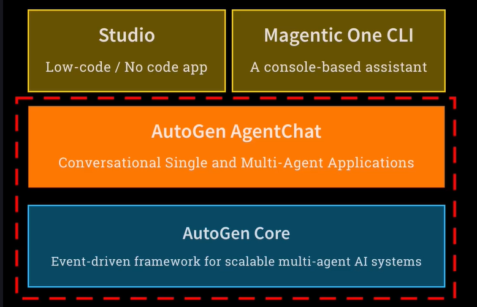

## Day 1

### Microsoft Autogen 0.5.1: AI Agent Framework Explained for Beginners

#### Introduction to Microsoft Autogen 0.5.1

This week focuses on understanding Autogen concepts, specifically Autogen from Microsoft. The framework is open source and was released with version 0.4 in January. This release was described as a ground-up rewrite, adopting an asynchronous, event-driven architecture to address previous criticisms.

#### Key Features of Autogen 0.4 and Beyond

The new architecture aims to improve:

- Observability: Understanding agent interactions.
- Flexibility, control, and scale.

Autogen 0.4 is a direct replacement for Autogen 0.2, with a very different feel and architecture. The decision was made to use the latest version, which is 0.5.1. This version is not radically different from 0.4, but it is the most current.

#### Documentation Differences

When searching for documentation, it is important to be aware of whether it is for version 0.4+ or for the older 0.2 versions, as they look and feel quite different.

#### The Autogen Community Split

Late last year, the original creator and several co-founders of Autogen left Microsoft and created a fork of Autogen. This fork is managed by this group, with the creator now at Google. The fork is called AG2 (for Autogen Gen 2), also known as Agent OS 2. AG2 started from Autogen 0.2, making it compatible and consistent with the earlier version of Autogen. It has broken off from Autogen 0.4, which Microsoft released after the split.

#### Reasons for the Fork

The stated reason for the fork was to allow for more rapid and flexible development, free from the corporate bureaucracy of Microsoft. However, being under the Microsoft umbrella also brings many benefits. The main Microsoft Autogen is widely used, with many enterprise clients and broad adoption.

#### Community Confusion and PyPI Package Ownership

The situation is complicated by the fact that the AG2 group now controls the Discord chat group originally for Autogen, leading to much of the community discussion being about AG2. Newcomers to the Autogen ecosystem may be confused, as documentation and community resources may refer to either AG2 (based on Autogen 0.2) or the official Microsoft Autogen.

Microsoft has made it clear that they will continue to push forward with Autogen, as seen with the release of version 0.4 and beyond. Meanwhile, the AG2 camp claims to be more flexible and faster, with frequent releases. As of now, AG2 is at version 0.8, suggesting swift progress.

#### PyPI Installation Issues

The AG2 team also controls the official PyPI package for Autogen. If you run `pip install autogen`, you will get AG2, not Microsoft's official Autogen. This is problematic and confusing for new users, especially since one would expect Microsoft to own the official PyPI package for their product.

#### Course Direction and Environment Setup

For this course, the decision has been made to use the Microsoft track of Autogen, which currently has a larger community and more traction. Students should be aware of the split and potential confusion in documentation. The course environment is set up to install the official Microsoft Autogen (currently version 0.5.1), not AG2.

The official Microsoft Autogen will be installed in your environment, and it will likely continue to progress quickly. It is important to be aware of these distinctions as you work with Autogen.

#### Key Takeaways

- Microsoft Autogen 0.5.1 is the latest version, featuring an asynchronous, event-driven architecture for improved observability, flexibility, control, and scale.
- There is a split in the Autogen community: the original creators forked the project to create AG2 (Agent OS 2), which is based on Autogen 0.2 and is now managed independently from Microsoft.
- The PyPI package name 'autogen' now installs AG2, not Microsoft's official Autogen, leading to confusion for new users.
- The course will use the official Microsoft Autogen (currently version 0.5.1), and students should be aware of documentation differences and community split.

### AutoGen vs Other Agent Frameworks: Features & Components Compared

#### Introduction to Autogen

Let's begin by discussing what Autogen actually is. We have reviewed several frameworks so far, and Autogen is the last of these frameworks before we consider MCP, which is not really a framework.

Autogen is a collection of different components all unified under the Autogen umbrella name. The first component is called Autogen Core.

Autogen Core is agnostic to the specific frameworks, agents, or large language models (LLMs) being used. It is a general, generic framework designed for building scalable multi-agent systems. It manages aspects such as messaging between agents, even if they are distributed across different locations. Essentially, it acts as a fabric for agents to run within.

While it shares some similarities with concepts like LangGraph, Autogen Core is much simpler. Fundamentally, it serves as a runtime environment for running agents together.

Next is Autogen Agent Chat, which is quite a mouthful. This framework will be very familiar because it closely resembles the OpenAI Agents SDK and Crew. It provides a lightweight, simple abstraction for assembling LLMs into an agent construct, enabling them to use tools and interact with each other.

Autogen Agent Chat is built on top of Autogen Core. On top of Agent Chat, there are additional offerings such as Studio and Magentic One.

Studio is a low-code, no-code application designed for visually constructing agent systems. Magentic One is a command-line console application that manages and runs an out-of-the-box agent framework.

These components collectively make up the Autogen ecosystem. All of this is open source and managed by Microsoft Research, with contributions from people worldwide.

Unlike Crew and LangChain, which may have commercial motivations influencing their product roadmaps, Autogen is positioned as a Microsoft Research community project. Studio and Magentic One are considered research environments and are not ready for production use, a fact clearly stated in their documentation.

Our primary focus will be on Autogen Core and Autogen Agent Chat, as these are the core parts of the framework. We will not delve deeply into the low-code/no-code Studio application since we are coders, nor will we focus extensively on Magentic One, although it appears to be an interesting tool.

We will concentrate mostly on Autogen Agent Chat because it directly compares with Crew, OpenAI Agents SDK, and the agent interaction components of LangGraph. We will also explore Autogen Core to some extent to spark interest and experimentation, often using Agent Chat alongside it.

#### Core Concepts of Autogen Agent Chat

Let's now discuss the fundamental building blocks of the Autogen framework, particularly focusing on Agent Chat. These concepts will be familiar and straightforward, similar to those we have encountered before.

The first concept is **models** , which are similar to the LLMs we have seen in other platforms. The second is **messages** , a core concept that represents communication between agents or events within an agent's interactions, such as tool calls. Messages can originate from users to models, between agents, or within an agent during tool usage.

The third concept is **agents** , which are entities with a model behind them capable of carrying out a series of tasks on behalf of a user or another agent. Finally, **teams** are groups of agents that interact to achieve a common goal, similar to the Crew framework.

For today's session, we will focus briefly on the first three concepts: models, messages, and agents. We will set up a quick example and incorporate some SQL, which will be useful for some participants.

#### Key Takeaways

- Autogen is a comprehensive open-source framework for building scalable multi-agent systems.
- It consists of Autogen Core, Autogen Agent Chat, Studio, and Magentic One, each serving different roles.
- Autogen Core provides a generic runtime for managing messaging and coordination among distributed agents.

### AutoGen Agent Chat Tutorial: Creating Tools and Database Integration

#### Introduction to Autogen Agent Chat

Welcome to week five, day one of the Autogen Agent Chat tutorial, which is the main part of Autogen. This framework is comparable to other agent SDKs like crew. Much of what we do here will look familiar because it is consistent with crew and the OpenAI agents SDK, particularly the initial step of loading the environment as usual.

#### The Model Concept

The first concept is the model, which is similar to concepts like language models (LM) we have encountered before. It acts as a wrapper around calling a large language model. Here, we import the `OpenAIChatCompletionClient`, which is the wrapper for the language model we will be using, GPT-4 mini.

Creating the model client is straightforward: you simply pass in the name of your model. For example, you can create a client for GPT-4 mini or, alternatively, run a local model like LLaMA 3.2 using the same approach. This flexibility allows you to continue working locally instead of using GPT-4 mini.

#### The Message Concept

The second concept is the message, which is unique to Autogen Agent Chat. You create an object called a text message. For instance, a message might have the content "I'd like to go to London" with the source set as the user.

When you run and print this message, it shows the content and the source, encapsulating the communication from the user to the agent. This simple structure forms the basis for message passing in the framework.

#### The Agent Concept

The third concept is the agent, which is similar to previous frameworks. We import the `AssistantAgent` class, which is the fundamental class used in Autogen Agent Chat.

To create an agent, instantiate `AssistantAgent` with a name, such as "airline agent", provide the model client (the underlying language model), and supply a system message that acts like instructions. For example:

> You are a helpful assistant for an airline. You give short, humorous answers.

You can also specify streaming of results by setting the `model_client_stream` parameter. This creates an agent ready to process messages.

#### Passing Messages to the Agent

To interact with the agent, you call its `on_messages` method, passing a list of messages. For example, passing the message "I'd like to go to London" in a list.

You also pass a `cancellation_token` which signals when the message processing is complete. This method is asynchronous, so you must `await` it.

After processing, you can print the content of the chat message returned by the agent. For example, the agent might respond with a humorous answer about London weather.

#### Example Agent Response

When you pass the message "I'd like to go to London" to the agent configured as a helpful airline assistant, it might respond:

> Great choice. Just remember, if it starts raining, it's not a sign to panic. It's just London welcoming you. Ha!

This demonstrates the agent's ability to generate short, humorous answers as instructed.

#### Integrating Tools: Ticket Price Lookup

Next, we enhance the agent by integrating tools. We create a tool to get ticket prices, arming our agent with the ability to look up ticket prices from a SQLite database.

We start by importing `sqlite3`, deleting any existing tickets database to start fresh, then creating a new database with a table called `cities` containing city names and round-trip prices.

We populate the database with ticket prices for cities such as London, Paris, Rome, Madrid, Barcelona, and Berlin.

#### Defining the Database Query Function

We define a simple query function `get_city_price` that takes a city name as input, connects to the database, runs a `SELECT` statement to retrieve the round-trip price for that city, and returns the result.

While this example is simplified and does not include extensive input validation or security measures, it serves as a toy example to demonstrate tool integration.

#### Testing the Query Function

Testing `get_city_price` with inputs like "London" and "Rome" returns prices such as 299 and 499 respectively, confirming that the database is populated and the query function works correctly.

#### Creating a Smarter Agent with Tool Integration

We create a new assistant agent named "smart agent" using the same model client and system message as before. We add the `get_city_price` function as a tool, enabling the agent to query ticket prices.

We also set the attribute `reflect_on_tool_use` to `True`, which allows the agent to continue processing after receiving tool results, rather than returning immediately. This is typically the desired behavior.

#### Lightweight Tool Integration in Autogen

A notable advantage of Autogen is that you can pass Python functions directly as tools without requiring decorators or wrappers. This contrasts with other frameworks like OpenAI agents SDK or LangChain, which require additional syntax or wrappers.

Autogen uses comments to extract tool descriptions, simplifying the integration process and reducing the learning curve.

#### Using the Smart Agent

We call the `on_messages` method of the smart agent, passing the same message "I'd like to go to London". We print the agent's inner messages, which show the function call to `get_city_price` with the city name "London", the result returned (299), and the final response from the model.

The final response might be:

> A round trip ticket to London will set you back 299. Just remember, the only thing you should pack is your sense of humor, because the weather might require it.

This demonstrates the agent's ability to use tools and generate a humorous, informative answer.

#### Summary

This example highlights how simple it is to write a tool that performs a SQL call to a database and integrate it into an Autogen agent. The framework is quick and straightforward, and after less than ten minutes, you can become proficient at agent chat with tool integration.

#### Key Takeaways

- Autogen Agent Chat provides a lightweight abstraction for interacting with large language models, similar to OpenAI agents SDK.
- The core concepts include the model client, message objects, and the assistant agent.
- Tools can be integrated easily, such as a SQLite database query function, enabling agents to perform dynamic lookups.
- Autogen simplifies tool integration by allowing direct use of Python functions without decorators, enhancing ease of use and reducing the learning curve.

---

### Week 5 Day 1 Summary

**Microsoft Autogen 0.5.1 Overview:**

- Microsoft released Autogen 0.4 in January with a ground-up rewrite featuring asynchronous, event-driven architecture for improved observability, flexibility, control, and scale
- Current version is 0.5.1, which builds upon 0.4's foundation
- Important note: A community split occurred when original creators left Microsoft to create AG2 (fork based on Autogen 0.2), which now controls the PyPI package name "autogen"
- To use Microsoft's official Autogen, specific installation instructions must be followed

**Autogen Framework Components:**

1. **Autogen Core** - Generic runtime framework for building scalable multi-agent systems, manages messaging and coordination between distributed agents
2. **Autogen Agent Chat** - Lightweight abstraction layer for assembling LLMs into agents with tool usage capabilities (focus of this course)
3. **Studio** - Low-code/no-code visual construction tool (research environment)
4. **Magentic One** - Command-line console application with pre-built agent framework (research environment)

   

**Core Concepts in Autogen Agent Chat:**

- **Models**: Wrappers around LLMs (e.g., OpenAIChatCompletionClient for GPT-4 mini or local models)
- **Messages**: Communication objects between agents, users, and within agent interactions (e.g., TextMessage with content and source)
- **Agents**: Entities with underlying models capable of carrying out tasks (e.g., AssistantAgent class)
- **Teams**: Groups of agents working together toward common goals

**Practical Tutorial Highlights:**

- Created an airline assistant agent with humorous personality using system messages
- Integrated SQLite database tool (`get_city_price`) to query ticket prices for cities
- Demonstrated Autogen's simplified tool integration - Python functions can be passed directly as tools without decorators or wrappers
- Used `reflect_on_tool_use=True` parameter to enable agents to continue processing after receiving tool results
- Agent successfully performed database lookup and generated contextual, humorous responses

**Key Advantages:**

- Lightweight and straightforward framework comparable to Crew and OpenAI Agents SDK
- Minimal learning curve due to simplified tool integration
- Flexibility to use cloud-based or local models
- Open-source, community-driven project backed by Microsoft Research

## Day 2

### Advanced Autogen Agent Chat: Multimodal Features & Structured Outputs

#### Introduction to Autogen Agent Chat

Welcome to week five, day two, where we delve deeper into Autogen agent chat. To recap, Autogen encompasses several components:

- **Autogen Core** : The infrastructure enabling agent interactions.
- **Autogen Agent Chat** : A framework similar to Crew and OpenAI Agents SDK.
- **No Code/Low Code Platform Studio** and **Magnetic One** : Built on top of Autogen but not covered today.

Today, our focus is primarily on Autogen agent chat, building upon the core concepts of models, messages, and agents. We will also explore teams, which we have not discussed previously.

#### Overview of Today's Topics

We will cover several advanced topics:

- Multi-modal conversations, introducing the ability to send images alongside text.
- Structured outputs, a familiar concept but revisited with Autogen's approach.
- Integration with LangChain tools, enabling calls to LangChain **tools** from Autogen.
- Exploring teams within Autogen.
- A special guest entry to showcase an entertaining feature.

Let's proceed with these exciting topics.

#### Setting Up for Multi-Modal Conversations

We begin by importing necessary libraries, including `load_dotenv` to manage environment variables. This setup allows us to proceed smoothly with our demonstrations.

#### Creating a Multi-Modal Message with an Image

We demonstrate a multi-modal conversation by sending an image along with text. The image is sourced from a URL on my website. Using the Python Imaging Library (PIL), we open the image and create an Autogen image object.

Here is the image, which is designed to evoke the concept of entering the world of AI.

```python
from PIL import Image
import requests
from io import BytesIO

url = "https://example.com/path/to/image.jpg"
response = requests.get(url)
image = Image.open(BytesIO(response.content))

# Create Autogen image object
multimodal_image = AutogenImage(image)
```

#### Constructing the Multi-Modal Message

We create a multi-modal message that includes:

- A textual description detailing the image content.
- The image itself.
- The source of the message, which is the user.

This message structure enables the model to process both text and image inputs.

```python
multimodal_message = MultiModalMessage(
    content=[
"This is a detailed description of the image content.",
        multimodal_image
    ],
    source="user"
)
```

#### Sending the Multi-Modal Message to the Model

We instantiate the model client and create an assistant agent named "describer". The system message instructs the model to be proficient at describing images. We then send the multi-modal message to the model and print the markdown-formatted reply.

This process may take some time as the model processes the image and generates a response.

```python
model_client = ModelClient("gpt-4-mini")

assistant_agent = AssistantAgent(
    model_client=model_client,
    system_message="You are good at describing images.",
    user_message=multimodal_message
)

reply = assistant_agent.chat(cancellation_token=None)
print(reply.markdown())
```

#### Example Model Response

The model responds with a detailed description of the image:

> The image depicts a brightly colored, stylized space that combines elements of a workspace with a whimsical, otherworldly doorway. The room setting includes furniture and decorative elements. The image cleverly intertwines a workspace focused on technology and coding with imaginative and vibrant elements that evoke the limitless possibilities of AI.

This demonstrates the model's ability to understand and describe multi-modal content effectively.

#### Structured Outputs with Pydantic

Next, we explore structured outputs using Pydantic models. We define a subclass of `BaseModel` called `ImageDescription` with fields:

- `scene`: A brief overall description of the scene.
- `message`: The point the image is trying to convey.
- `style`: The artistic style of the image.
- `orientation`: The image orientation (portrait, landscape, or square).

Each field includes a description using Pydantic's `Field` for clarity.

```python
from pydantic import BaseModel, Field

classImageDescription(BaseModel):
    scene: str = Field(..., description="Brief overall scene in the image")
    message: str = Field(..., description="The point the image is trying to convey")
    style: str = Field(..., description="Artistic style of the image")
    orientation: str = Field(..., description="Orientation of the image")
```

#### Using Structured Outputs in Autogen

We create the model client and the description agent similarly as before. The key difference is specifying `output_content_type` as the `ImageDescription` Pydantic model. This instructs Autogen to parse the model's JSON response into an instance of this class.

The agent then returns a typed object representing the structured description.

```python
model_client = ModelClient("gpt-4-mini")

description_agent = AssistantAgent(
    model_client=model_client,
    system_message="You are good at describing images.",
    user_message=multimodal_message,
    output_content_type=ImageDescription
)

response = description_agent.chat()
image_description = response.content  # This is an ImageDescription instance
```

#### Displaying the Structured Output

We use Python's `textwrap` module to neatly format the output fields from the `ImageDescription` instance. The fields include:

- Scene
- Message
- Style
- Orientation

This structured data can be used for UI display, cataloging, or database storage.

```python
import textwrap

wrapper = textwrap.TextWrapper(width=70)

print("Scene:")
print(wrapper.fill(image_description.scene))
print("\nMessage:")
print(wrapper.fill(image_description.message))
print("\nStyle:")
print(wrapper.fill(image_description.style))
print("\nOrientation:")
print(image_description.orientation)
```

#### Insights on Model Understanding

Interestingly, the model correctly identifies the image as a landscape orientation and infers the AI theme from subtle clues such as the text "AI" visible in the image. This demonstrates the model's nuanced understanding and ability to incorporate contextual hints into its descriptions.

This example highlights the power of structured outputs combined with multi-modal inputs in Autogen.

#### Key Takeaways

- Autogen supports multi-modal conversations, allowing images to be sent alongside text messages.
- Multi-modal messages can be created by combining textual descriptions with images using Autogen's message structure.
- Structured outputs can be easily implemented using Pydantic models to define the expected response schema from the language model.
- Autogen converts model responses into JSON, which can then be parsed into Python objects for further processing or storage.

### Implementing Primary and Evaluator Agents in AutoGen with Langchain

#### Integrating Langchain Tools with Autogen

Autogen provides an easy way to wrap Langchain tools so that they can be called directly within the Autogen ecosystem. This integration allows access to the extensive Langchain tools community and their functionalities from Autogen.

We start by importing some Langchain classes, including the Google Serp API wrapper, which enables internet search capabilities, and the file management toolkit for reading and writing files within a specified directory. These tools are then wrapped using the Langchain tool adapter to become Autogen-compatible tools.

The prompt for the language model (LM) is as follows:

> Your task is to find one way nonstop flights from New York's John F Kennedy to London's Heathrow Airport in June. Search online, write the details to a file, and select the best one.

The code creates a Google search API wrapper and then uses Langchain to create a tool for internet searching with a description based on this function. Similar wrappers can be created for other functionalities such as sending push notifications or running Python code.

By passing the Langchain tool into the Autogen tool adapter, it becomes an Autogen tool. These tools are collected into a list called `autogen_tools`. Additionally, file management tools are obtained from the file management toolkit by specifying a sandbox directory and are also wrapped and appended to the `autogen_tools` list.

Each tool in the `autogen_tools` list is printed out to display the available functionalities. Then, an Autogen agent is called with the prompt "Find me a flight, use your tools," passing in the `autogen_tools` so the agent can utilize them. The agent's inner messages and final outcome are printed to observe its actions.

When executed, the agent prints the different tools it has access to, including internet search and file management. It performs a function call to query the internet for nonstop flights, retrieves results, and writes the details to a file named `flights.md`. The agent then selects the best flight option based on the prompt.

The saved file `flights.md` in the sandbox directory contains a nicely formatted list of flight options with details. Although a cheaper option was available, the agent selected a Virgin Atlantic flight, which was described as a good balance of price and service rather than the cheapest option, consistent with the prompt's instructions.

```python
serper = GoogleSerperAPIWrapper()
langchain_serper =Tool(name="internet_search", func=serper.run, description="useful for when you need to search the internet")
autogen_serper = LangChainToolAdapter(langchain_serper)
autogen_tools = [autogen_serper]
```

#### Exploring More Langchain Tools

Users are encouraged to explore additional Langchain tools, such as the Python tool for computations (e.g., multiplying pi by three), to extend Autogen's capabilities. The vast Langchain ecosystem enables Autogen to perform a wide range of tasks by leveraging these tools.

#### Team Interactions with Multiple Agents

Autogen supports creating multiple assistants (agents) that can interact as a team. For example, a primary agent can perform internet searches, while an evaluator agent reviews the primary agent's responses. This pattern facilitates collaborative problem-solving and quality control.

The prompt for the primary agent is:

> Your task is to find a one-way non-stop flight from JFK to London-Heathrow. First, search online for promising deals, then reply with the best option you found. Each time you are called, reply with a different option.

The primary agent has access only to the Sherpa search tool and is instructed to respond with one option at a time.

The evaluator agent's prompt is:

> Check whether the assistant has given a very promising recommendation. Respond with "approve" when satisfied. If only one reply has been seen, do not approve.

This agent provides feedback and approves responses when appropriate, enabling iterative improvement of the primary agent's outputs.

A team is created with these agents in a round-robin group chat, allowing them to converse sequentially. A termination condition is defined to end the conversation when the evaluator replies with the word "approve." This setup enables controlled multi-agent interactions.

The termination condition is somewhat brittle, relying on the evaluator's reply containing the word "approve." In practice, more robust structured outputs and checks would be preferable to determine when to terminate the interaction.

The team is run asynchronously using `team.run()`. Alternatively, individual agents can be called with `agent.run()` by passing the task prompt, which returns the final messages. Both methods facilitate agent execution within Autogen.

The prompts were tightened to be shorter and simpler to reduce thrashing and improve efficiency. Despite this, the conversation between agents can be quite chatty and may require interruption or kernel restarts if it runs too long, to avoid excessive token consumption.

#### Challenges and Observations

Agent frameworks with autonomous decision-making can be unstable, potentially continuing indefinitely without proper termination conditions. Langchain has a recursion limit of 25 conversations between agents, but Autogen currently lacks similar protections, so users must monitor and manage execution carefully.

In a sample run, the primary agent used tools to query for a flight and responded with an option. The evaluator agent provided constructive feedback, noting the response lacked a specific answer and suggested improvements. The primary agent revised its response accordingly. Once the evaluator sent "approve," the termination condition was met, concluding the interaction with a satisfactory answer.

This example demonstrates how teams of agents can collaborate within Autogen. While this is a simple implementation, more extensive and sophisticated team interactions can be built by exploring the documentation and customizing prompts and termination logic.

#### Key Takeaways

- integration of Langchain tools with an adapter.
- evaluating.
- Team interactions.
- termination conditions.

### Headless Web Scraping Tutorial: MCP Server Fetch Integration in AutoGen

#### Introduction to Intelligent Termination Conditions

When working with agents, it is important to use intelligent termination conditions to ensure that interactions stay on track. Avoid relying on hard-coded pieces of text in agent responses, as this can lead to issues.

#### Overview of MCP

MCP is a topic we will explore in detail next week, but here is a brief introduction. MCP provides a simple and elegant way to package tools so that different models can use them. It is not an abstraction layer or complex code, but rather an agreement on how to write tools so that language models (LLMs) can discover and call them in various ways.

This concept is similar to LangChain, which has an ecosystem where tools wrapped as LangChain tools can be used by others in the ecosystem. Anthropics' MCP simplifies this further by removing the need for glue code. As long as a function conforms to a particular specification, it can be used as a tool by any model.

Anthropic describes MCP as the USB-C connector for AI and LLMs. It is an agreed protocol that allows models to plug into tools and resources, such as context for retrieval-augmented generation (RAG). MCP is open and not limited to any single ecosystem, allowing anyone to participate.

#### Using MCP Tools in Autogen

Autogen provides convenient wrappers to use both LangChain tools and MCP tools. This means if there is an MCP tool available, you can easily integrate and use it within Autogen.

There are two main ways to work with MCP tools, which will be covered in detail next week. For now, we will focus on using the MCP fetch tool.

#### MCP Fetch Tool

The MCP fetch tool runs locally on your computer and uses the Playwright browser in headless mode to fetch web pages quietly in the background. This is similar to what we did with Sidekick last week, but without opening a visible browser window.

By running this tool locally, it becomes available as a tool within Autogen simply by importing and using it. This demonstrates the power of MCP's open standard: tools written by anyone, following the MCP specification, can be dropped in and used immediately.

#### Example Usage

In this example, we use the assistant agent with the OpenAI chat completion client and import the MCP fetch tool from Autogen tools. We run the MCP fetch server locally, which enables the assistant to use it as a tool.

We then ask the assistant to review the website epodunk.com, summarize what it learns, and reply in markdown format. You can change the website URL to any site you want to explore.

#### Demonstration Results

The assistant successfully retrieves and summarizes information from the website. For example, it identifies a technology enthusiast focused on coding and experimenting with LLMs, including relevant links such as a LinkedIn profile. The responses are formatted in markdown with accurate links.

This showcases how MCP tools can be seamlessly integrated and used within Autogen to extend capabilities.

#### Advantages of MCP

MCP is an open standard that allows anyone to write tools conforming to its specification. There are many websites hosting MCP tools, creating a large, open-source, public community ecosystem. This is broader than the LangChain ecosystem, providing access to a wide variety of tools.

Using MCP tools within Autogen is straightforward, enabling immediate access to these tools and expanding the functionality of your agents.

#### Summary and Next Steps

This session provided a teaser on how to use MCP tools within Autogen. Although the details of MCP will be covered next week, this introduction gives an idea of the potential and ease of integrating MCP tools.

We also reviewed multimodal capabilities, structured outputs, LangChain tools, and briefly touched on round-robin teams. The next session will focus on Autogen core, the underlying infrastructure.

#### Key Takeaways

- MCP is an open standard protocol that allows different models to use tools seamlessly without complex glue code.
- Autogen supports using MCP tools easily, enabling integration of external functionalities like headless web scraping.
- MCP tools, such as MCP fetch, can run locally and perform tasks like headless browsing and web page fetching.
- The MCP ecosystem is open and public, allowing anyone to write and use tools conforming to the MCP specification.

---

### Week 5 Day 2 Summary

**Advanced Autogen Agent Chat capabilities:**

**Multi-Modal Conversations:**

- Send images alongside text using PIL and Autogen's image objects
- Models process combined text+image inputs to generate detailed descriptions

**Structured Outputs:**

- Define Pydantic models to parse JSON responses into typed Python objects
- Use `output_content_type` parameter for structured data extraction

**Langchain Tool Integration:**

- Use `LangChainToolAdapter` to wrap Langchain tools for Autogen
- Example: Google Serp API for searches and file management toolkit
- Access to vast Langchain ecosystem extends capabilities

**Team Interactions:**

- Primary and evaluator agent pattern for collaborative problem-solving
- Round-robin group chat with termination conditions (e.g., "approve" keyword)
- Warning: Use robust termination conditions, not hard-coded text matching

**MCP (Model Context Protocol):**

- Open standard protocol ("USB-C for AI") for seamless tool integration
- No glue code needed, just conform to specification
- Example: MCP fetch tool for headless web scraping with Playwright
- Import directly from `autogen.tools` for immediate use

**Key Challenges:**

- Autogen lacks recursion limits (unlike Langchain's 25-conversation cap)
- Agent conversations can become "chatty" and consume excessive tokens
- Requires manual monitoring to prevent runaway execution

## Day 3

### AutoGen Core: The Backbone of Distributed Agent Communications

Welcome to day three of week five, where we continue our exploration of Autogen by discussing Autogen Core.

#### Positioning Autogen Core

Autogen Core serves as the foundation of Autogen agent chat. It is the fundamental infrastructure that underpins the entire system, providing the base upon which everything else is built.

#### Relation to Microsoft Semantic Kernel

You might have heard of Microsoft Semantic Kernel and wondered how it fits into this picture. Semantic Kernel is also an agentic framework but differs significantly from Autogen Core.

Semantic Kernel is more akin to frameworks like LangChain. It is a relatively heavyweight glue code that wraps calls to large language models (LLMs). It manages memory, tool calling with its own framework, and uses its own terminology such as "plugins". It also supports structured outputs and includes a prompt templating framework for building and populating prompts.

While there is some overlap—Semantic Kernel can manage tools and agent calls and includes some agent functionality—Microsoft views it as a different kind of offering compared to Autogen. Autogen is a higher-level, more agent-focused framework exclusively aimed at building autonomous agent applications. In contrast, Semantic Kernel focuses on stitching together LLM calls, generally for business purposes.

Therefore, this course does not cover Semantic Kernel, as it is more relevant alongside frameworks like LangChain rather than Autogen.

#### What is Autogen Core?

Autogen Core is described as an agent **interaction** framework. It is platform-agnostic and does not depend on the specific product or platform you use to code your agents.

You can call LLMs directly or use an abstraction or framework around them; Autogen Core does not require any particular approach. If you choose to use the agent chat framework as your agent abstraction, that works well since agent chat is built on top of Autogen Core, and they are designed to complement each other.

In some ways, Autogen Core's positioning is similar to LangGraph. LangGraph also focuses on interactions between agents, conceptualized as a graph of operations and dependencies. Similarly, Autogen Core focuses on interactions between operations or agents, and it does not care how your agents are implemented.

However, the key difference is that LangGraph emphasizes robustness and repeatability, enabling replaying everything built around it. Autogen Core, on the other hand, emphasizes creating an environment where agents can interact, even if they are distributed, diverse, written in different languages such as JavaScript or Python, or use different abstractions.

Autogen Core manages the interactions between these diverse agents, handles their creation, and facilitates messaging between them. This focus on supporting diverse, distributed agent interactions is the core thesis behind Autogen Core.

#### Key Takeaways

- Autogen Core is the foundational infrastructure for Autogen agent chat, focusing on agent interactions.
- Semantic Kernel differs from Autogen Core by providing a heavyweight framework for LLM calls, memory, and tool management, primarily for business applications.
- Autogen Core is platform-agnostic and supports diverse agents implemented in various languages and abstractions.
- Unlike Landgraf, which emphasizes robustness and replayability, Autogen Core prioritizes enabling distributed, diverse agent interactions.

### Agent Communication in Autogen Core: Message Handlers & Dispatching

#### Introduction to Autogen Core

The core idea behind Autogen Core is to decouple the logic of an agent—what it actually does—from how messages get delivered to it and the interplay between agents. The framework manages the creation and communication of agents, handling their entire life cycle and the messaging between them and the developers coding the agents. The responsibility for the agent's logic lies with the developer; Autogen Core simply facilitates their interaction.

#### Runtime Types in Autogen Core

Autogen Core supports two types of runtimes, which define the environment in which agents interact:

- **Standalone Runtime:** Runs locally on your machine in a straightforward manner.
- **Distributed Runtime:** Enables remote agents to interact across different systems.

These runtimes are coded differently. Today, we will focus on the standalone runtime, with the distributed runtime covered in a subsequent session.

#### Overview and Approach

This session will provide a high-level overview of Autogen Core. The examples will be somewhat superficial, aiming to give you a sense of where Autogen Core fits within the ecosystem and its potential relevance to your use cases. If you find it applicable, further research and development on your part will be necessary. The goal is to familiarize you with the framework before moving on to other topics.

#### Starting the Lab: Autogen Core Setup

We begin in the fifth folder for Autogen, specifically in lab three titled "Autogen Core." The setup includes several imports, such as `load_dotenv`. After restarting the environment to ensure freshness, we proceed to define our own message object, which will be used to pass information between agents.

#### Defining the Message Object

The message object is defined as a data class, which means it primarily holds data without any methods. This design choice makes sense because messages are intended solely to transport information between agents. In this example, the message contains a single field named `content`, which is a string. However, you can experiment with more sophisticated message structures containing various types of information.

#### Defining an Agent in Autogen Core

The agent we define in Autogen Core differs from the agent created in Agent Chat. Here, an agent acts as a wrapper or management object that can be created, managed, referenced, and messaged. It contains an agent ID, which uniquely identifies it through a combination of a type and a key.

In a distributed runtime, agents from around the world can collaborate, each uniquely identified by their type and key. This structure allows any agent to communicate with another if it knows the other's type and key.

#### Implementing a Simple Agent

Here is an example of a simple Autogen Core agent named `SimpleAgent`. It subclasses `RootedAgent`, which serves as its superclass. The agent defines two methods:

- The constructor (`__init__`), which calls the parent constructor with the agent's name.
- An asynchronous method `on_my_message`, decorated with `@message_handler`, which handles incoming messages.

The `@message_handler` decorator marks methods that can receive messages. The runtime manages registration and dispatching, ensuring that messages sent to an agent with a specific name and ID are routed to the appropriate handler based on the message class.

#### Message Handling and Dispatching

Autogen Core supports multiple message classes, allowing different handlers for different message types. For example, you could have separate handlers for text messages and image messages. The framework automatically dispatches the correct message to the corresponding coroutine based on the method signatures.

In this simple agent example, the `on_my_message` coroutine receives a message and returns a new message identifying itself and echoing back the received content with a disagreement statement. This agent does not use any language model or AI; it is purely code-driven. Autogen Core focuses solely on message handling.

#### Key Takeaways

- Autogen Core separates agent logic from message delivery and communication.
- There are two runtime types: standalone and distributed, each with different use cases.
- Agents in Autogen Core are management objects identified by unique type and key pairs.
- Message handlers decorated with `message_handler` enable asynchronous message processing and dispatching.

### AutoGenCore Agent Registration and Message Handling: Practical Examples

#### Introduction to AutoGen Core Runtime

We begin by creating a single-threaded agent runtime, which operates as a standalone runtime on a local machine. This runtime handles agents in a single-threaded manner, managing their lifecycle and communication.

The first step is to register an agent type with the runtime. Calling `register` on the agent informs the runtime that this agent type can be spawned and instantiated. This registration does not create an agent instance but declares the agent type, such as `simple agent`, to the runtime.

A factory function is provided during registration, which can instantiate new agents of this type when needed.

After registration, the runtime is started, becoming a fully operational environment ready to manage agents. At this point, the runtime recognizes the `simple agent` type but has not yet instantiated any agents.

#### Agent Identification and Messaging

An agent ID object is created to uniquely identify an agent instance. Using this ID, we can send messages to the agent. For example, sending the message "well hi there" to the `simple agent` with the default ID.

The agent replies with a message indicating its type and ID, followed by a response disagreeing with the input, showcasing its programmed behavior.

This demonstration highlights AutoGen Core's role: managing message passing by looking up agents based on their type and ID. It does not handle the internal logic or code execution within agents; that responsibility lies with the agent implementations themselves.

#### Integrating Language Models with Agents

Next, we explore a more complex agent called `my LM agent`, which subclasses the rooted agent and integrates a language model (LM).

Instead of directly calling OpenAI's API, this agent uses the AutoGen agent chat framework to create a GPT-4 Mini model client. This client is assigned to a private field `_delegate`, which the agent uses to delegate language model operations.

The `_delegate` is set to an assistant agent instance, which requires the agent's name and the model client. This encapsulation allows the LM agent to forward requests to the underlying language model through the assistant agent.

#### Message Handling in LM Agent

The LM agent defines a message handler method, here named `handle_my_message_type`. This method is invoked automatically by AutoGen Core when a message of the corresponding type is sent to the agent.

The handler prints the received message content and constructs a new text message compatible with AutoGen agent chat, setting the source as `user`.

This text message is passed to the assistant agent's `on_message` method along with a cancellation token. The assistant agent processes the message and returns a reply, which the LM agent then wraps in a new message instance and returns as its response.

It is important to note the distinction between the `TextMessage` class from AutoGen agent chat and the `Message` class from AutoGen Core. Although similarly named, they serve different roles in their respective frameworks.

#### Running the Runtime with Multiple Agents

We create a new single-threaded agent runtime and register two agents: the simple agent and the LM agent.

The simple agent responds with a fixed disagreement message, while the LM agent delegates to the GPT-4 Mini model for dynamic responses.

After starting the runtime, we send the message "Hi there" to the LM agent. It replies with a classic GPT-4 Mini response: "Hello, how can I assist you today?"

We then forward this reply to the simple agent, which responds by disagreeing with the LM agent's message, demonstrating the interaction between agents.

#### Summary

This example illustrates how AutoGen Core facilitates agent registration, message routing, and integration with language models. It abstracts the complexity of message dispatching and agent lifecycle management, allowing developers to focus on agent behavior and logic.

#### Key Takeaways

- AutoGen Core manages agent registration and message routing efficiently in a single-threaded runtime.
- Agents register their types with the runtime, enabling dynamic instantiation and message handling.
- The framework supports integration with language models, demonstrated by the LM agent delegating to GPT-4 Mini.
- Message dispatching is flexible, supporting direct messaging and publish-subscribe patterns for scalable communication.

### AutoGenCore Standalone Agents: Rock Paper Scissors with GPT

#### Introduction to Agent Interaction

In this session, we revisit the pantomime example with an additional response from the language model (LM) agent. The LM agent will respond to a greeting, while a disagreeable agent will express disagreement. Subsequently, GPT-4o will handle the disagreement to observe how it manages such interactions.

Hi there. Hello. How can I assist you today? You said hello. How can I assist you today, and I disagree. I appreciate your feedback. How would you prefer I greet you or assist you?

This conversation can be extended indefinitely by having the disagreeable agent continually disagree, allowing observation of how GPT-4 and Mini handle persistent disagreement. After experimentation, it is recommended to stop and close the runtime as per AutoGenCore guidelines before starting another session.

#### Rock, Paper, Scissors Agents Setup

For the next example, we will demonstrate the AutoGenCore platform by implementing a rock, paper, scissors game between multiple agents. This example illustrates agent collaboration and interaction, which is central to the platform's purpose.

#### Player One Agent

Player One is a subclass of a routed agent. It uses an OpenAI chat completion client as its delegate. The agent has a `handle_my_message` method that takes messages and returns responses. This is a straightforward language model routing agent that responds to the given message object.

#### Player Two Agent

Player Two is similar to Player One but with one key difference: it uses a Llama chat completion client instead of OpenAI's. Specifically, it uses the local Llama 3.2 model with 3 billion parameters. This demonstrates the use of a local model within the agent framework.

#### Judge Agent

The Judge agent orchestrates the game. It has instructions specifying that it is playing rock, paper, scissors and must respond only with one of the words: rock, paper, or scissors. It looks up the default IDs for Player One and Player Two and dispatches messages to them. Upon receiving their choices, it composes a judgment message stating the players' choices and asks who wins. This message is then sent to the GPT-4 Mini model for evaluation.

#### Summary of Agents

- **Player One:** Delegates to OpenAI GPT-4 Mini.
- **Player Two:** Delegates to Llama 3.2 local model.
- **Judge:** Sends instructions to players, collects their choices, and judges the outcome using GPT-4 Mini.

These agents are wrappers that delegate to real language models, enabling interaction and collaboration.

#### Running the Rock, Paper, Scissors Game

We create a single-threaded agent runtime and register Player One, Player Two, and the Judge agents. The runtime is started, and the Judge agent is invoked to begin the game. The agents communicate, and the game proceeds as follows:

Player One said rock. Player Two said scissors. Player One wins because rock beats scissors.

This demonstrates agent discovery, interaction, and management within the AutoGenCore framework.

#### Applications and Future Directions

While this example is a simple game, the framework supports more complex and commercial applications. For instance, in week six, a financial trading setup will be built where agents can debate investment decisions. The platform enables autonomy and interaction among agents, which can be tailored for various use cases.

#### Standalone vs Distributed Agents

Today's session focused on standalone agents running locally. Tomorrow's session will cover distributed agents. Understanding both modes provides insight into the capabilities and design of agent-based systems within AutoGenCore.

This concludes Day 3 of the course. Tomorrow, we will explore distributed agent setups.

#### Key Takeaways

- Demonstrated a multi-agent interaction framework using GPT-4o and Llama models.
- Illustrated a rock, paper, scissors game implemented with three agents: two players and a judge.
- Showcased agent discovery, message dispatching, and result judgment within the AutoGenCore platform.
- Highlighted the difference between standalone and distributed agent runtimes, with a focus on standalone in this session.

---

### Week 5 Day 3 Summary

**AutoGen Core Overview:**

AutoGen Core is the foundational infrastructure layer that powers AutoGen Agent Chat, focusing on agent interaction rather than agent implementation. It is a platform-agnostic framework that decouples agent logic from message delivery and communication.

**Key Differences from Related Frameworks:**

- **vs. Semantic Kernel**: Semantic Kernel is a heavyweight framework for LLM calls, memory, and tool management (similar to LangChain), while AutoGen Core focuses purely on agent interactions
- **vs. LangGraph**: Both focus on agent interactions, but LangGraph emphasizes robustness/replayability, while AutoGen Core prioritizes supporting diverse, distributed agents across languages and platforms

**Core Concepts:**

1. **Runtime Types:**

   - **Standalone Runtime**: Local execution using `SingleThreadedAgentRuntime`
   - **Distributed Runtime**: Enables remote agent collaboration (covered in Day 4)

2. **Agent Architecture:**

   - Agents subclass `RoutedAgent`
   - Each agent has a unique **Agent ID** with two components:
     - `agent.id.type`: Agent type/category
     - `agent.id.key`: Unique identifier
   - Methods decorated with `@message_handler` can receive and process messages

3. **Message Structure:**
   - Custom message objects defined as dataclasses
   - Simple data containers for agent communication

**Code Example - Simple Agent:**

```python
from dataclasses import dataclass
from autogen_core import AgentId, MessageContext, RoutedAgent, message_handler
from autogen_core import SingleThreadedAgentRuntime

@dataclass
class Message:
    content: str

class SimpleAgent(RoutedAgent):
    def __init__(self) -> None:
        super().__init__("Simple")

    @message_handler
    async def on_my_message(self, message: Message, ctx: MessageContext) -> Message:
        return Message(content=f"This is {self.id.type}-{self.id.key}. You said '{message.content}' and I disagree.")

# Register and run
runtime = SingleThreadedAgentRuntime()
await SimpleAgent.register(runtime, "simple_agent", lambda: SimpleAgent())
runtime.start()

agent_id = AgentId("simple_agent", "default")
response = await runtime.send_message(Message("Well hi there!"), agent_id)
print(">>>", response.content)
```

**Code Example - LLM-Powered Agent:**

```python
from autogen_agentchat.agents import AssistantAgent
from autogen_agentchat.messages import TextMessage
from autogen_ext.models.openai import OpenAIChatCompletionClient

class MyLLMAgent(RoutedAgent):
    def __init__(self) -> None:
        super().__init__("LLMAgent")
        model_client = OpenAIChatCompletionClient(model="gpt-4o-mini")
        self._delegate = AssistantAgent("LLMAgent", model_client=model_client)

    @message_handler
    async def handle_my_message_type(self, message: Message, ctx: MessageContext) -> Message:
        print(f"{self.id.type} received message: {message.content}")
        text_message = TextMessage(content=message.content, source="user")
        response = await self._delegate.on_messages([text_message], ctx.cancellation_token)
        reply = response.chat_message.content
        return Message(content=reply)
```

**Rock, Paper, Scissors Multi-Agent Example:**

Demonstrated a three-agent system showcasing agent discovery, interaction, and orchestration:

- **Player 1**: Uses OpenAI GPT-4o-mini
- **Player 2**: Uses local Ollama Llama 3.2 model
- **Judge**: Orchestrates game, collects player choices, and determines winner

```python
class RockPaperScissorsAgent(RoutedAgent):
    def __init__(self, name: str) -> None:
        super().__init__(name)
        model_client = OpenAIChatCompletionClient(model="gpt-4o-mini", temperature=1.0)
        self._delegate = AssistantAgent(name, model_client=model_client)

    @message_handler
    async def handle_my_message_type(self, message: Message, ctx: MessageContext) -> Message:
        instruction = "You are playing rock, paper, scissors. Respond only with the one word, one of the following: rock, paper, or scissors."
        message = Message(content=instruction)

        # Send message to both players
        inner_1 = AgentId("player1", "default")
        inner_2 = AgentId("player2", "default")
        response1 = await self.send_message(message, inner_1)
        response2 = await self.send_message(message, inner_2)

        # Judge the results
        result = f"Player 1: {response1.content}\nPlayer 2: {response2.content}\n"
        judgement = f"You are judging a game of rock, paper, scissors. The players have made these choices:\n{result}Who wins?"
        message = TextMessage(content=judgement, source="user")
        response = await self._delegate.on_messages([message], ctx.cancellation_token)
        return Message(content=result + response.chat_message.content)
```

**Key Advantages:**

- **Platform Agnostic**: Works with any LLM or agent framework
- **Flexible Architecture**: Supports diverse agents written in different languages
- **Message-Based Communication**: Clean separation between agent logic and messaging infrastructure
- **Automatic Message Dispatching**: Runtime handles message routing based on agent IDs and message types
- **Multi-Model Support**: Can mix cloud models (GPT-4) with local models (Llama) in same system

**Workflow:**

1. Define custom message dataclasses
2. Create agents by subclassing `RoutedAgent`
3. Implement message handlers with `@message_handler` decorator
4. Register agents with runtime using factory functions
5. Start runtime and send messages using `AgentId`
6. Stop and close runtime when complete

**Use Cases:**

- Multi-agent debates and discussions
- Agent orchestration and coordination
- Distributed agent systems (covered in Day 4)
- Complex workflows requiring agent-to-agent communication

This foundation enables building sophisticated multi-agent applications where agents can discover, message, and collaborate with each other autonomously.
