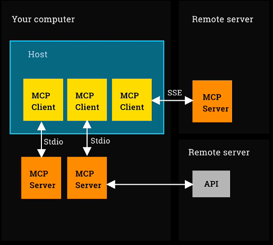
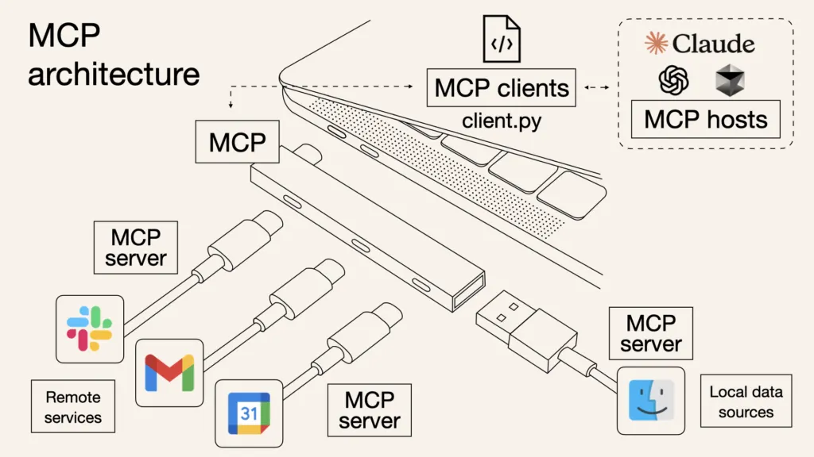

## Day 1

### Intro to MCP: The USB

#### Introduction to MCP and the Capstone Project

Welcome to the epic finale week of the complete Agentic AI course. This week, we introduce MCP, the Model Context Protocol from Anthropic, and build our flagship capstone project: an equity trading floor.

Throughout this course, we have covered various agent frameworks, including my favorite, the OpenAI Agents SDK, as well as Crew, LangGraph, and most recently, Autogen. This time, we return to MCP, which is not really a framework but a protocol, as we will discuss. This is where everything comes together.

At the end of the week, I will also provide a retrospective overview of the different frameworks we have covered, mention some others we did not cover directly, and bring it all together.

#### A Note for Those Who Skipped Ahead

I have noticed some people have skipped straight to week six, eager to learn about MCP. While it is open for you to do so, I want to emphasize that you may have missed some valuable foundational content, especially from weeks one and two, which prepare you well for this material.

In week one, we covered what it means to connect with different large language models (LLMs) and orchestrate them using tools. We explored various design patterns for agent models and what it means for a model to be autonomous.

In week two, we introduced the OpenAI Agents SDK, which we will use to leverage MCP this week.

If you have skipped ahead, I suggest at least taking a quick look at weeks one and two to gain this foundational knowledge. For those who have completed the entire course so far, we are in great shape.

#### Introducing the Model Context Protocol (MCP) from Anthropic

MCP was first announced late last year but gained significant traction from January through April of this year. Anthropics themselves describe MCP as the "USB-C of Agentic AI." This term has become popular, and we will explain what it means shortly.

I should point out that the AI-generated image often associated with MCP mistakenly shows a USB-A connector, not a USB-C. MCP is decidedly the USB-C of Agentic AI, and that is what we will discover now.

#### Dispelling Misconceptions About MCP

Let me clarify what MCP is not:

- It is not an agent framework.
- It is not about building agents.
- It is not a fundamental change invented by Anthropic that alters how we do things.
- It is not a way to code agents.

So, what is MCP? It is a protocol, a standard, a way to do things consistently and simply. It provides a simple method to integrate your agents with tools, resources, or prompts created by others, enabling easy sharing of such components.

#### Focus on Tools

Primarily, MCP is about tools. This is where the greatest excitement lies. The ability to share resources, such as retrieval-augmented generation (RAG) sources from others, is also popular. Sharing prompts is possible but less widely adopted.

The core idea is to easily share tools so that one person can build a useful tool that performs a helpful function, and others can readily incorporate that tool into their products. This is why MCP is known as the USB-C for AI applications: it emphasizes connectivity and seamless integration of agent applications with external tools.

#### Reasons to Be Excited and Some Caveats

While MCP is exciting, it is important to note some limitations:

- MCP is just the standard or approach for integrating with others' tools; it is not the tools themselves.
- Anthropic has built a few tools, but the excitement is not about these tools.
- For example, the OpenAI Agents SDK already has a massive tools ecosystem, giving access to many tools created by the community.
- It is easy to turn any function into a tool using a decorator in the OpenAI Agents SDK, enabling your agent to use your own tools effortlessly.
- MCP does not help you build your own tools; in fact, it can make that harder.

The real value of MCP is in frictionlessly connecting with other people's tools, immediately accessing descriptions of what the tools do, their parameters, and running them seamlessly.

#### The Growing Ecosystem and Importance of Adoption

Many people have adopted MCP, resulting in thousands of MCP-based tools available for integration. You can quickly search and incorporate diverse capabilities, making your agent more powerful.

Standards can be very exciting when widely adopted. The World Wide Web became successful because people coalesced around HTML as a standard protocol. Similarly, MCP's excitement stems from its adoption, which drives the ecosystem of tools and enables you to easily equip your agents with enhanced functionality.

#### Key Takeaways

- MCP (Model Context Protocol) is a protocol, not a framework, designed to standardize integration of agents with external tools.
- MCP enables easy sharing and use of tools developed by others, enhancing agent capabilities through connectivity.
- MCP is likened to the USB-C of Agentic AI, emphasizing its role in seamless interoperability.
- The excitement around MCP stems from its growing ecosystem and adoption, not from the tools themselves or agent coding changes.

### Understanding MCP Hosts, Clients, and Servers

#### Introduction to MCP Core Concepts

There are three core concepts behind MCP that need to be explained: the MCP host, MCP client, and MCP server.

#### MCP Host

The MCP host is the overall application in which you equip an agent with tools. For example, the host could be Claude Desktop, the software running on your computer that manages Claude, the language model, and lets you chat with Claude. It could also be an agent architecture built using the OpenAI agents SDK that runs agents and tools. This overall application piece of software running the agent framework is known as the MCP host.

#### MCP Client

The MCP client is a small piece of software, similar to a plugin, that runs inside the host. Each MCP client connects one-to-one with an MCP server. For example, if you are running Claude Desktop and using multiple MCP servers, you will have an MCP client running for each of those servers. The MCP client lives within the host and connects to the server.

#### MCP Server

The MCP server is the actual piece of code that provides tools, context, and prompt templates to your agent. Tools are the most exciting aspect, as they equip the agent with extra capabilities. The MCP server runs outside the host.

#### Example: Fetch MCP Server

Fetch is an MCP server capable of searching the internet and fetching web pages. It operates by launching a headless browser, such as headless Chrome, controlled by Microsoft's Playwright to collect and read page contents. This tool is wrapped in an MCP server that you can run locally. You can configure Claude Desktop to run an MCP client that connects to this fetch MCP server, enabling Claude to read web pages live during chat sessions.

In this setup, the fetch MCP server runs on your computer. Claude Desktop connects behind the scenes to the MCP server, which runs the headless browser, collects web pages, and answers questions based on them. This fetch MCP server was used in Autogen last week, demonstrating its practical application.

#### Architecture Diagram Explanation

Imagine a box representing your computer. Inside it, you have a host running, such as Claude Desktop or software built with the OpenAI agents SDK. You may have multiple MCP servers running on your machine, for example, one connecting to the local file system and another providing weather information. Within the host, you have multiple MCP clients, each connecting to one MCP server running on your computer.

You can also have a remote MCP server running on another machine, which you connect to using an MCP client. However, this is quite rare. Although the term "MCP server" might suggest a remote server, most MCP servers run locally on your machine outside the host. You typically download them from a public repository and run them locally.

For example, the fetch MCP server was retrieved from Anthropic's repository but ran locally on our machine. Our host was Autogen, and we wrote code acting as the client connecting to the server running on our computer. While remote MCP servers are possible, they are uncommon and sometimes called hosted or managed MCP servers.

#### Local MCP Server Configurations

The MCP server running on your machine might perform local processing, such as writing files to your file system. Many MCP servers also access internet functionality, like the fetch MCP server running a web browser to browse the internet or MCP servers that check the weather by calling web services. This is the most common configuration.

It is important to distinguish this from the less common case where your MCP client calls a remote MCP server hosted on another machine.

#### Summary on MCP Server Locations

To reiterate, MCP servers mostly run on your local machine. You download and run them locally. This point is emphasized because the terminology can be confusing. When exploring MCP marketplaces, thousands of MCP servers run locally, and it is rare to find ones you can connect to remotely.

#### MCP Server Transport Mechanisms

There are two different transport mechanisms for MCP servers according to the official Anthropic specification:

- **Stdio (Standard Input/Output):** This is the most common approach. The MCP client spawns a separate process on your computer and communicates with it over standard input and output. This is called Stdio and will be used extensively, including when building custom MCP servers.
- **SSE (Server-Sent Events):** This uses an HTTPS connection and streams back results, similar to how language models stream output. SSE is required when connecting to remote hosted or managed MCP servers, as Stdio cannot be used remotely.

For local MCP servers, either Stdio or SSE can be used, but Stdio is the most common. Understanding the difference between host, MCP client, MCP server, and the transport mechanisms (Stdio vs SSE) is essential.



#### Conclusion and Next Steps

With this understanding of MCP hosts, clients, servers, and their communication methods, it is time to proceed to the lab where you will make use of MCP servers in the OpenAI agents SDK.

#### Key Takeaways

- MCP architecture consists of three core components: MCP host, MCP client, and MCP server.
- MCP hosts are applications running agents equipped with tools, such as Claude Desktop.
- MCP clients run within the host and connect one-to-one with MCP servers, which provide tools and context.
- MCP servers usually run locally on your machine, often communicating via standard input/output (Stdio), with remote servers being less common.

### Using MCP Servers with OpenAI Agents SDK

#### Introduction to Week Six and MCP

Welcome to week six of the course. We begin with an organized file explorer and a lot of work ahead. The first lab starts here. Remember to set the kernel before proceeding, which by now should be familiar.

This week focuses on the Model Context Protocol (MCP) and the OpenAI Agents SDK, which is a favorite tool. Note that the code you see may differ from the lab as it is constantly updated to keep pace with MCP's rapid evolution. If you are new, ensure you pull the latest code using git as per the guides to stay current.

#### MCP Compatibility and Setup for Windows Users

There is an important note for Windows PC users: MCP currently has production issues on Windows and may not work out of the box. While some workarounds exist, they are unreliable. The recommended and reliable solution is to install the Windows Subsystem for Linux (WSL), which allows running a Linux environment on your PC.

Running Cursor connected through WSL enables MCP to function properly. This has been confirmed through extensive testing and student feedback. Unfortunately, there is no reliable alternative at this time.

When setting up WSL, be mindful of whether you are in the Linux home directory or the Windows home directory. Your work should reside in the Linux home directory. Launching WSL via the `ubuntu` command takes you directly to the Linux home directory, which is safer. Detailed instructions are available in the setup guide.

#### Setup Instructions and Mac User Notes

The setup process is straightforward and similar to previous environment setups. Although it may feel repetitive, completing it ensures MCP will work correctly.

Mac users do not need to worry about these Windows-specific issues and are in a good position to proceed without additional setup.

#### Starting with MCP in OpenAI Agents SDK

We begin by importing necessary modules and loading environment secrets. The plan is to use MCP within the OpenAI Agents SDK by creating an MCP client, spawning an MCP server, and then collecting the tools that the server provides.

We start with the `fetch` tool, which is an SMTP server running a headless browser, as discussed previously.

#### Understanding MCP Server Parameters

Everything in MCP servers begins with parameters, which describe the MCP server. These parameters are structured like a dictionary containing the command line instruction to spawn the MCP server.

For example, the `fetch` parameters specify a command that runs a Python process to install and run a package script locally. Many MCP servers follow this pattern of installing and running a Python repository script.

#### Creating an MCP Client and Spawning the Server

Using the OpenAI Agents SDK, creating an MCP client and spawning the server is straightforward. Using a context manager with `MCPServerStdio`, you provide the parameters describing the server.

It is advisable to specify a timeout longer than the default five seconds, such as 30 or 60 seconds, to avoid premature timeouts.

Once the server is running, you can query it for the tools it offers.

#### Example: Fetch Tool and Its Description

The MCP client runs the command to spawn the server as a Python process. It then connects to the server and requests the list of available tools.

In this example, the server returns a tool named `fetch`. This tool fetches a URL from the internet and can optionally extract its contents as markdown.

Interestingly, the tool's description clarifies that although originally it did not have internet access and would refuse requests, it now grants internet access. This description helps language models understand the tool's capabilities and use it properly.

#### Importance of Tool Descriptions for Language Models

The detailed description provided by the makers of the MCP server is crucial. It informs the language model that it now has internet access, which is a change from previous behavior.

This kind of prompt information is valuable because it guides the language model to use the tool correctly without requiring the developer to manually explain the new functionality.

Using the fetch MCP server thus provides this benefit automatically, enhancing the tool's usability behind the scenes.

#### Key Takeaways

- The Model Context Protocol (MCP) is rapidly evolving, requiring users to keep their code updated.
- Windows users may face compatibility issues with MCP and should use Windows Subsystem for Linux (WSL) for reliable operation.
- MCP servers are spawned via command-line parameters describing the server process.
- OpenAI Agents SDK simplifies creating MCP clients, spawning servers, and retrieving available tools.

### Exploring Node

#### Introduction to Node-Based MCP Servers

We are now moving on to explore another MCP server before returning to put the previous one to use. The first MCP server we examined was a Python-based server executed by calling and passing the name of a package available on PyPI, which you could install using pip.

Now, we will use a JavaScript-based MCP server. While Python-based MCP servers typically run using Python, JavaScript-based ones run using server-side JavaScript, which uses something called Node.js. Many of you are probably familiar with Node.js, but if you are not and do not have Node installed on your system, please follow the provided link to ChatGPT's instructions. Installing Node is very simple, and many people already have it installed.

It is important to have a recent version of Node. If you already have Node but an older version, use a version manager such as nvm to upgrade to a recent version. You can verify your Node version by typing `npx --version` in your terminal, ensuring it returns a recent version.

#### Running a Node-Based MCP Server with Playwright

We will now use Node.js to run a Node-based MCP server. This time, the command we use is not `uvicorn` but `npx`. We use npm, the Node package manager, instead of pip. This MCP server is an official Node package.

The MCP server we are using is based on Microsoft's Playwright, which is browser automation software. This is a particularly popular MCP server that runs with Node using Playwright.

You might recall that the fetch MCP server we previously used also utilizes Playwright behind the scenes. However, there is a benefit to using this Node-based MCP server, which will become clear shortly.

Once we specify the parameters, we use the same code structure: we take `MCPServerStdio` as our context manager, pass in the parameters, and remember that the timeout parameter is important. Then, we call `server_tools` to find the tools provided by this server.

When we run this, it calls `npx`, which installs the package and then calls the tools on it. The result is quite impressive.

Unlike the fetch MCP server, which provided only one tool, this Node-based Playwright MCP server offers much more granular control over the browser process. It provides many tools such as closing the browser, resizing the browser window, viewing console messages, uploading files, pressing keys, navigating back and forward, taking screenshots, dragging, clicking, hovering, and selecting.

This level of fine-grained control over the browser window enables us to write agents that can power a browser window, similar to the sidekick we developed in week four.

One of the great advantages of MCP servers is how easy it is to equip your agent with a wide range of tools. You can find tools that interest you and add them in seamlessly. We will now explore another MCP server, which is also JavaScript-based and Node-based.

#### Using a Node-Based MCP Server for File System Access

First, I will quickly get the name of a directory called `sandbox` inside the current directory. If this directory does not already exist on your file system, you may need to create it.

Then, I create parameters for running the MCP server. The command is `npx` again to run Node. I pass in the name of another npm package, which is an Anthropic example MCP server called `server-file-system`. As the name suggests, it provides file system capabilities.

We list its tools again. This Node program spawns the server, connects to it, and requests the available tools. The server responds with tools that allow reading and writing from your local file system, such as reading a file, reading multiple files, creating a directory, listing a directory, and so on.

Importantly, all file system operations are restricted within the sandbox directory path that we specified. This allows you to equip an agent with tools to read and write from your file system while keeping it isolated within a certain directory for security.

#### Key Takeaways

- Node-based MCP servers use server-side JavaScript and require a recent version of Node.js installed.
- The Node package manager (npm) is used to install and run MCP servers in JavaScript, unlike Python's pip.
- Playwright-based MCP servers provide granular control over browser automation, offering many tools such as closing the browser, resizing, taking screenshots, and more.
- MCP servers can be equipped with various tools, such as file system access within a sandboxed directory, enabling agents to interact with local files securely.

### Building an Agent That Uses Multiple MCP Servers

#### Introduction to Agent Using MCP Servers

You might be thinking, all right, I understand that we can create something that spawns a server and tells us about a bunch of tools, but that does not sound very exciting. We want it to actually perform tasks, and that is what we will address now.

We will create a quick example of an agent that uses these tools.

Here are some instructions for our agent:

- Browse the internet to accomplish your instructions.
- You are highly capable of browsing the internet independently to accomplish your task, including accepting cookies.
- Click "Not now" when prompted.
- If one website is not fruitful, try another.
- Be persistent until you have solved your assignment.

This is a clear set of instructions to prepare our server.

We use the same context manager as before, the one we used to collect the names of tools. We pass in the parameters we want, including the timeout. We do this for both of our files: the MCP server that can write to disk, and the Playwright server that can control a browser in a fine-grained way.

We will create an agent called "investigator". We give it the instructions, specify the model (changing it to the latest GPT-4 mini), and pass in a collection of MCP servers. Instead of passing tools directly, we pass MCP servers. The OpenAI agents SDK queries these servers to understand their tools and provide those capabilities to the investigator agent.

This is the extent of the complexity involved in equipping our agents to use these tools.

Once the agent is created, the next step is to set up a trace to track the agent's activity in the UI. Then, we call the runner with the assignment.

The assignment given to our agent is to find a great recipe for banoffee pie and summarize it in Markdown format.

Banoffee pie is a British dessert that, although we Brits are not well known for our cooking, is something we invented and is truly amazing. It is unfortunate that more people do not know about it, so this agent will investigate it on our behalf.

We run the agent, and after a few seconds of processing, it spawns the MCP servers and opens a browser window on the computer. The agent appears to have navigated to BBC Good Food, indicating it understands the British context and is actively searching.

The browser title confirms that it has located a banoffee pie recipe. This is the result of the MCP server running and driving Playwright. Although we do not see all the behind-the-scenes actions, we observe it clicking and navigating.

From a quick look, this appears to be a legitimate version of banoffee pie. Despite my own poor cooking skills, I am confident I can make banoffee pie.

Most importantly, we check our sandbox and preview the file to confirm that the other MCP server was used to write the recipe to disk.

Thus, the agent has used one MCP server to navigate the internet and find the recipe, and another MCP server to write the recipe to disk. Mission accomplished.

Next, we look at the trace in Open IE to see what happened behind the scenes. The trace shows the MCP tools associated with each MCP server. The browser navigate tool was used to navigate the web page, and the file tools performed a read file and then wrote out the banoffee pie recipe.

This trace illustrates the interactions between the tools. It is important to review it to ensure the agent behaves as expected and uses the correct tools appropriately.

#### Exploring MCP Marketplaces

The exciting moment with MCP is when you first see an MCP marketplace. These marketplaces are websites where you can browse all the MCP servers available to equip your agent.

One popular marketplace is MCP itself. Upon launching it, you see a featured list of MCP servers, including the Playwright MCP server we just used. You can view its parameters, tools, and creator information (Microsoft), which indicates legitimacy.

The explore tab allows you to search and filter MCP servers by categories. For example:

- 4000 servers in Research and Data
- 68 in Browser Automation Knowledge and Memory
- 34 in Memory-related tools
- 19 Calendar Managers
- Many in Monitoring and Visualization
- 7344 in Developer Tools

There may be overlap between categories, but this demonstrates the vast selection available to equip your agents.

Another popular marketplace is Glamour. It provides ratings for security, licensing permissiveness, and quality. The methodology for these ratings is documented, which helps in assessing the security of MCP servers.

The volume of servers available is substantial, emphasizing the richness of the ecosystem.

#### Security Considerations for MCP Servers

Security is a significant concern in the community regarding MCP servers. When running an MCP server, it operates on your computer. Authentication methods exist for connecting to remote or hosted MCP servers.

Typically, you run someone else's code on your computer when using MCP servers. This raises valid concerns, but it is important to remember that this is similar to installing open source packages via pip or npm.

You are installing open source code on your computer, which carries inherent risks. Therefore, you must perform due diligence on the tools you use, just as you would with any package installed from PyPI or npm.

If the package is published by reputable organizations like Microsoft or Anthropic, it is likely safe. Otherwise, you should investigate the repository's stars, community activity, feedback, and security reviews to ensure it meets your standards.

MCP servers are only as safe as any code you download and run on your computer. Some MCP servers can be configured to run inside Docker containers, providing additional security controls.

Ultimately, you should always conduct your own security review by researching the publisher, examining the code, and verifying the repository before running an MCP server.

A particular concern arises when non-technologists or end users add MCP servers to cloud desktops. These users may lack the skills to vet packages properly, such as checking GitHub repositories, community engagement, or publisher reputation.

For knowledgeable users like us, we can perform due diligence on open source packages. However, the risk is higher when end users add MCP servers without such expertise.

Marketplaces like Glamour help by providing security ratings and detailed testing information. You can use these ratings as a starting point and choose MCP servers with high security grades.

#### Key Takeaways

- Created an agent capable of using multiple MCP servers to browse the internet and write to disk.
- Demonstrated how to equip an agent with MCP servers using the OpenAI agents SDK.
- Explored MCP marketplaces showcasing thousands of servers across various categories.
- Emphasized the importance of security and due diligence when running MCP servers on local machines.

### MCP Marketplaces & Security Considerations

#### Introduction to MCP Marketplaces

There are several MCP marketplaces available. One notable example is Smithery, which is very popular among users. Many familiar MCP servers are installed across these marketplaces, including Smithery.

In Smithery, you can find servers such as Playwright from Microsoft. You can explore the MSP server itself and see how to run it directly from the command line using NPM. By logging in, you can access parameters and view the tools it offers.

Smithery, like other marketplaces, is quite popular among users.

#### Resources and Blog Posts on MCP Marketplaces

There are several blog posts and resources worth exploring. For example, Huggingface hosts a post featuring a variety of libraries and marketplaces, including the ones we have already seen such as Smithery.

There are many MCP servers to explore. Awesome MCP servers and Cursor provide directories if you want to integrate MCP servers directly into Cursor to enhance your Cursor agent with this functionality and many more.

The official MCP open source project hosted by Anthropic includes several reference servers, such as Fetch, which we have looked at. These are among the most robust servers you can start with, including Klein.

This is a valuable resource to explore with many great marketplaces.

I also found an article on Huggingface that is very well written, accurate, and thoughtful. It discusses what makes MCP exciting, while also providing a reality check to distinguish hype from reality. It is important for people to understand both the genuine excitement and the limitations of MCP.

It is very worthwhile to review these articles and marketplaces to gain a clear understanding of the MCP landscape.

#### Summary of MCP Concepts Covered

Today, we covered a lot of material including MCP hosts, clients, and servers. MCP servers can be written in Python and launched with UV, or in JavaScript through Mpcs. They can also run in other ways, but these are the main two methods.

There are two transport mechanisms for MCP servers: Studio and ZK. Most importantly, MCP servers are exciting because they make it easy and frictionless to connect your agent to many tools developed by people all over the world. There are thousands of such tools to choose from.

#### Looking Ahead

Next time, we will create our own MCP server and client so that we can contribute to this ecosystem.

I look forward to seeing you then.

#### Key Takeaways

- Smithery is a popular MCP marketplace featuring many familiar MCP servers.
- MCP servers can be written in Python or JavaScript and launched using different methods.
- MCP servers enable easy integration of agents with numerous tools developed worldwide.
- Resources like Huggingface and official MCP projects provide valuable directories and insights into MCP marketplaces.

### Day 1 — Summary and external insights

#### Concise Day 1 recap

- MCP is a protocol (not a framework) that standardizes how agents access tools, resources, and prompts — the “USB‑C of Agentic AI.” The value is in easy, interoperable tool sharing and adoption across an ecosystem, not in changing how you write agents.
- MCP architecture: host (e.g., Claude Desktop or an OpenAI Agents SDK app) runs one MCP client per server; servers run locally most of the time and expose tools/resources via a standard API. Common transports are Stdio (local, process I/O) and SSE (remote/hosted).
- In practice for this course, you used three servers:
  - Fetch (Python) via uvx mcp-server-fetch — to fetch web pages.
  - Playwright (Node) via npx @playwright/mcp — granular browser automation.
  - Filesystem (Node) via npx @modelcontextprotocol/server-filesystem `<sandbox>` — constrained file I/O within a sandbox dir.
- With OpenAI Agents SDK, you spawn servers with MCPServerStdio, discover tools (server.list_tools()), and pass servers to the Agent. The “investigator” agent browses to find a Banoffee pie recipe and writes a markdown summary to disk using two different MCP servers.
- Marketplaces (mcp.so, Glama/Smithery, etc.) surface thousands of servers. Treat security seriously: you’re running other people’s code; prefer reputable publishers, review repos, and use sandboxing.

Reference notes from `6_mcp/1_lab1.ipynb`:

- Uses dotenv, Agent/Runner/trace from agents, and MCPServerStdio.
- Ensures a sandbox directory exists before starting the filesystem server.
- Example parameters: {"command": "uvx", "args": ["mcp-server-fetch"]} and {"command": "npx", "args": ["@playwright/mcp@latest"]}.
- Timeout increased to 60s to avoid startup flakiness; if you upgraded the Agents SDK, list_tools may be under server.session.
- Windows users should prefer WSL; Node is required for the Node-based servers (npx available).

### What the wider community says (Hugging Face article highlights)

- Why MCP is surging now: it squarely solves integration — connecting agents to real systems and data — and it’s open, model‑agnostic, and rapidly gaining a network effect (1,000+ community servers early 2025). Many see it becoming a de facto standard for tool access.
- How it works: agents dynamically discover MCP servers and capabilities without hard‑coded connectors; any model or framework can participate. This shifts tool choice from compile‑time wiring to runtime discovery.
- Position in agent stacks: MCP isn’t an agent brain; it powers the Action layer. It complements orchestrators like LangChain/LangGraph/Crew/LlamaIndex. Adapters already exist so MCP servers can appear as framework “tools.”
- Not a silver bullet: consider operational overhead (managing many local/remote servers), security/governance (authN/Z, logging, policy — e.g., MCP Guardian), tool usability/quality of descriptions, and the ecosystem’s maturity/compatibility. Start small, observe, iterate.
- Emerging capabilities and roadmap: remote servers over SSE, OAuth, a registry for discovery/verification, well‑known endpoints, better streaming/statelessness, proactive servers, and improved namespacing.
- New use cases unlocked: multi‑step cross‑system workflows (calendar/email/db/budget), environment‑aware agents (IoT/OS), multi‑agent cooperation via shared tools, personal assistants with local/private data, and enterprise governance with standardized access.

### Practical takeaways for this repo

- Prefer Stdio for local development; consider SSE for remote/hosted servers later.
- Keep server timeouts generous (30–60s) and pre‑create sandbox dirs to avoid exits.
- Treat every MCP server like any third‑party package: verify publisher, review code, prefer signed/official builds, and use directory sandboxes.
- If the OpenAI Agents SDK changes, adjust list_tools calls as noted in the notebook comments.

Sources: `6_mcp/1_lab1.ipynb`; Hugging Face — “What Is MCP, and Why Is Everyone – Suddenly!– Talking About It?”

#### Minimal code: start servers and list tools

```python
from dotenv import load_dotenv
from agents.mcp import MCPServerStdio
import os

load_dotenv(override=True)

# 1) Define server params (Python + Node based)
fetch_params = {"command": "uvx", "args": ["mcp-server-fetch"]}
playwright_params = {"command": "npx", "args": ["@playwright/mcp@latest"]}

# Filesystem server needs a sandbox path that exists
sandbox_path = os.path.abspath(os.path.join(os.getcwd(), "sandbox"))
os.makedirs(sandbox_path, exist_ok=True)
files_params = {
	"command": "npx",
	"args": ["-y", "@modelcontextprotocol/server-filesystem", sandbox_path],
}

# 2) Launch servers and list available tools
async with MCPServerStdio(params=fetch_params, client_session_timeout_seconds=60) as server:
	tools = await server.list_tools()  # If on newer Agents SDK: await server.session.list_tools()
	print("fetch tools:", [t.name for t in getattr(tools, 'tools', tools)])

async with MCPServerStdio(params=playwright_params, client_session_timeout_seconds=60) as server:
	tools = await server.list_tools()
	print("playwright tools:", [t.name for t in getattr(tools, 'tools', tools)])

async with MCPServerStdio(params=files_params, client_session_timeout_seconds=60) as server:
	tools = await server.list_tools()
	print("filesystem tools:", [t.name for t in getattr(tools, 'tools', tools)])
```

#### Compose an agent with two MCP servers and run a task

```python
from agents import Agent, Runner, trace

instructions = """
You browse the internet to accomplish your instructions.
You are highly capable at browsing independently, accepting cookies,
and clicking 'not now' when appropriate. If one website isn't fruitful,
try another. Be persistent until you solve the assignment.
"""

async with MCPServerStdio(params=files_params, client_session_timeout_seconds=60) as mcp_server_files:
	async with MCPServerStdio(params=playwright_params, client_session_timeout_seconds=60) as mcp_server_browser:
		agent = Agent(
			name="investigator",
			instructions=instructions,
			model="gpt-4.1-mini",
			mcp_servers=[mcp_server_files, mcp_server_browser],
		)
		with trace("investigate"):
			# Example from the notebook
			result = await Runner.run(
				agent,
				"Find a great recipe for 锅包肉, then you summarize it in markdown to banoffee.md",
			)
			print(result.final_output)
```

## Day 2

### Intro to Week 6 Day 2: Building Your Own MCP Server

#### Introduction to MCP Server and Client

Welcome to day two of week six, where we delve deeper into MCP. Today, we focus on building our own MCP client and MCP server. It is important to note that we are creating our own implementations, not using pre-existing ones such as USB-A of Agent Guy or USB-C of Agentic I.

#### Core Concepts of MCP Architecture

- The **host** refers to the overall application, such as a cloud desktop or an agent architecture.
- The **client** resides inside the host and maintains a one-on-one connection, typically over input/output, to an MCP server.
- The **MCP server** is a separate process running externally, providing tools, contexts, and prompts to MCP clients within the host.
-

Most discussions focus on tools, although contexts are also briefly used.

#### MCP Architecture Examples



- **Local MCP Server:** An MCP server running on your computer, connected to an MCP client locally. For example, the file writer used when creating Banoffee Pie.
- **Local Client with Remote Service:** An MCP client on your machine connects to an MCP server on your machine, which then calls out to a remote internet service. Examples include Playwright and Fetch.
- **Hosted or Managed MCP Server:** An MCP client connects remotely to an MCP server running on another machine. This setup typically uses the Server-Sent Events (SSE) transport mechanism, whereas local connections often use standard input/output (stdio) or SSE, with stdio being more common.

#### MCP Server Implementation Details

- MCP servers can be written in Python or JavaScript.
- Common parameters to describe MCP servers include commands to run or MPW (MCP Wrapper).
- MCP servers can also be created using Docker containers, although UX and MPW are the most common methods.

#### Why Build Your Own MCP Server?

The primary reason to build your own MCP server is to **share it** . When you create a tool that others can use with their agents, you describe it in a way that enables integration. This includes working on prompts and the information surrounding your tool.

Additional benefits include:

- Packaging all tools consistently as MCP servers, which is useful when building an agent system that uses multiple MCP servers.
- Gaining a deeper understanding of the underlying plumbing by building the nuts and bolts yourself.

#### Reasons Against Building an MCP Server

If you are building a tool solely for your own use, creating an MCP server may be unnecessary and inefficient. For example, if you have a function you want to equip your large language model (LLM) with, you can simply decorate that function with `@function_tool` and provide it directly to your LLM using the OpenAI agents SDK or the JSON approach from week one.

In this case, the function is called within your current Python process as a tool, avoiding the extra plumbing and scaffolding required to spawn and communicate with a separate MCP server process over standard input/output.

Therefore, MCP servers are not intended for building your own tools for personal use; they are designed for sharing tools.

#### Key Takeaways

- MCP architecture involves a host application, MCP clients, and MCP servers communicating over input/output.
- MCP servers can run locally or remotely, using different transport mechanisms like stdio or SSE.
- Building your own MCP server is beneficial primarily for sharing tools with others and maintaining consistent packaging.
- For personal use, directly decorating functions as tools is simpler than creating an MCP server, which involves additional complexity.

### Wiring Business Logic into Your MCP Server

#### Introduction to MCP Server and Business Logic

We begin by navigating to the week six folder and then to lab two, where we will create our own MCP server and client. While this setup is relatively simple, it is not trivial. The excitement around MCP stems from its simplicity in using other tools, rather than just creating MCP servers.

#### Exploring the Accounts Python Module

Our first step is to examine a Python module named `accounts`. This module contains extensive code for managing your account, including buying and selling shares, maintaining balances, calculating profit and loss, listing transactions, and executing trades based on market prices. This business logic should feel familiar, as it was generated by our agent engineering team in week three.

The code was created by our agent crew and includes comments and type hints. Although I typically write comments and type hints only when necessary, the agent team did a wonderful job here. We are using this code directly, with only minor modifications.

#### Database Integration

I have updated the code slightly to save accounts in a database, separated into a module called `database`. This module uses SQLite in a straightforward manner, allowing reading and writing of accounts as JSON objects. This database module is integrated with `accounts.py`. Apart from these minor changes, the code remains essentially untouched from what our engineering team produced.

#### Using the Accounts Module

Let's proceed with our lab for today. We will start by importing the `accounts` Python module. Once imported, we can call `account.get` with a name to retrieve the account with that ID. For example, my account shows a balance of $9,400, three Amazon shares, and a list of transactions.

I can buy three more shares of Amazon by calling `buy_shares` and providing a reason. For instance, I might say, "I'm going to buy three shares of Amazon because this bookstore website looks promising." After executing this, I now have six Amazon shares in my account.

Additionally, I can call `account.report` to get a detailed report about the account, and `account.list_transactions` to view all transactions. This demonstrates that the code written by our agents is operational and allows us to perform typical account operations such as buying shares and listing transactions.

#### Writing an MCP Server

Creating an MCP server is straightforward. It involves boilerplate code that wraps existing business logic into an MCP server using libraries provided by Anthropic. Let's examine a Python module called `accountsservice`.

The module begins by importing the `FastMCP` class from Anthropic and the business logic module `account`. We then create an MCP server instance named `account_server` using `FastMCP`.

#### Defining MCP Tools

Several functions are defined and decorated with `@mcp.tool`. Each function, such as `get_balance`, includes a descriptive docstring and delegates its operation to the corresponding business logic function. When the MCP server launches, these tools become available for use.

The tools include `get_balance`, `get_holdings`, `buy_shares`, `sell_shares`, and `change_strategy` for modifying the portfolio's strategy. This setup allows the MCP server to expose business logic functionality as callable tools.

#### MCP Resources

In addition to tools, the server defines resources, which are less common but useful. For example, accessing the resource named after an account returns its report, while accessing the resource named after an account's strategy returns that strategy. These resources are accessible via URIs that describe the requested data.

#### Running the MCP Server

At the bottom of the script, when the Python module is executed, it calls the `run` function on the MCP server, specifying the transport mechanism as standard input/output (stdio). This launches the MCP server, imports the business logic, and prepares it to handle the defined tools and resources.

Overall, writing your own MCP server to wrap business logic and launch a server is not difficult. The code is mostly boilerplate, and the server can be quickly put to use.

#### Key Takeaways

- The MCP server simplifies wrapping existing business logic into callable tools and resources.
- The accounts Python module provides comprehensive business logic for managing accounts, shares, and transactions.
- MCP tools are decorated functions that delegate to business logic, enabling easy server functionality.
- Resources in MCP provide access to specific data endpoints, complementing the tool-based interface.

### Creating Client Code to Use Your MCP Server

#### Introduction to MCP Server and Client

In this session, parameters are being set for a custom MCP server that was just written. The command to run is exactly what would be typed at a command line to execute the module.

The command to run the server is as follows:

```python
python account_server.py
```

Running `account_server.py` creates an MCP server, specifically a fast MCP. It calls `run`, and some functions are decorated as MCP tools.

The OpenAI agents SDK context manager is used with `MCPServerStudio`, passing in the parameters, including a timeout. The server's tools are then listed. Running this will create an MCP client, spawn the MCP server, and ask it what tools are offered. The decorated functions should be visible.

#### Listing and Using MCP Tools

After running, the following decorated functions are available as tools:

- get_balance
- get_holdings
- buy_shares
- sell_shares
- change_strategy

These functions are now accessible.

It is not super easy, but it is also not too difficult. Next, instructions are provided to manage an account for a client and answer questions about the account. For example, the account is under the name Ed, and the balance and holdings are requested.

The latest model is used, and the same code as before is applied. The context manager is used with `MCPServerStudio`, parameters are passed, and the client session timeout is set to 30. Instructions and the model are provided, and the output is displayed.

The server is spawned, tools are called, and the response includes the current cash balance and holdings. For example, the response might state: "Your current cash balance is 8000. Your holdings include six shares of Amazon. If you need any further details, let me know." This demonstrates successfully calling the custom MCP server, which then calls the business logic.

#### Writing an MCP Client

It is not common to write an MCP client anymore. Previously, when working with the OpenAI agents SDK, MCP was not natively supported, so a custom client had to be written and the tools provided to the SDK. However, after an update to the OpenAI SDK, this process was greatly simplified, making previous code obsolete.

With the context manager construct, the OpenAI SDK now automatically creates the client. However, it is still useful to see how to make a client, especially if working with resources rather than tools.

#### The Accounts MCP Client Module

The MCP client is implemented in a Python module called `accounts_clients`. At the top, parameters are specified for launching the MCP server. While this could be made configurable for a generic client, it is currently fixed for the accounts MCP server.

The client needs to:

- List the tools
- Call a tool
- Read resources

The first function lists tools by managing a session, initializing it, calling `list_tools` on the session, and returning the tools. This is necessary for contacting the server and listing its tools.

The second function demonstrates calling a tool and reading a resource by specifying the resource name. MCP returns tools in a format similar to standard JSON used when calling a tool, but with slight differences. Therefore, mapping between the MCP description and the general JSON description is necessary. A function is provided for this mapping.

All of this functionality is now included in the OpenAI agents SDK, so manual implementation is not required. However, reviewing the code can help in understanding how an MCP client operates.

#### Running the MCP Client

To run the MCP client, import the relevant functions from the module. The `list_account_tools` function spawns the MCP server and retrieves its tools. The MCP tools are then reconstituted as OpenAI function tools, similar to using a decorator. Both the MCP tools and the reconstituted function tools are printed for comparison.

The MCP tools are wrappers that create an MCP client, launch the MCP server, and run the business logic, returning results to the language model. This process is now handled automatically by the OpenAI agents SDK, but understanding the underlying mechanics is beneficial.

#### Using the MCP Client for Resources

Another example uses the `read_accounts_resource_client` function to read a resource called editor. The result is a description of the account. Alternatively, the business logic can be imported and called directly, yielding the same result.

This demonstrates that the business logic is wrapped in an MCP server to be available as a resource. The MCP client exposes that resource, allowing calls through the client or directly. Sharing the resource via the MCP client provides a streamlined way for others to access it without needing to understand the underlying business logic.

#### Exercises and Further Exploration

To practice, create an MCP server that provides the current date as a tool. This allows an OpenAI agent to access the current date for context-aware responses. As a more advanced exercise, build an MCP client to accompany the server, following the approach demonstrated for the accounts client and server.

You can also write a native call to OpenAI, similar to week one, using a tool as JSON. This exposes the mechanics of calling a language model with an MCP client and server. While not required for daily work, it is a valuable exercise for deeper understanding.

It is worth noting that providing the current date as a tool is not particularly useful in practice, as it is better to state the date directly in the prompt. This ensures the model always has access to it without needing to call a tool. For more interesting tools, consider creating a calculator or another operation on two inputs, and then write an MCP server and possibly a client for it.

#### Conclusion

This concludes the overview of creating MCP servers and clients, with emphasis on the server side. Exercises are provided for further exploration and understanding.

#### Key Takeaways

- Running the MCP server and client allows for managing accounts and exposing business logic as tools.
- The OpenAI agents SDK now simplifies MCP client creation, but understanding manual client construction is valuable.
- MCP clients can list tools, call resources, and map MCP tool descriptions to standard JSON.
- Creating custom MCP servers and clients is a useful exercise for understanding the underlying mechanics.

### Day 2 — Summary and quick code

#### Concise Day 2 recap

- You wrapped existing business logic (the `accounts` module) behind a custom MCP server and exercised it via the OpenAI Agents SDK and a hand-rolled MCP client.
- Why/when to build an MCP server: do it to share capabilities in a standard way across hosts and models; if it’s only for your own agent in-process, prefer a direct tool function or decorator instead of MCP overhead.
- Server shape: a thin MCP server exposes tools like `get_balance`, `get_holdings`, `buy_shares`, `sell_shares`, and `change_strategy`, plus simple resources (e.g., an account report) over stdio.
- Client options:
  - Easiest: let the OpenAI Agents SDK spawn the MCP server with `MCPServerStdio` and pass it to an `Agent`.
  - Educational: a custom client can list tools, map MCP tool schemas to OpenAI tool schemas, and read resources.
- Exercise idea: a trivial “today’s date” tool as an MCP server; more interesting is a small calculator server to practice inputs/outputs and schema.

#### Minimal code from `6_mcp/2_lab2.ipynb`

1. Use the business logic directly

```python
from accounts import Account

account = Account.get("Ed")
account.buy_shares("AMZN", 3, "Because this bookstore website looks promising")
account.report()
account.list_transactions()
```

2. Spawn your Accounts MCP server and let an Agent use it

```python
from agents import Agent, Runner, trace
from agents.mcp import MCPServerStdio

params = {"command": "uv", "args": ["run", "accounts_server.py"]}

instructions = "You are able to manage an account for a client, and answer questions about the account."
request = "My name is Ed and my account is under the name Ed. What's my balance and my holdings?"
model = "gpt-5-nano"

async with MCPServerStdio(params=params, client_session_timeout_seconds=30) as mcp_server:
	# Optional: inspect the exposed tools
	mcp_tools = await mcp_server.list_tools()
	# Equip agent with the MCP server (tools are auto-discovered)
	agent = Agent(name="account_manager", instructions=instructions, model=model, mcp_servers=[mcp_server])
	with trace("account_manager"):
		result = await Runner.run(agent, request)
	print(result.final_output)
```

3. Use the lightweight MCP client helpers (tools-as-OpenAI schema + resources)

```python
from agents import Agent, Runner, trace
from accounts_client import get_accounts_tools_openai, list_accounts_tools, read_accounts_resource

# Discover raw MCP tools and OpenAI-tool equivalents
mcp_tools = await list_accounts_tools()
openai_tools = await get_accounts_tools_openai()

agent = Agent(name="account_manager", instructions=instructions, model=model, tools=openai_tools)
with trace("account_mcp_client"):
	result = await Runner.run(agent, "My name is Ed and my account is under the name Ed. What's my balance?")
print(result.final_output)

# Read a resource exposed by the server (e.g., account report for 'ed')
context = await read_accounts_resource("ed")
print(context)
```

Key references: `6_mcp/2_lab2.ipynb`, `6_mcp/accounts.py`, `6_mcp/accounts_server.py`, `6_mcp/accounts_client.py`.

## Day 3

### Exploring Types of MCP Servers and Agent Memory

#### Introduction to MCP Server Configurations

Welcome to week six, day three. Today, we will extensively explore the capabilities of MCP. Let's begin with a quick recap of the core concepts behind MCP by examining the architecture diagram.

There are three different configurations of MCP servers:

1. **Local-only MCP Server:** This is the simplest configuration where the MCP server runs solely on your local computer, utilizing only local resources. Examples include the accounts MCP server we previously used, which was hand-written, and the local file system.
2. **Local MCP Server with Remote API Calls:** This is perhaps the most common setup. The MCP server runs locally but makes remote calls to APIs that leverage online resources.
3. **Managed or Hosted MCP Server:** This server runs remotely and is managed externally. Although less common, we will briefly look at examples to understand this architecture.

It's important to note that even in the first two configurations, MCP servers are often downloaded from public online repositories and then run locally on your machine.

#### Starting the Lab: Experimenting with MCP Servers

We are now in the week six, third lab, ready to experiment with various MCP servers. The first type we will explore is the local-only MCP server, which runs entirely on your computer. Remember, although it runs locally, it is usually downloaded from a public repository.

We will select a JavaScript (Node.js) MCP server that provides our agent with memory and knowledge capabilities. Specifically, it offers graph-based memory, a special kind of memory that understands entities, observations about those entities, and the relationships between them.

Memory is a hot topic, and many think of it as a single construct, possibly influenced by frameworks like LangChain. However, in the MCP paradigm, memory is considered a set of tools that can be equipped to a language model (LM). An agent can have multiple types of memory tools, each providing different context or capabilities.

This particular memory tool allows the agent to store information about entities, observations, and their relationships. Such information can be requested by tools or included in prompts, thereby enriching the LM's context.

#### Configuring the MCP Server Parameters

As always, we start by specifying the parameters for the MCP server. Since we are running a Node.js version, the parameters are prefixed with `mpc`.

We will use a version called `libsql`, which stores memory in a SQLite database. This is an improved version over alternatives that store data in JSON files, offering better stability.

The configuration allows specifying a directory and a database name for the memory store. This enables having different memory stores for different agents, which is quite handy.

In this example, the memory directory is set to `memory` and the database is named `Ed`. If the database already exists, we delete it to start with a clean slate. If the `memory` folder does not exist, it should be created.

#### Available Memory Tools

The MCP server provides several tools related to memory management:

- `create_entities`
- `search_nodes`
- `read_graph`
- `create_relations`
- `delete_entity`
- `delete_relation`

These tools allow the agent to build connectivity between the entities it wants to remember, effectively managing relationships within its memory graph.

#### Demonstration: Using Persistent Memory with the Agent

Let's see this memory in action. We use the entity tools as persistent memory to store and recall information about conversations.

For example, we provide the following information to the agent:

- Name: Edgar
- Profession: LLM engineer
- Activity: Teaching a course about agents, including the MCP protocol

We pass these instructions along with the model and MCP server parameters to the agent. Using a context manager with MCP Server Studio, we create the MCP client with a 30-second timeout.

We then create the agent with the instructions, model, and MCP server, and run the agent with a request to see how it handles this information.

The agent responds by acknowledging the information, saying "Nice to meet you, Edgar. It's great to know you're teaching a course about AI agents and the MCP protocol."

On the left side of the interface, a file named `Edgar` is created, representing the stored entity in memory.

For a follow-up, we create a new agent with the same instructions, model, and MCP server, and ask, "My name is Ed. What do you know about me?"

The MCP server responds accurately, recalling that Ed is an LLM engineer teaching a course about AI agents and the MCP protocol.

This simple example demonstrates how easily we can equip an agent with a memory capable of handling relationships between entities.

#### Checking the Conversation Trace

It is always a good practice to check the conversation trace to understand how the agent interacts with memory.

In this example, the trace shows that the agent called `search_nodes`, queried for "Ed", and received a JSON structure reflecting the entity type, observations, and relationships.

Reviewing the trace helps in building more sophisticated memory structures for different parts of the conversation that the agent should remember.

#### Exploring the Second Type of MCP Server: Local with Internet Access

Next, we will explore the second type of MCP server, which runs locally but uses internet resources. We have already seen examples of this with tools like `fetch` and `playwright`.

We will now experiment with another such MCP server to further understand this architecture.

#### Key Takeaways

- Explored three types of MCP servers: local-only, local with remote API calls, and managed/hosted remote servers.
- Demonstrated a graph-based memory MCP server that stores entities, observations, and relationships using SQLite.
- Showed how to equip an agent with persistent memory tools to store and recall conversational information.
- Highlighted the importance of checking conversation traces to understand memory interactions and agent behavior.

### Brave Search API: MCP Server Calling the Web

#### Introduction to Brave Search API

In recent weeks, we have frequently used tools that perform internet searches. You might recall the hosted tool with OpenAI that we used back in week two, which was quite expensive, costing about two and a half cents per web search. We have also used services like Tavileh and Serpa. Now, we will explore another option called Brave Search. This company specializes in API-driven search, including for AI applications. The service is free, offering 2000 free searches per month, which is very generous. I have set up a paid account due to frequent use, but you can remain on the free plan.

To get started, you sign up on the Brave Search website, where you can easily obtain an API key without needing a credit card. After acquiring your Brave API key, you add it to your environment variables file as usual and rerun the environment loading script at the top of your project.

#### Setting Up the MCP Server with Brave Search

When specifying the parameters for our MCP server, we include environment variables to pass the Brave API key. This is a new aspect for this setup, allowing the MCP server to authenticate with Brave. The MCP server is implemented in Node.js and runs locally on your machine. Although the code is downloaded and executed locally using npm, it makes calls to Brave's web service in the cloud, passing in your API key. This architecture is an example of a type two MCP server: running locally but calling out to the cloud.

#### Running the Brave Search MCP Server

Using MCP Server Studio, we pass in the necessary parameters and run the server. The tools available include a Brave web search tool, which performs web searches via the API, and a local search tool for businesses, which is available only on the paid plan. Unlike fetch, which runs a local browser to access web pages, Brave Search makes direct web calls to its own search engine and returns query results.

We can query the Brave Search MCP server to research the latest news on topics such as the Amazon stock price, providing the current date as context. Running the server returns results, such as the current Amazon stock price and related information. Checking the trace confirms that the query was sent to Brave Search and the results were received successfully, demonstrating end-to-end functionality.

#### Type Three MCP Servers: Remote Servers

Now, let's discuss the third type of MCP servers, where the server runs remotely and you connect to it using the SSC approach. This setup is uncommon and can be unreliable because there is no guarantee that the remote server will remain operational. Previously, there was an example of a hosted MCP server available for remote connection, but it is no longer active. Other examples tend to be paid business services requiring enterprise accounts.

Companies like Asana, Intercom, PayPal, Square, Waikato, and Zapier offer remote MCP servers for clients with paid accounts. For instance, Asana clients can interact with their workspace via a remote MCP server. However, these services are not commonly accessible to the general public and require commercial agreements.

#### Running MCP Servers Locally vs. Remotely

In many cases, commercial users run MCP servers locally rather than relying on remote servers. Cloudflare provides tools for customers to create and deploy remote MCP servers, offering detailed instructions and monitoring capabilities. These deployments can include authentication mechanisms, which are increasingly important for hosted tools to verify user identity.

Although remote MCP servers are not common currently, this may change in the future if managed hosted MCP servers gain popularity. For now, the typical configuration involves setting up an API key with a service like Brave Search and passing that key when calling a local MCP server.

#### Conclusion

This overview covered the Brave Search API integration with MCP servers, the architecture of local MCP servers calling cloud services, and the less common remote MCP server setups. We will now return to the second type of MCP server for another interesting example.

#### Key Takeaways

- Brave Search offers a free API with generous limits, ideal for AI-driven web searches.
- MCP servers can run locally while calling external web services using API keys.
- Remote MCP servers exist but are uncommon and mostly used in paid enterprise contexts.
- Cloudflare provides tools for deploying remote MCP servers with authentication capabilities.

### Integrating Polygon API for Stock Market Data

#### Introduction to the Trading Floor Project

The main project for this week is to set up a trading floor with autonomous agents that can buy and sell equities. These agents will not actually buy and sell equities but will use the simulated account management system that we have already built. However, they will be using real market data.

#### Choosing a Market Data Provider

There are several Market Data API servers that can provide market data. After experimenting with many, my preferred provider is Polygon. Polygon is a well-known professional provider of financial market data. One of their significant advantages is that they offer both a free plan and a paid plan.

I recommend sticking with the free plan. However, if you are enthusiastic about this field, you can opt to pay a small fee, typically between 20 and 30 dollars per month, to access more accurate market data. With the free plan, you receive data as of the previous day's business close stock prices. The paid plan, which I use, provides data with a 15-minute delay but allows unlimited API usage. For real-time market data, you would need to pay significantly more, but that is unnecessary unless you are an active trader.

#### Setting Up Polygon API Access

To start using Polygon, sign up on their website. Once signed in, select the "Keys" option in the left-hand navigation panel. Press the blue "New Key" button to generate an API key. This key should be placed in your environment variable file as `POLYGON_API_KEY`.

After setting the API key, you can run your code to verify the key is set correctly. If the message "polygon API key is not set" does not appear, it means the key has been set properly. You can then directly use the Polygon client, which has excellent documentation and is very easy to use.

For example, querying the previous close price for Apple (ticker symbol AAPL) will return the value 195.27. This demonstrates how to use Polygon code directly to retrieve market data.

#### Market.py Module and Rate Limiting

I have written a Python module called `market.py` that wraps some of the calls to Polygon. The Polygon API, when using the free plan, is rate limited, allowing only about five API calls per minute. This limit is quite restrictive if you want to query multiple share prices frequently.

However, there is a useful feature: if you make a single API call requesting all share prices in the market as a snapshot, it counts as only one API call. To leverage this, I implemented a mechanism where if you request the share price for a single stock like Apple on the free plan, the module will fetch the full market snapshot once and cache it in memory. Subsequent requests for share prices will return data from this cache, avoiding additional API calls and thus respecting the rate limits.

Let me demonstrate this. In `market.py`, there is a function `get_share_price` which first checks if you have a Polygon API key. It then determines if you are on the paid plan or free plan. If on the free plan, it calls the function that fetches the full market snapshot for the prior business day and caches it. If the same date's data has already been fetched, it returns the cached data instead of making another API call.

For example, when we get the share price for Apple, it returns 195. If we put this call inside a tight loop and request it 1000 times, it will consistently return 195 without hitting the API rate limit, because the data is served from the cache. Without this caching mechanism, we would quickly exceed the rate limit.

#### Market Server as an MCP Server

I have also created a local MCP server called `market_server`. This is a simple MCP server similar to previous examples. You create the MCP instance and use the MCP tool decorator to define functions.

One such function is `lookup_share_price`, which calls `get_share_price`. The server can be launched easily, and it exposes the `lookup_share_price` tool. This allows agents to query the share price of stocks through the MCP server interface.

For example, an agent can be asked, "What is the share price of Apple?" By using the latest model and passing the MCP server context, the agent calls the MCP tool and returns the share price of Apple successfully.

#### Key Takeaways

- The project involves creating autonomous trading agents using simulated accounts with real market data.
- Polygon API is recommended for accessing financial market data, offering both free and paid plans.
- The free plan provides previous day's closing prices with rate limits, while paid plans offer more frequent data access.
- A caching mechanism is implemented to efficiently handle API rate limits by fetching full market snapshots and serving cached data for repeated requests.

### Advanced Market Tools Using Paid Polygon Plan

#### Introduction to Polygon MCP Server

The most interesting aspect of using Polygon is when you have a paid plan and want to utilize their MCP server with all its capabilities. This demonstration is optional, but you can sign up for the first month to experience it yourself.

Here are the parameters provided for our MCP tool. It is UVC, a Python-based MCP server. Interestingly, you can provide a link to the GitHub repository containing this MCP server, allowing you to use it directly from the repo.

We are calling MCP Polygon from this repository. It does not have to be something pip-installable; it can be straight from a repository. However, if you do this, you must perform due diligence to verify that it is the official GitHub repository for Polygon, the company behind polygon.io. Check the community traction, number of stars, support, and so on, just as you would when cloning any other repository.

I have done this research myself and am satisfied, but you should do the same. Then, I pass in my Polygon API key and ask what tools this MCP server provides.

Running this query reveals a large number of tools available. The model is allowed to perform many actions, including retrieving the last trade, accessing crypto data, ethics data, market status, tickers, dividends, conditions, financials, and more. This equips our agent with extensive capabilities to analyze financial markets directly.

You can provide all these tools to your agent even on the free plan, but most will respond that the tool is unavailable for free users, which can be disappointing. Therefore, you either provide only one tool, as done in the free plan example, or sign up for the paid plan.

Let's try these out. Because on the free plan, we must specify that only the "get snapshot ticker" tool should be used. Running this, we hope the agent uses the correct tool.

Initially, the agent did not use the correct tool, which is interesting. Upgrading the model while trying again, it used the right tool on the second attempt and retrieved the latest share price at 195. This illustrates that with generative AI, sometimes the agent does not follow prompts correctly, and you need to account for such behavior. Upgrading to a more recent model appeared to improve performance in this case.

If you have a paid plan, you can add this to your environment file by setting `polygon_plan=paid`. This ensures the system switches to use the appropriate tools. For the premium real-time plan, set this to `real_time` to access all real-time APIs. I have the paid plan and will update my environment file accordingly.

Running the cell now confirms the subscription to the paid Polygon plan, indicating that prices will be viewed with a 15-minute delay. This concludes our initial exploration of MCP servers.

There are many more MCP servers available. I encourage you to explore marketplaces for tools that interest you and experiment with them here. Try all three approaches: local MCP servers, those that call the web, Python-based, and JavaScript-based servers. Experiment and enjoy enhancing your agents' capabilities.

Hopefully, you have taken up the exercises and added more MCP servers. That concludes day three of week six. Next, we will begin the capstone project of building a trading floor, which is an exciting project. I look forward to showing it to you.

#### Key Takeaways

- The paid Polygon plan unlocks extensive MCP server capabilities for financial market analysis.
- MCP servers can be integrated directly from GitHub repositories, requiring due diligence on authenticity.
- Agents equipped with multiple tools can access diverse market data, but free plans limit tool availability.
- Experimenting with various MCP servers locally and remotely enhances agent functionality and learning.

## Day 3 — Complete Summary

### Overview: Three Types of MCP Server Configurations

Day 3 explores three distinct MCP server architectures, each with different deployment patterns and use cases:

1. **Local-only MCP Servers**: Run entirely on your local machine using only local resources (e.g., file system, SQLite databases)
2. **Local MCP Servers with Remote API Calls**: Run locally but make calls to cloud services (most common setup)
3. **Managed/Hosted MCP Servers**: Run remotely on another machine (rare, typically enterprise services)

**Important Note**: Even when servers call remote APIs, the MCP server code itself typically runs locally after being downloaded from public repositories.

### Type 1: Local-Only MCP Servers

#### Graph-Based Memory Server (`mcp-memory-libsql`)

**What it does**: Provides persistent memory storage for agents using a knowledge graph structure that stores:

- **Entities**: Objects or people the agent needs to remember
- **Observations**: Facts and details about entities
- **Relationships**: Connections between entities

**Why it matters**: Memory in the MCP paradigm is not a single construct but a set of tools that can be equipped to language models. Different memory tools provide different capabilities, and agents can have multiple memory types simultaneously.

**Key features**:

- Uses SQLite database (via `libsql`) for better stability than JSON-based alternatives
- Can configure different databases for different agents
- Supports entity/relationship operations through tools like `create_entities`, `search_nodes`, `read_graph`, `create_relations`, `delete_entity`, `delete_relation`

**Configuration**:

```python
params = {
    "command": "npx",
    "args": ["-y", "mcp-memory-libsql"],
    "env": {"LIBSQL_URL": "file:./memory/ed.db"}
}
```

**Workflow**:

1. First interaction: Agent creates entities and stores observations
2. Subsequent interactions: Agent searches nodes and retrieves stored information
3. Check traces to see how the agent queries memory (e.g., `search_nodes` returns JSON with entity types, observations, relationships)

**Code example**:

```python
from agents import Agent, Runner, trace
from agents.mcp import MCPServerStdio

memory_params = {
    "command": "npx",
    "args": ["-y", "mcp-memory-libsql"],
    "env": {"LIBSQL_URL": "file:./memory/ed.db"}
}

instructions = "You use your entity tools as a persistent memory to store and recall information about your conversations."

# Store information
async with MCPServerStdio(params=memory_params, client_session_timeout_seconds=30) as mcp_server:
    agent = Agent(name="agent", instructions=instructions, model="gpt-4o-mini", mcp_servers=[mcp_server])
    with trace("memory_store"):
        await Runner.run(agent, "My name's Ed. I'm an LLM engineer teaching a course about AI Agents and MCP.")

# Recall information in a new session
async with MCPServerStdio(params=memory_params, client_session_timeout_seconds=30) as mcp_server:
    agent = Agent(name="agent", instructions=instructions, model="gpt-4o-mini", mcp_servers=[mcp_server])
    with trace("memory_recall"):
        result = await Runner.run(agent, "My name's Ed. What do you know about me?")
    print(result.final_output)
```

### Type 2: Local MCP Servers Calling Web Services

#### Brave Search MCP Server

**What it does**: Provides web search capabilities through the Brave Search API

**Key differences from other search tools**:

- **vs. OpenAI hosted search**: Much cheaper (2000 free searches/month vs. $0.025 per search)
- **vs. Fetch server**: Makes direct API calls to search engine rather than running a browser
- **vs. Tavily/Serper**: Another free alternative with generous limits

**Setup requirements**:

1. Sign up at https://brave.com/search/api/
2. Get free API key (no credit card needed)
3. Add to `.env` as `BRAVE_API_KEY`

**Available tools**:

- `brave_web_search`: Performs web searches
- `brave_local_search`: Business search (paid plan only)

**Configuration**:

```python
env = {"BRAVE_API_KEY": os.getenv("BRAVE_API_KEY")}
params = {
    "command": "npx",
    "args": ["-y", "@modelcontextprotocol/server-brave-search"],
    "env": env
}
```

**Code example**:

```python
from dotenv import load_dotenv
from agents import Agent, Runner, trace
from agents.mcp import MCPServerStdio
import os
from datetime import datetime

load_dotenv(override=True)

env = {"BRAVE_API_KEY": os.getenv("BRAVE_API_KEY")}
params = {"command": "npx", "args": ["-y", "@modelcontextprotocol/server-brave-search"], "env": env}

instructions = "You are able to search the web for information and briefly summarize the takeaways."
request = f"Please research the latest news on Amazon stock price and briefly summarize its outlook. For context, the current date is {datetime.now().strftime('%Y-%m-%d')}"

async with MCPServerStdio(params=params, client_session_timeout_seconds=30) as mcp_server:
    agent = Agent(name="agent", instructions=instructions, model="gpt-4o-mini", mcp_servers=[mcp_server])
    with trace("web_search"):
        result = await Runner.run(agent, request)
    print(result.final_output)
```

#### Polygon.io Market Data Integration

**What it does**: Provides real-time and historical financial market data for building trading applications

**Plan options**:

- **Free Plan**: Previous day's closing prices, ~5 API calls/minute rate limit
- **Paid Plan ($20-30/month)**: 15-minute delayed data, unlimited API calls
- **Real-time Plan**: Live market data (significantly more expensive, unnecessary for most use cases)

**Setup**:

1. Sign up at https://polygon.io
2. Navigate to "Keys" → "New Key"
3. Add to `.env` as `POLYGON_API_KEY`

**Rate limiting strategy for free plan**:
The `market.py` module implements a clever caching mechanism:

- Single snapshot API call fetches all market prices (counts as 1 call)
- Caches results in memory/database
- Subsequent price queries use cached data
- Avoids hitting rate limits even with 1000+ queries

**Direct API usage**:

```python
from polygon import RESTClient

polygon_api_key = os.getenv("POLYGON_API_KEY")
client = RESTClient(polygon_api_key)
price_data = client.get_previous_close_agg("AAPL")[0]
```

**Wrapped market.py module**:

```python
from market import get_share_price

# First call fetches full market snapshot
price = get_share_price("AAPL")

# Subsequent calls use cache - no rate limiting concerns
for i in range(1000):
    get_share_price("AAPL")
```

**Custom Market MCP Server**:
The `market_server.py` wraps the caching logic as an MCP server, similar to `accounts_server.py`:

```python
# market_server.py uses FastMCP to expose lookup_share_price tool
params = {"command": "uv", "args": ["run", "market_server.py"]}

async with MCPServerStdio(params=params, client_session_timeout_seconds=60) as server:
    mcp_tools = await server.list_tools()  # Shows lookup_share_price

instructions = "You answer questions about the stock market."
request = "What's the share price of Apple?"

async with MCPServerStdio(params=params, client_session_timeout_seconds=60) as mcp_server:
    agent = Agent(name="agent", instructions=instructions, model="gpt-4.1-mini", mcp_servers=[mcp_server])
    with trace("market_query"):
        result = await Runner.run(agent, request)
    print(result.final_output)
```

**Official Polygon MCP Server (Paid Plan)**:

For paid subscribers, Polygon provides a full-featured MCP server with extensive tools:

```python
params = {
    "command": "uvx",
    "args": ["--from", "git+https://github.com/polygon-io/mcp_polygon@v0.1.0", "mcp_polygon"],
    "env": {"POLYGON_API_KEY": polygon_api_key}
}

async with MCPServerStdio(params=params, client_session_timeout_seconds=60) as server:
    mcp_tools = await server.list_tools()
    # Returns many tools: get_last_trade, crypto data, market status, tickers, dividends, etc.
```

**Important notes**:

- Can install MCP servers directly from GitHub repos (not just pip/npm packages)
- Must verify repository authenticity (check stars, community, official org)
- Free plan users see "unavailable" errors for paid tools
- Set `POLYGON_PLAN=paid` or `POLYGON_PLAN=realtime` in `.env` to indicate your plan level

**Tool selection behavior**:

- With many tools available, models may not always choose correctly on first try
- Upgrading to better models (e.g., gpt-4.1-mini) improves tool selection accuracy
- Can provide explicit instructions: "Use your get_snapshot_ticker tool to get the latest price"

### Type 3: Remote/Hosted MCP Servers

**Reality check**: This configuration is uncommon and not recommended for most use cases.

**Why rare?**:

- No standard discovery mechanism for remote servers
- No guarantee of server uptime/availability
- Requires SSE (Server-Sent Events) transport instead of stdio
- Authentication complexity

**Enterprise examples**:
Companies offering remote MCP servers for paid business clients:

- Asana (workspace management)
- Intercom (customer communication)
- PayPal (payment processing)
- Square (commerce)
- Zapier (automation)

**Cloudflare tooling**:
Cloudflare provides infrastructure for deploying your own remote MCP servers with:

- Detailed deployment instructions
- Monitoring capabilities
- Authentication mechanisms

**Typical enterprise pattern**:
Even commercial users often run MCP servers locally rather than remotely, passing API keys to local servers that call cloud services (Type 2 pattern).

### Best Practices and Operational Hygiene

**Environment setup**:

- Store all API keys in `.env` file
- Use `load_dotenv(override=True)` to refresh environment variables
- Verify keys are set before running code

**Timeout configuration**:

- Default 5-second timeout is often too short
- Use 30-60 second timeouts: `client_session_timeout_seconds=60`
- Prevents premature disconnections during server initialization

**Database/file preparation**:

- Create required directories before spawning servers (e.g., `memory/`, `sandbox/`)
- Delete and recreate databases for clean testing
- Use `os.path.exists()` and `os.makedirs()` to ensure paths exist

**Security due diligence**:

- MCP servers run other people's code on your machine
- Same risk as any open source package (pip/npm)
- Verify publisher (Microsoft, Anthropic = trustworthy)
- Check GitHub stars, community activity, recent updates
- Review code before running unfamiliar servers
- Prefer official repositories and well-known publishers

**Tracing and debugging**:

- Always check traces at https://platform.openai.com/traces
- Traces show which tools were called and with what parameters
- Essential for understanding agent behavior and tool usage
- Helps debug when agents don't use expected tools

**Plan limitations awareness**:

- Know which tools are available on your plan tier
- Free plans often have feature restrictions
- Document plan requirements in code/docs
- Provide clear error messages when features unavailable

### Marketplace Exploration

**Assignment**: Explore MCP server marketplaces and experiment with servers using all three approaches:

1. Local-only servers (like memory)
2. Local servers calling web services (like Brave, Polygon)
3. Remote servers (if you have enterprise access)

**Try both**:

- Python-based servers (using `uvx`, `uv`)
- JavaScript-based servers (using `npx`, `npm`)

### Complete Working Examples

#### Example 1: Memory-equipped agent with persistent recall

```python
from dotenv import load_dotenv
from agents import Agent, Runner, trace
from agents.mcp import MCPServerStdio
import os

load_dotenv(override=True)

memory_params = {
    "command": "npx",
    "args": ["-y", "mcp-memory-libsql"],
    "env": {"LIBSQL_URL": "file:./memory/new.db"}
}

instructions = "You use your entity tools as a persistent memory to store and recall information about your conversations."

# First conversation - store facts
async with MCPServerStdio(params=memory_params, client_session_timeout_seconds=30) as mcp_server:
    agent = Agent(name="agent", instructions=instructions, model="gpt-4o-mini", mcp_servers=[mcp_server])
    with trace("conversation"):
        result = await Runner.run(
            agent,
            "My name's Ed. I'm an LLM engineer. I'm teaching a course about AI Agents, including the incredible MCP protocol. MCP is a protocol for connecting agents with tools, resources and prompt templates, and makes it easy to integrate AI agents with capabilities."
        )

# Second conversation - recall facts
async with MCPServerStdio(params=memory_params, client_session_timeout_seconds=30) as mcp_server:
    agent = Agent(name="agent", instructions=instructions, model="gpt-4o-mini", mcp_servers=[mcp_server])
    with trace("conversation"):
        result = await Runner.run(agent, "My name's Ed. What do you know about me?")
    # Agent will recall: Ed is an LLM engineer teaching MCP course
```

#### Example 2: Web search with date context

```python
from dotenv import load_dotenv
from agents import Agent, Runner, trace
from agents.mcp import MCPServerStdio
import os
from datetime import datetime
from IPython.display import Markdown, display

load_dotenv(override=True)

env = {"BRAVE_API_KEY": os.getenv("BRAVE_API_KEY")}
params = {"command": "npx", "args": ["-y", "@modelcontextprotocol/server-brave-search"], "env": env}

instructions = "You are able to search the web for information and briefly summarize the takeaways."
request = f"Please research the latest news on Amazon stock price and briefly summarize its outlook. For context, the current date is {datetime.now().strftime('%Y-%m-%d')}"
model = "gpt-4o-mini"

async with MCPServerStdio(params=params, client_session_timeout_seconds=30) as mcp_server:
    agent = Agent(name="agent", instructions=instructions, model=model, mcp_servers=[mcp_server])
    with trace("conversation"):
        result = await Runner.run(agent, request)
    display(Markdown(result.final_output))
```

#### Example 3: Market data with custom caching

```python
from dotenv import load_dotenv
from agents import Agent, Runner, trace
from agents.mcp import MCPServerStdio
from market import get_share_price
from IPython.display import Markdown, display
import os

load_dotenv(override=True)

# Direct module usage with caching
print(f"Apple price: {get_share_price('AAPL')}")

# No rate limiting concerns due to caching
for i in range(1000):
    get_share_price("AAPL")

# Use as MCP server
params = {"command": "uv", "args": ["run", "market_server.py"]}

async with MCPServerStdio(params=params, client_session_timeout_seconds=60) as server:
    mcp_tools = await server.list_tools()
    print(f"Available tools: {mcp_tools}")

instructions = "You answer questions about the stock market."
request = "What's the share price of Apple?"
model = "gpt-4.1-mini"

async with MCPServerStdio(params=params, client_session_timeout_seconds=60) as mcp_server:
    agent = Agent(name="agent", instructions=instructions, model=model, mcp_servers=[mcp_server])
    with trace("conversation"):
        result = await Runner.run(agent, request)
    display(Markdown(result.final_output))
```

#### Example 4: Paid Polygon with full toolset (optional)

```python
from dotenv import load_dotenv
import os

load_dotenv(override=True)

polygon_api_key = os.getenv("POLYGON_API_KEY")

params = {
    "command": "uvx",
    "args": ["--from", "git+https://github.com/polygon-io/mcp_polygon@v0.1.0", "mcp_polygon"],
    "env": {"POLYGON_API_KEY": polygon_api_key}
}

async with MCPServerStdio(params=params, client_session_timeout_seconds=60) as server:
    mcp_tools = await server.list_tools()
    # Many tools: last_trade, crypto, market status, tickers, dividends, conditions, financials

instructions = "You answer questions about the stock market."
request = "What's the share price of Apple? Use your get_snapshot_ticker tool to get the latest price."
model = "gpt-4.1-mini"

async with MCPServerStdio(params=params, client_session_timeout_seconds=60) as mcp_server:
    agent = Agent(name="agent", instructions=instructions, model=model, mcp_servers=[mcp_server])
    with trace("conversation"):
        result = await Runner.run(agent, request)
    display(Markdown(result.final_output))
```

### Environment Configuration Reference

**Required .env entries for Day 3 labs**:

```bash
# Brave Search (free, 2000 searches/month)
BRAVE_API_KEY=your_brave_api_key_here

# Polygon.io (start with free plan)
POLYGON_API_KEY=your_polygon_api_key_here

# Optional: Indicate your Polygon plan level
# POLYGON_PLAN=paid          # For $29/month plan (15-min delay, unlimited calls)
# POLYGON_PLAN=realtime      # For real-time plan (most expensive)
# If not set, assumes free plan (EOD prices, rate limited)
```

### Project Context: Building Toward Trading Floor

Day 3 labs lay the groundwork for the week's capstone project: an autonomous equity trading floor where:

- Agents use simulated accounts (from Day 2's `accounts.py`)
- Real market data powers trading decisions (via Polygon)
- Agents can search for market news (via Brave)
- Agents remember past decisions and strategies (via memory server)

### Key References

**Notebooks**: `6_mcp/3_lab3.ipynb`

**Python modules**:

- `6_mcp/market.py` - Market data wrapper with caching
- `6_mcp/market_server.py` - Market data MCP server
- `6_mcp/database.py` - SQLite persistence

**External documentation**:

- Brave Search API: https://brave.com/search/api/
- Polygon.io: https://polygon.io
- MCP Memory Server: https://github.com/modelcontextprotocol/servers/tree/main/src/memory
- Anthropic Remote Servers: https://docs.anthropic.com/en/docs/agents-and-tools/remote-mcp-servers
- Cloudflare MCP Deployment: https://developers.cloudflare.com/agents/guides/remote-mcp-server/

### Summary of Key Concepts

1. **Three MCP server types** exist with different deployment patterns, but local execution is most common
2. **Memory as tools**: MCP treats memory as a set of tools, not a monolithic construct
3. **Graph-based memory** stores entities, observations, and relationships in SQLite for persistence
4. **API key management** through environment variables enables secure local-to-cloud connections
5. **Rate limiting strategies** like caching full snapshots enable free-tier usage without hitting limits
6. **Security through diligence**: Vet all third-party MCP servers as you would any open source package
7. **Model quality matters**: Better models (gpt-4.1-mini) make better tool selection decisions
8. **Trace checking** is essential for understanding and debugging agent tool usage
9. **Plan awareness**: Know your service tier and its limitations before deploying
10. **GitHub integration**: MCP servers can be installed directly from repos using `uvx --from git+https://...`

## Day 4

### What’s Next: Launching Our Agent Trading Floor

#### Introduction to the Capstone Project

It feels like just a second ago that we were starting this journey, and somehow we are already on week six, day four. We are heading into the final section with the capstone project, and let's make sure that we end this in style. This is going to be a great project.

Welcome to the Capstone project: Autonomous Trading. We are going to build agents that can make their own decisions about analyzing financial markets and that can make trades in a synthetic account that we created ourselves in week three with our other team of agents.

#### Overview of the Autonomous Traders Project

Let me tell you a few things about the project I have in store for you. First of all, it is something commercial. One of the things I've noticed about many modern Agentic AI projects is that they tend to be quite technical because they are so open to possibilities that people often build teams of coders and similar setups.

I really wanted our capstone project to show how you could apply this technology to a true commercial problem, such as analyzing and understanding financial markets. That is why I have chosen this direction.

#### Project Components and Autonomy

The project will involve five different MCP servers with tools and resources, and we will count them up. There will be many of them, so look forward to it. There will be interactions between agents, and there will also be autonomy in this system. We will allow our agents to choose their own adventure, giving them the freedom to make various decisions themselves.

#### Important Disclaimer

Most importantly, and something I may say once or twice, please do not use this for actual trading decisions. This is an experimental project and nothing more than that. I do not want to get in trouble if you put all your life savings into this.

Having said that, if you make a massive fortune on this and are off sailing your yacht, then I do expect an invitation. But seriously, do not use this to get your yacht. Get your yacht by building autonomous agentic solutions for people, not by having your traders run amok with financial markets.

#### Getting Started with the Project

With that introduction, we are going to spend most of our time sleeves rolled up in code. Let's get started now.

We will navigate into the folder for week six and into the lab for our Autonomous Traders project and Equity Trading Simulation. This will illustrate autonomous agents powered by tools and resources from MCP servers.

#### Simulation Setup

We are going to create a simulation with four different traders eventually, and one researcher. Each trader will have their own researcher powered by a bunch of MCP servers. We will use our homemade accounts MCP server that we created on the second day, the fetch tool from the first day, memory, the SQL-based relationship memory, Brave search, and financial data courtesy of Polygon AI.

We will build this in the lab and then look at the code in the module `traders.py`. This approach allows us to work initially in the lab while experimenting, which ties into an important point: it is essential to approach agent projects with a data scientist's hat on.

#### Approach to Agent Projects

First and foremost, be looking to experiment and understand what you are doing, not just jumping straight into engineering and building. It is important to start by investigating and understanding your work.

One other important note: do not use this for trading decisions, if I have not already mentioned that. So one more warning for that.

#### Environment Setup and API Keys

Let's do our imports and set our environment variables. We will check the Polygon situation to see if we have an API key and whether we are on a paid plan. For me, we are on a paid plan; for you, it may be false, and we will not be using the real-time Polygon data.

In the next few steps, we will collect together the different MCP server parameters for all the MCP servers that we will equip our model with.

#### MCP Server Configuration

First, if we are using any of the paid Polygon plans, we will directly use Polygon's MCP server with its whole set of different tools. If not, we will use the tiny MCP server that I handcrafted in `market_server`.

This is because if you are using the free plan, we do not want to overwhelm the model with lots of different tools. Another reason is that I am using a trick of caching the previous day's data so that we do not exceed rate limits with Polygon on the free plan.

That is why we have this little decision here.

#### Additional MCP Servers

We will also include in our parameters the accounts server, which is our homegrown MCP server to read and write from accounts. Then there is a new one: the push server. Let's take a quick look at the push server.

The push server is another homegrown MCP server. It is designed to send push notifications. I like push notifications because it makes the system feel so autonomous when it suddenly messages you.

We will arm it with an MCP tool. This is an example where we write this MCP server and do not delegate to some business logic; instead, we put all the logic right here in this single Python module. It is an MCP server with a single tool called `push`. It takes a small pedantic object that we set up to say it is a brief message to push, and that is the message we give.

#### Writing Custom MCP Servers

This is a clear example of how you can write a little tool and expose it as an MCP server. As I said before, there is absolutely nothing stopping you from having this as a tool instead. In fact, that would be the better way of doing it since there is no point in having an MCP server like this when we are just using the tool ourselves locally.

However, we want to get into the practice of making MCP servers, so why not?

With that, we have now included our push notification server as well as the accounts and market data servers as our trader MCP servers.

#### Researcher Agent and Tools

We will have another agent called the researcher who is able to do market research. We also want to arm that agent with tools. For that, we will use the Brave key and give it the ability to fetch web pages.

Both of these together will be some of the tools that we equip our model with.

Now it is time to put these to use.

#### Key Takeaways

- The capstone project focuses on building autonomous trading agents that analyze financial markets and trade within a synthetic account.
- The project involves multiple MCP servers providing tools and resources, including accounts, market data, memory, search, and push notifications.
- Emphasis is placed on experimentation and understanding, not on using the system for real trading decisions.
- The project demonstrates how to create and integrate custom MCP servers and tools to empower autonomous agents.

### Viewing the User Interface for Trading Activity

#### Creating MCP Servers

We have gathered our parameters into parameter lists. Now, we will create MCP servers by instantiating them with each of those parameters and a 32-second timeout. This process results in a collection of MCP servers ready for use.

#### Defining Agents: Trader and Researcher

We will define two different agents: a trader who makes trading decisions, and a researcher who conducts market research. The trader will utilize the researcher agent. From week two in the OpenAI agents SDK, when one agent uses another, the recommended approach is to convert the other agent into a tool so it can be used seamlessly. We will apply this pattern here.

#### Researcher Agent Setup

We start by defining our researcher agent with the following system prompt:

"You are a financial researcher. You search the web for interesting news, carry out deeper research, and respond with your findings."

We also provide the current date directly in the prompt. This approach avoids adding complexity by forcing the agent to run a separate tool to look up the date. We then pass in our MCP servers to define the researcher agent.

#### Using the Researcher Agent as a Tool

To enable the trader to use the researcher as a tool, we call the `as_tool` method on the researcher agent, providing a name and description. This makes the researcher agent available for use by other agents as a tool, which is a common pattern in the OpenAI agents SDK.

#### Testing the Researcher Agent Directly

Before integrating the researcher as a tool, we test it directly by asking, "What's the latest news on Amazon?" We connect to all MCP servers and run the researcher agent with a maximum of 30 turns, allowing it to perform deep research beyond the default 10 turns. This flexibility helps prevent premature termination of complex queries.

#### Research Agent Trace Analysis

Upon receiving the response about Amazon, we examine the trace to understand the agent's behavior. The researcher performed multiple Brave searches and fetched several web pages before formulating its answer. Reviewing these traces is essential to verify the agent's research process and data sources.

#### Trader Agent Setup

We begin by assigning a strategy to our trader, which is stored in the account. This allows traders to modify their strategies autonomously if desired. For example, Ed's initial strategy is to be a day trader who aggressively buys and sells shares based on news and market conditions. We initialize Ed's account with $10,000 ready to invest, an empty portfolio, and no transactions, preparing him for trading activity.

#### Creating the Trader Agent

The trader agent, named Ed, reads its account details and strategy as resources via MCP clients. These MCP clients communicate with MCP servers that provide the resources by invoking business logic. This demonstrates that MCP can be used not only for tools but also for resources, which are simply text snippets added to the agent's prompt to provide context for decision-making.

#### Trader Agent System Prompt

The system prompt for the trader agent includes:

- Identification as a trader managing a portfolio of shares named Ed.
- Access to tools necessary for trading.
- The investment strategy injected from the resource.
- The current holdings and balance from the account resource.
- Instructions to make decisions based on available tools.

This prompt is constructed by embedding JSON-formatted strategy and account details, which are well-understood by large language models.

#### Running the Trader Agent

We connect to each MCP server, convert the researcher agent into a tool, and create the trader agent with its instructions and tools, including the researcher tool. We use GPT-4-mini as the model for the trader agent and run it with a maximum of 30 turns to allow extensive interaction and decision-making. The trader agent then executes trades based on its strategy and research findings.

#### Trader Agent Output and Behavior

The trader agent, Ed, produces a summary of actions including research results and executed trades such as buying and selling shares. The current portfolio status and next steps are also provided. This demonstrates the agent's ability to collaborate with the researcher tool and utilize resources effectively.

#### Analyzing the Trader Agent Trace

Examining the trace reveals that Ed spent about half the time in research mode, using the researcher tool extensively. The trace shows multiple Brave searches, web page fetches, and retrieval of market data such as tickers, last trades, quotes, and close-of-market prices. The agent then executed trades, including buying and selling shares of Disney and Tesla, consistent with its aggressive trading strategy.

#### Reviewing Trading Results

By reading the resource again via the MCP client, we observe that the cash balance has decreased due to trades, and the portfolio holds 25 shares of Disney. This confirms the trader agent's actions and updates to its account state.

#### Next Steps

We will now proceed to explore some Python modules relevant to this trading agent setup.

#### Key Takeaways

- Created MCP servers with specified parameters and timeout for agent communication.
- Defined two agents: a researcher agent used as a tool and a trader agent that uses the researcher.
- Demonstrated how to pass resources as context to agents using MCP clients.
- Showcased the collaboration between agents and the use of traces to analyze agent actions.

### How Trading Agents Operate and Make Decisions

#### Investigating Trading Agent Behavior

We observed an intentional hiccup in the agent's trading activity. After stopping the recording, I noticed that the agent bought Tesla stock, but this purchase was not reported or reflected in the final holdings. Let's investigate what happened.

Upon reviewing the trace logs and loading more entries, it became clear that the agent indeed bought 50 Disney shares followed by 30 Tesla shares. However, an error was returned from the execution tool stating "Insufficient funds to buy shares." This error message was implemented by our crew agents in week three as a business requirement to prevent purchasing more shares than affordable.

This error message was surfaced back in the logs, explaining why those shares were not actually bought and why they were not included in the summary or the final holdings. Everything is working perfectly as designed, and this behavior should be monitored in subsequent steps.

#### Transitioning from Experimentation to Code

Now, we will examine some Python modules and code. This highlights an important point: when building genetic frameworks or solutions to business problems, it is best to start in the lab environment. Begin with notebooks experimenting with prompts and different agent configurations before moving to Python modules.

Many people ask how to build an agent solution for a commercial problem and want to dive straight into coding multiple agents and designing complex diagrams. However, it is crucial to start small, experimenting with prompts to understand agent capabilities, coherence, instruction following, and balancing autonomy. These insights come through practice rather than premature large-scale coding.

We have followed this approach by experimenting in the lab and are now ready to translate our work into code. I will demonstrate this through three different files: MCP servers, templates, and traders.

#### MCP Parameters Module

First, the MCP parameters are defined in the `MCP_params.py` file. This file organizes the MCP server parameters separately from other code, maintaining tidy separation of concerns.

In this module, different MCP parameters are set up for later use when creating MCP servers. For market data, either the official Polygon MCP server or a custom market server that caches results is selected. The custom server helps avoid exceeding free Polygon IO limits.

The full set of MCP servers for our trader includes:

- Accounts server: a homegrown MCP server for account management.
- Push server: a custom server sending push notifications.
- Market data server: for retrieving market data.

For the researcher, a separate set of MCP servers is defined:

- A fetch server using Playwright browser to fetch pages.
- Brave search API server for web searches.
- SQL-based memory server, with separate memory files per trader based on their name.

#### Templates Module

The `templates.py` module contains functions that return prompt instructions or strings. This separation keeps large text blocks out of the main functionality code, improving organization and maintainability.

This module includes researcher instructions, research tool definitions, trader instructions, and prompts. For example, the current date is inserted into prompts to avoid requiring the agent to call external tools for this information. Strategy and account details are also embedded directly in prompts.

Separating prompt texts into a dedicated module is a good practice, similar to how frameworks like LangChain or Crew AI handle prompt templates, often using YAML files. Although we are not using those frameworks, adopting this discipline enhances clarity and ease of editing.

#### Key Takeaways

- The agent's error handling prevents buying shares without sufficient funds, ensuring accurate portfolio updates.
- Experimentation in a lab environment with prompts and agent configurations is crucial before coding.
- Organizing code into separate modules like MCP parameters, templates, and traders enhances maintainability.
- Separating prompt texts into a dedicated module allows easier updates and cleaner code structure.

### Portfolio Management with Four Autonomous Agents

#### Introduction to the Trader Module

In this session, we examine `traders.py`, the module responsible for defining our trader agents.

#### Advanced Python Context Management

At the start, there is some advanced Python code that may seem confusing initially. When working with the OpenAI agents SDK, it is beneficial to use context managers to wrap the creation of a server, as shown with the `async with` statement and the server studio, passing in parameters as a server.

However, if you have many servers, you would need a separate `with` statement for each, leading to deeply nested and less readable code. There is a Python technique that allows you to iterate over multiple context managers without stacking them. With async code, you can use an async exit stack and enter each context in a list. This construct iterates over the MCP server parameters and effectively performs a `with` for each one in turn.

This approach is used to make the code neater, but you could also use the manual method, which would be more nested but simpler.

#### Exploring the Trader Module

This module takes what was developed in the lab and converts it into a Python module. At the top, there is functionality to switch between different models, so you are not limited to OpenAI. You can use DeepSeek, Grok, Google, or OpenRouter to connect to any model of your choosing. The guides directory contains more information about using different models. Based on your selection, a different model provider will be chosen.

Other than that, the module closely mirrors what was in the lab notebook, now structured as a class in a Python module. The advanced context management technique discussed earlier is implemented here. If you are unsure about this construct, you are encouraged to read more about it. Alternatively, you can use manual `with` statements, though the code will be more nested.

#### Trader Agent Functionality

The main functionality involves creating a trader agent and using a research agent as a tool. The code is packaged into a `Trader` class, allowing you to create an instance by providing a name, an agent, and a model name. The agent can alternate between making trading decisions and rebalancing its own portfolio. If the `do_trade` flag is set, it will execute a trade message; otherwise, it will run a rebalance message, instructing the agent to optimize its portfolio.

#### Running the Trader Agent

The `run` method is the main function that initiates the process. It starts a run and then toggles the `do_trade` flag. This module encapsulates all the features needed for an autonomous trader that alternates between trading and rebalancing, using a researcher agent and several MCP tools.

#### Using the Trader Module in Practice

Back in the lab, we import the `Trader` class from the module. We create a new instance called `add` and, since the name is `add`, it accesses the corresponding account. This is the same account that previously bought and sold Disney shares. We then call the `trader.run()` method to start the process.

```python
trader = Trader(name="add", agent=agent, model_name=model_name)
trader.run()
```

The agent begins its activity, and we can observe its progress in the trace. It starts by listing tools, then the researcher performs a web search. The trader then processes several tickers, buying and selling shares of companies like Amazon, Apple, and Microsoft. At the end, it sends a push notification, although an error is reported for one of the tools. Despite the error, the push notification was received, indicating the process worked as intended.

#### Verifying the Results

We can call the `read_accounts` resource to check the outcome. The account now holds Amazon shares and reflects the transactions consistent with the trading activity. The trader agent ran successfully using the module and interacted with multiple MCP servers, collaborating with both a trader and a researcher agent.

#### Counting Tools and Encouraging Experimentation

To determine how many tools were used, we import the trader and researcher parameters from the MCP params module, sum them, and iterate through to count the tools. In total, there were six MCP servers and 44 tools available to the trader and researcher agents. This demonstrates the system's extensibility, and you are encouraged to add more tools to enhance the agents' capabilities.

If you have finance or business knowledge, you can expand far beyond the 44 tools currently implemented. However, it is recommended to start by adding tools and experimenting in the lab to understand the models' capabilities before integrating them into the final architecture.

#### Conclusion and Next Steps

This concludes day four. It is important to replicate these steps yourself and review the code to understand how to build agent solutions. Customize and experiment with prompts in the module template `Test.py` to see how they affect the trader's behavior. The next session will unveil the full platform, provide finishing touches, and offer guidance on selecting the appropriate agent framework for your project.

#### Key Takeaways

- The `traders.py` module organizes trader agents using advanced Python context management for cleaner code.
- The module supports multiple model providers, allowing flexibility beyond OpenAI.
- Trader agents alternate between trading and rebalancing their portfolios, leveraging a researcher agent as a tool.
- The system successfully executes trades and rebalancing, utilizing a large set of MCP tools, and encourages further experimentation and customization.

### Day 4 — Summary

#### Overview: Building the Capstone Autonomous Trading Floor

Day 4 introduces the capstone project: an **autonomous equity trading simulation** featuring multiple trader agents powered by MCP servers. This project demonstrates how to apply agentic AI to a real commercial problem—analyzing financial markets and executing trades in simulated accounts.

**Key Components:**

- 4 autonomous trader agents (each with their own strategy)
- 1 researcher agent (shared by traders as a tool)
- 5+ MCP servers providing tools and resources
- Simulated accounts from Week 3
- Real market data from Polygon.io

**⚠️ Critical Disclaimer:** This is an experimental learning project. **DO NOT use this for actual trading decisions.**

#### Architecture: Multi-Agent Trading System

The system involves two types of agents working together:

1. **Trader Agents**: Make autonomous buy/sell decisions based on their strategy
2. **Researcher Agent**: Performs web searches and analysis (used as a tool by traders)

**MCP Servers Used:**

**For Traders (3 servers):**

- `accounts_server.py` - Custom MCP server for account management (from Day 2)
- `push_server.py` - Custom server for push notifications
- `market_server.py` OR official Polygon MCP server - Market data (depending on plan)

**For Researchers (2 servers):**

- `mcp-server-fetch` - Fetches web pages via headless browser
- `@modelcontextprotocol/server-brave-search` - Web search API

**Optional (in full implementation):**

- `mcp-memory-libsql` - Graph-based memory for each trader

**Total Tools Available:** 44+ tools across 6 MCP servers

#### Step-by-Step Implementation

##### Step 1: Environment Setup and MCP Server Configuration

```python
import os
from dotenv import load_dotenv
from agents import Agent, Runner, trace, Tool
from agents.mcp import MCPServerStdio
from IPython.display import Markdown, display
from datetime import datetime
from accounts_client import read_accounts_resource, read_strategy_resource
from accounts import Account

load_dotenv(override=True)

# Check Polygon.io plan status
polygon_api_key = os.getenv("POLYGON_API_KEY")
polygon_plan = os.getenv("POLYGON_PLAN")

is_paid_polygon = polygon_plan == "paid"
is_realtime_polygon = polygon_plan == "realtime"

print(f"Paid plan: {is_paid_polygon}")
print(f"Realtime plan: {is_realtime_polygon}")
```

##### Step 2: Configure MCP Server Parameters

**Smart Market Data Selection:**

- Free plan users: Use custom `market_server.py` with caching to avoid rate limits
- Paid plan users: Use official Polygon MCP server with full toolset

```python
# Market data server (conditional based on plan)
if is_paid_polygon or is_realtime_polygon:
    market_mcp = {
        "command": "uvx",
        "args": ["--from", "git+https://github.com/polygon-io/mcp_polygon@master", "mcp_polygon"],
        "env": {"POLYGON_API_KEY": polygon_api_key}
    }
else:
    market_mcp = {"command": "uv", "args": ["run", "market_server.py"]}

# Trader's MCP servers
trader_mcp_server_params = [
    {"command": "uv", "args": ["run", "accounts_server.py"]},
    {"command": "uv", "args": ["run", "push_server.py"]},
    market_mcp
]

# Researcher's MCP servers
brave_env = {"BRAVE_API_KEY": os.getenv("BRAVE_API_KEY")}
researcher_mcp_server_params = [
    {"command": "uvx", "args": ["mcp-server-fetch"]},
    {"command": "npx", "args": ["-y", "@modelcontextprotocol/server-brave-search"], "env": brave_env}
]
```

##### Step 3: Create MCP Server Instances

```python
# Create MCP server instances with 30-second timeout
researcher_mcp_servers = [
    MCPServerStdio(params, client_session_timeout_seconds=30)
    for params in researcher_mcp_server_params
]

trader_mcp_servers = [
    MCPServerStdio(params, client_session_timeout_seconds=30)
    for params in trader_mcp_server_params
]

# Combined list for connecting all servers
mcp_servers = trader_mcp_servers + researcher_mcp_servers
```

##### Step 4: Create the Researcher Agent

The researcher agent searches the web for financial news and trading opportunities. It's designed to be used **as a tool** by trader agents.

```python
async def get_researcher(mcp_servers) -> Agent:
    instructions = f"""You are a financial researcher. You are able to search the web for interesting financial news,
look for possible trading opportunities, and help with research.
Based on the request, you carry out necessary research and respond with your findings.
Take time to make multiple searches to get a comprehensive overview, and then summarize your findings.
If there isn't a specific request, then just respond with investment opportunities based on searching latest news.
The current datetime is {datetime.now().strftime("%Y-%m-%d %H:%M:%S")}
"""
    researcher = Agent(
        name="Researcher",
        instructions=instructions,
        model="gpt-4.1-mini",
        mcp_servers=mcp_servers,
    )
    return researcher

async def get_researcher_tool(mcp_servers) -> Tool:
    """Convert researcher agent into a tool for use by trader agents"""
    researcher = await get_researcher(mcp_servers)
    return researcher.as_tool(
        tool_name="Researcher",
        tool_description="This tool researches online for news and opportunities, \
            either based on your specific request to look into a certain stock, \
            or generally for notable financial news and opportunities. \
            Describe what kind of research you're looking for."
    )
```

**Key Pattern:** Using `.as_tool()` method to convert one agent into a tool for another agent. This is the recommended pattern in OpenAI Agents SDK (different from handoffs).

##### Step 5: Test the Researcher Directly

Before using the researcher as a tool, test it independently:

```python
research_question = "What's the latest news on Amazon?"

# Connect to all researcher MCP servers
for server in researcher_mcp_servers:
    await server.connect()

researcher = await get_researcher(researcher_mcp_servers)

with trace("Researcher"):
    result = await Runner.run(researcher, research_question, max_turns=30)

display(Markdown(result.final_output))
```

**Important:** Use `max_turns=30` (instead of default 10) to allow deep research with multiple searches and fetches.

**Check the trace:** Visit https://platform.openai.com/traces to see:

- Multiple Brave searches performed
- Web pages fetched with the fetch tool
- How the agent synthesized information

##### Step 6: Initialize Trader Account with Strategy

Each trader has a **strategy** stored in their account. This strategy guides their trading decisions.

```python
# Set Ed's trading strategy
ed_initial_strategy = "You are a day trader that aggressively buys and sells shares based on news and market conditions."

# Reset Ed's account with $10,000 and the strategy
Account.get("Ed").reset(ed_initial_strategy)

# View the account details
display(Markdown(await read_accounts_resource("Ed")))
display(Markdown(await read_strategy_resource("Ed")))
```

**Output shows:**

- Balance: $10,000
- Holdings: {} (empty portfolio)
- Transactions: [] (no trades yet)
- Strategy: day trader description

##### Step 7: Create the Trader Agent

The trader agent reads its **account details** and **strategy** as **MCP resources** (not just tools). These resources are injected into the agent's prompt as context.

```python
agent_name = "Ed"

# Read resources via MCP clients
account_details = await read_accounts_resource(agent_name)
strategy = await read_strategy_resource(agent_name)

# Construct trader instructions with embedded resources
instructions = f"""
You are a trader that manages a portfolio of shares. Your name is {agent_name} and your account is under your name, {agent_name}.
You have access to tools that allow you to search the internet for company news, check stock prices, and buy and sell shares.
Your investment strategy for your portfolio is:
{strategy}
Your current holdings and balance is:
{account_details}
You have the tools to perform a websearch for relevant news and information.
You have tools to check stock prices.
You have tools to buy and sell shares.
You have tools to save memory of companies, research and thinking so far.
Please make use of these tools to manage your portfolio. Carry out trades as you see fit; do not wait for instructions or ask for confirmation.
"""

prompt = """
Use your tools to make decisions about your portfolio.
Investigate the news and the market, make your decision, make the trades, and respond with a summary of your actions.
"""
```

**Key Design Choices:**

1. **Embed current date in prompt** - Avoids needing a tool call for date
2. **Inject strategy and account as text** - JSON format is well-understood by LLMs
3. **Explicit autonomy instruction** - "do not wait for instructions or ask for confirmation"
4. **List available tool categories** - Helps agent understand capabilities

##### Step 8: Run the Trader Agent

```python
# Connect all MCP servers (trader + researcher)
for server in mcp_servers:
    await server.connect()

# Get researcher as a tool
researcher_tool = await get_researcher_tool(researcher_mcp_servers)

# Create trader agent
trader = Agent(
    name=agent_name,
    instructions=instructions,
    tools=[researcher_tool],  # Researcher agent as a tool
    mcp_servers=trader_mcp_servers,  # Accounts, push, market data
    model="gpt-4o-mini",
)

# Run with extended turns for complex trading workflow
with trace(agent_name):
    result = await Runner.run(trader, prompt, max_turns=30)

display(Markdown(result.final_output))
```

**What happens:**

1. Trader agent researches market news (calls researcher tool)
2. Researcher performs web searches and fetches pages
3. Trader checks specific stock prices (market data tools)
4. Trader executes buy/sell trades (account tools)
5. Trader sends push notification with summary
6. Returns summary of actions taken

##### Step 9: Verify Trading Results

```python
# Check updated account status
await read_accounts_resource(agent_name)
```

**Expected changes:**

- Cash balance decreased (shares purchased)
- Holdings show new shares (e.g., 25 Disney shares)
- Transactions list shows buy/sell operations

##### Step 10: Analyze the Trace

Visit https://platform.openai.com/traces and examine:

**Research phase:**

- Multiple Brave searches for market news
- Web page fetches for detailed information
- Synthesis of findings

**Trading phase:**

- `lookup_share_price` calls for specific tickers
- `get_snapshot_ticker` or `get_last_trade` (if paid plan)
- `buy_shares` and `sell_shares` operations
- Account balance updates

**Error handling:**

- If insufficient funds: error message returned
- Agent adjusts and doesn't report failed trades in summary
- Business logic from Week 3 prevents over-spending

#### Advanced Pattern: Error Handling Example

```python
# Example trace showing error handling:
# Agent tries: buy_shares("TSLA", 30)
# Tool returns: {"error": "Insufficient funds to buy shares"}
# Agent response: Doesn't include TSLA in final holdings summary
```

This demonstrates proper error propagation from MCP tools back to the agent, allowing the agent to adjust its behavior.

#### Modularizing Code: From Lab to Production

**Key Principle:** Always experiment in notebooks first, then refactor into modules.

#### File Structure Created:

```
6_mcp/
├── 4_lab4.ipynb          # Experimentation notebook
├── mcp_params.py         # MCP server configurations
├── templates.py          # Prompt templates and instructions
├── traders.py            # Trader class implementation
├── accounts_server.py    # Account management MCP server
├── market_server.py      # Market data MCP server (with caching)
├── push_server.py        # Push notification MCP server
├── accounts.py           # Account business logic
├── market.py             # Market data wrapper
└── database.py           # SQLite persistence
```

##### Module 1: `mcp_params.py`

Separates MCP server configuration from business logic:

```python
# mcp_params.py
import os

def get_market_mcp_params():
    """Returns market MCP params based on Polygon plan"""
    polygon_api_key = os.getenv("POLYGON_API_KEY")
    polygon_plan = os.getenv("POLYGON_PLAN")

    if polygon_plan in ["paid", "realtime"]:
        return {
            "command": "uvx",
            "args": ["--from", "git+https://github.com/polygon-io/mcp_polygon@master", "mcp_polygon"],
            "env": {"POLYGON_API_KEY": polygon_api_key}
        }
    else:
        return {"command": "uv", "args": ["run", "market_server.py"]}

trader_mcp_server_params = [
    {"command": "uv", "args": ["run", "accounts_server.py"]},
    {"command": "uv", "args": ["run", "push_server.py"]},
    get_market_mcp_params()
]

def researcher_mcp_server_params(trader_name):
    """Returns researcher MCP params with trader-specific memory"""
    return [
        {"command": "uvx", "args": ["mcp-server-fetch"]},
        {
            "command": "npx",
            "args": ["-y", "@modelcontextprotocol/server-brave-search"],
            "env": {"BRAVE_API_KEY": os.getenv("BRAVE_API_KEY")}
        },
        {
            "command": "npx",
            "args": ["-y", "mcp-memory-libsql"],
            "env": {"LIBSQL_URL": f"file:./memory/{trader_name}.db"}
        }
    ]
```

**Benefits:**

- Centralized configuration
- Easy to add/remove MCP servers
- Trader-specific memory databases
- Clean separation of concerns

##### Module 2: `templates.py`

Separates prompt text from code:

```python
# templates.py
from datetime import datetime

def get_researcher_instructions():
    """Returns researcher agent system prompt"""
    return f"""You are a financial researcher. You are able to search the web for interesting financial news,
look for possible trading opportunities, and help with research.
Based on the request, you carry out necessary research and respond with your findings.
Take time to make multiple searches to get a comprehensive overview, and then summarize your findings.
If there isn't a specific request, then just respond with investment opportunities based on searching latest news.
The current datetime is {datetime.now().strftime("%Y-%m-%d %H:%M:%S")}
"""

def get_researcher_tool_description():
    """Returns description for researcher tool"""
    return """This tool researches online for news and opportunities, \
either based on your specific request to look into a certain stock, \
or generally for notable financial news and opportunities. \
Describe what kind of research you're looking for."""

def get_trader_instructions(agent_name, strategy, account_details):
    """Returns trader agent system prompt with embedded resources"""
    return f"""
You are a trader that manages a portfolio of shares. Your name is {agent_name} and your account is under your name, {agent_name}.
You have access to tools that allow you to search the internet for company news, check stock prices, and buy and sell shares.
Your investment strategy for your portfolio is:
{strategy}
Your current holdings and balance is:
{account_details}
You have the tools to perform a websearch for relevant news and information.
You have tools to check stock prices.
You have tools to buy and sell shares.
You have tools to save memory of companies, research and thinking so far.
Please make use of these tools to manage your portfolio. Carry out trades as you see fit; do not wait for instructions or ask for confirmation.
"""

def get_trade_prompt():
    """Returns user prompt for trading"""
    return """
Use your tools to make decisions about your portfolio.
Investigate the news and the market, make your decision, make the trades, and respond with a summary of your actions.
"""

def get_rebalance_prompt():
    """Returns user prompt for portfolio rebalancing"""
    return """
Review your current portfolio and strategy.
Research the performance of your holdings and rebalance your portfolio if necessary.
Make trades as needed and respond with a summary of your actions.
"""
```

**Benefits:**

- Easy to iterate on prompts without touching logic
- Similar to LangChain/Crew AI YAML templates
- Can version control prompt changes separately
- Easier to A/B test different instructions

##### Module 3: `traders.py`

Main implementation bringing everything together:

```python
# traders.py (simplified)
from contextlib import AsyncExitStack
from agents import Agent, Runner, trace
from agents.mcp import MCPServerStdio
from mcp_params import trader_mcp_server_params, researcher_mcp_server_params
from templates import (
    get_researcher_instructions,
    get_researcher_tool_description,
    get_trader_instructions,
    get_trade_prompt,
    get_rebalance_prompt
)
from accounts_client import read_accounts_resource, read_strategy_resource

class Trader:
    def __init__(self, name, model="gpt-4o-mini"):
        self.name = name
        self.model = model
        self.do_trade = True  # Alternates between trade and rebalance

    async def run(self):
        """Main execution method"""
        # Advanced context management pattern
        async with AsyncExitStack() as stack:
            # Create all MCP servers efficiently
            all_params = (
                trader_mcp_server_params +
                researcher_mcp_server_params(self.name)
            )

            mcp_servers = [
                await stack.enter_async_context(
                    MCPServerStdio(params, client_session_timeout_seconds=30)
                )
                for params in all_params
            ]

            # Split servers by type
            trader_servers = mcp_servers[:len(trader_mcp_server_params)]
            researcher_servers = mcp_servers[len(trader_mcp_server_params):]

            # Create researcher as tool
            researcher = Agent(
                name="Researcher",
                instructions=get_researcher_instructions(),
                model=self.model,
                mcp_servers=researcher_servers
            )
            researcher_tool = researcher.as_tool(
                tool_name="Researcher",
                tool_description=get_researcher_tool_description()
            )

            # Read resources
            account_details = await read_accounts_resource(self.name)
            strategy = await read_strategy_resource(self.name)

            # Create trader agent
            trader = Agent(
                name=self.name,
                instructions=get_trader_instructions(
                    self.name, strategy, account_details
                ),
                tools=[researcher_tool],
                mcp_servers=trader_servers,
                model=self.model
            )

            # Alternate between trading and rebalancing
            prompt = get_trade_prompt() if self.do_trade else get_rebalance_prompt()
            self.do_trade = not self.do_trade  # Toggle for next run

            # Execute with tracing
            with trace(self.name):
                result = await Runner.run(trader, prompt, max_turns=30)

            return result.final_output
```

##### Advanced Python Pattern: AsyncExitStack

**Problem:** Multiple nested context managers are hard to read:

```python
# Ugly nested approach
async with MCPServerStdio(params1) as server1:
    async with MCPServerStdio(params2) as server2:
        async with MCPServerStdio(params3) as server3:
            async with MCPServerStdio(params4) as server4:
                async with MCPServerStdio(params5) as server5:
                    mcp_servers = [server1, server2, server3, server4, server5]
                    # Rest of code...
```

**Solution:** Use `AsyncExitStack` to manage multiple context managers:

```python
from contextlib import AsyncExitStack

# Clean approach with AsyncExitStack
async with AsyncExitStack() as stack:
    mcp_servers = [
        await stack.enter_async_context(MCPServerStdio(params))
        for params in all_mcp_params
    ]
    # Rest of code at the same indentation level...
```

**Benefits:**

- No deep nesting
- Works with dynamic lists of context managers
- Cleaner, more maintainable code
- All servers properly cleaned up on exit

#### Using the Trader Module

```python
from traders import Trader

# Create trader instance
trader = Trader("Ed")

# Run autonomous trading session
await trader.run()

# Check results
await read_accounts_resource("Ed")
```

**What happens automatically:**

1. All MCP servers spawned and connected
2. Researcher agent created and converted to tool
3. Account resources read via MCP
4. Trader agent makes autonomous decisions
5. Trades executed
6. Push notification sent
7. Summary returned
8. All servers cleanly shut down

#### Multi-Model Support

The `traders.py` module supports multiple LLM providers:

```python
# In traders.py
def get_model_config(model_name):
    """Returns model configuration for different providers"""
    if model_name.startswith("gpt"):
        return {"model": model_name}  # OpenAI
    elif model_name.startswith("deepseek"):
        return {"model": model_name, "api_base": "https://api.deepseek.com"}
    elif model_name.startswith("grok"):
        return {"model": model_name, "api_base": "https://api.x.ai"}
    # ... etc
```

**Usage:**

```python
trader = Trader("Ed", model="gpt-4o-mini")  # OpenAI
trader = Trader("Ed", model="deepseek-chat")  # DeepSeek
trader = Trader("Ed", model="grok-2")  # Grok
```

See guides directory for detailed multi-model setup instructions.

#### Tool and Server Count

```python
from mcp_params import trader_mcp_server_params, researcher_mcp_server_params

# Combine all MCP server params
all_params = trader_mcp_server_params + researcher_mcp_server_params("Ed")

# Count servers and tools
count = 0
for params in all_params:
    async with MCPServerStdio(params=params, client_session_timeout_seconds=60) as server:
        mcp_tools = await server.list_tools()
        count += len(mcp_tools)

print(f"We have {len(all_params)} MCP servers, and {count} tools")
```

**Output:**

```
We have 6 MCP servers, and 44 tools
```

**Breakdown by server:**

- Accounts server: ~5 tools (buy, sell, balance, holdings, strategy)
- Push server: 1 tool (send notification)
- Market server (free): 1 tool (get snapshot)
- Market server (paid): 20+ tools (tickers, trades, quotes, financials, etc.)
- Fetch server: 1 tool (fetch web page)
- Brave search: 2 tools (web search, local search)
- Memory server: 6 tools (create entities, relations, search, delete, etc.)

#### Key Design Principles Demonstrated

##### 1. Start with Experimentation, Not Engineering

**Don't do this:**

- Jump straight to complex multi-agent architectures
- Draw elaborate system diagrams prematurely
- Write production code before understanding behavior

**Do this instead:**

- Start in notebook environment
- Experiment with prompts and instructions
- Test single agent behavior first
- Understand model capabilities and limitations
- Iterate on instructions based on traces
- Only then refactor into modules

##### 2. Resources vs. Tools in MCP

**Tools:** Functions the agent can call to perform actions

- `buy_shares(ticker, quantity)`
- `lookup_share_price(ticker)`
- `brave_web_search(query)`

**Resources:** Text snippets injected into the agent's context

- Account balance and holdings (JSON)
- Trading strategy (text)
- Account report (markdown)

**When to use resources:**

- Static or semi-static context needed for every decision
- Better than forcing tool calls for simple data access
- Reduces tool call overhead
- Good for providing "state" to agents

##### 3. Agent-as-Tool Pattern

When one agent needs to use another agent's capabilities:

```python
# Create the sub-agent
researcher = Agent(name="Researcher", instructions=..., mcp_servers=...)

# Convert to tool using .as_tool()
researcher_tool = researcher.as_tool(
    tool_name="Researcher",
    tool_description="Detailed description for the LLM"
)

# Pass to parent agent
trader = Agent(
    name="Trader",
    tools=[researcher_tool],  # Researcher agent becomes a tool
    mcp_servers=...
)
```

**This is different from handoffs:**

- Handoffs: Transfer control permanently to another agent
- Agent-as-tool: Call another agent like a function, get result back

##### 4. Autonomous vs. Conversational Agents

**Conversational agents:**

- Wait for user confirmation
- Ask clarifying questions
- Explain intended actions

**Autonomous agents (like our traders):**

- Make decisions independently
- Execute without confirmation
- Report actions after completion

**Key instruction for autonomy:**

```python
"Please make use of these tools to manage your portfolio.
Carry out trades as you see fit; do not wait for instructions or ask for confirmation."
```

##### 5. Trace-Driven Development

Always check traces at https://platform.openai.com/traces to:

- Verify which tools were called
- Understand agent decision-making process
- Debug unexpected behavior
- Identify if agent is using wrong tools
- See error messages from tools
- Validate research quality

**Traces reveal:**

- Tool call sequences
- Parameters passed to tools
- Tool responses (including errors)
- Agent reasoning between calls
- Total turns used

#### Push Notification Server Example

Simple custom MCP server for notifications:

```python
# push_server.py
from mcp import FastMCP
from pydantic import BaseModel

mcp = FastMCP("push_notification_server")

class PushMessage(BaseModel):
    message: str

@mcp.tool()
def push(message: PushMessage) -> str:
    """Send a push notification with a brief message"""
    # In production, this would integrate with notification service
    # For demo, just print
    print(f"\n📱 PUSH NOTIFICATION: {message.message}\n")
    return f"Notification sent: {message.message}"

if __name__ == "__main__":
    mcp.run(transport="stdio")
```

**Why create this as MCP server?**

- Practice creating custom servers
- Consistency with other tools
- Easy to swap implementations later

**But honestly:** Could just be a regular tool function. Creating MCP server adds overhead without benefit for internal-only tools.

#### Trading Strategy Autonomy

Each trader can modify their own strategy:

```python
# Initial strategy
"You are a day trader that aggressively buys and sells shares based on news and market conditions."

# Agent can call change_strategy tool
change_strategy("Focus on tech stocks with strong quarterly earnings")

# Strategy persisted in account
```

This demonstrates **meta-autonomy**: agents not only trade autonomously but can also evolve their own trading strategies.

#### Error Propagation and Business Logic

From Week 3's `accounts.py`:

```python
def buy_shares(self, ticker, quantity, reason):
    price = get_share_price(ticker)
    total_cost = price * quantity

    if total_cost > self.balance:
        return {"error": "Insufficient funds to buy shares"}

    self.balance -= total_cost
    self.holdings[ticker] = self.holdings.get(ticker, 0) + quantity
    # ... record transaction ...
    return {"success": True, "new_balance": self.balance}
```

**MCP server wraps this:**

```python
# accounts_server.py
@mcp.tool()
def buy_shares(ticker: str, quantity: int, reason: str) -> dict:
    """Buy shares of a company"""
    account = Account.get(current_account_name)
    return account.buy_shares(ticker, quantity, reason)
```

**Agent sees the error:**

```python
# Agent calls: buy_shares("TSLA", 50, "Tesla looks promising")
# Response: {"error": "Insufficient funds to buy shares"}
# Agent adapts: Doesn't report TSLA purchase in summary
```

This demonstrates proper error handling across the MCP boundary.

#### Testing Individual Components

```python
# Test researcher independently
researcher = await get_researcher(researcher_mcp_servers)
result = await Runner.run(researcher, "What's the latest on Apple?")

# Test trader without researcher
trader = Agent(
    name="Ed",
    instructions=instructions,
    mcp_servers=trader_mcp_servers,  # No researcher tool
    model="gpt-4o-mini"
)

# Test accounts directly (bypass MCP)
from accounts import Account
account = Account.get("Ed")
account.buy_shares("AAPL", 10, "Testing")
```

**Why test components separately:**

- Faster iteration
- Isolate issues
- Understand each piece
- Build confidence before integration

#### Extending the System

**Ideas to explore:**

1. **Add more tools:**

   - Technical analysis (RSI, MACD, moving averages)
   - Sentiment analysis of news
   - Portfolio risk metrics
   - Dividend tracking

2. **Add more traders:**

   - Different strategies (value investor, growth investor, index tracker)
   - Different risk tolerances
   - Different time horizons

3. **Add coordination:**

   - Trading floor manager agent
   - Agents share research findings
   - Compete or cooperate on opportunities

4. **Add guardrails:**

   - Maximum trade size limits
   - Sector diversification requirements
   - Stop-loss automation
   - Daily loss limits

5. **Add analytics:**

   - Performance tracking over time
   - Strategy effectiveness comparison
   - Risk-adjusted returns
   - Sharpe ratio calculation

#### Complete Working Example: Full Trader Session

```python
# Complete end-to-end example
import os
from dotenv import load_dotenv
from agents import Agent, Runner, trace
from agents.mcp import MCPServerStdio
from accounts_client import read_accounts_resource, read_strategy_resource
from accounts import Account
from datetime import datetime

load_dotenv(override=True)

# 1. Setup MCP server parameters
polygon_api_key = os.getenv("POLYGON_API_KEY")
is_paid = os.getenv("POLYGON_PLAN") == "paid"

market_mcp = (
    {"command": "uvx", "args": ["--from", "git+https://github.com/polygon-io/mcp_polygon@master", "mcp_polygon"], "env": {"POLYGON_API_KEY": polygon_api_key}}
    if is_paid else
    {"command": "uv", "args": ["run", "market_server.py"]}
)

trader_mcp_params = [
    {"command": "uv", "args": ["run", "accounts_server.py"]},
    {"command": "uv", "args": ["run", "push_server.py"]},
    market_mcp
]

researcher_mcp_params = [
    {"command": "uvx", "args": ["mcp-server-fetch"]},
    {"command": "npx", "args": ["-y", "@modelcontextprotocol/server-brave-search"], "env": {"BRAVE_API_KEY": os.getenv("BRAVE_API_KEY")}}
]

# 2. Create MCP server instances
trader_servers = [MCPServerStdio(p, client_session_timeout_seconds=30) for p in trader_mcp_params]
researcher_servers = [MCPServerStdio(p, client_session_timeout_seconds=30) for p in researcher_mcp_params]

# 3. Initialize account
Account.get("Ed").reset("You are a day trader that aggressively buys and sells shares based on news and market conditions.")

# 4. Connect servers
for server in trader_servers + researcher_servers:
    await server.connect()

# 5. Create researcher agent and convert to tool
researcher = Agent(
    name="Researcher",
    instructions=f"""You are a financial researcher. Search the web for news and opportunities.
The current datetime is {datetime.now().strftime("%Y-%m-%d %H:%M:%S")}""",
    model="gpt-4.1-mini",
    mcp_servers=researcher_servers
)
researcher_tool = researcher.as_tool(
    tool_name="Researcher",
    tool_description="Research online for financial news and opportunities"
)

# 6. Read account resources
account_details = await read_accounts_resource("Ed")
strategy = await read_strategy_resource("Ed")

# 7. Create trader agent
trader = Agent(
    name="Ed",
    instructions=f"""You are a trader named Ed managing a portfolio.
Your strategy: {strategy}
Your current status: {account_details}
Make autonomous trading decisions without asking for confirmation.""",
    tools=[researcher_tool],
    mcp_servers=trader_servers,
    model="gpt-4o-mini"
)

# 8. Run trading session
with trace("Ed"):
    result = await Runner.run(
        trader,
        "Use your tools to make portfolio decisions. Investigate, decide, trade, and summarize.",
        max_turns=30
    )

# 9. Display results
print(result.final_output)
print("\nFinal Account Status:")
print(await read_accounts_resource("Ed"))
```

#### Environment Variables Required

```bash
# .env file for Day 4
OPENAI_API_KEY=your_openai_key

# Polygon.io (choose free or paid)
POLYGON_API_KEY=your_polygon_key
# POLYGON_PLAN=paid  # Optional: uncomment for paid plan

# Brave Search
BRAVE_API_KEY=your_brave_key
```

#### Key Files Reference

**From Day 4:**

- `6_mcp/4_lab4.ipynb` - Full experimentation notebook
- `6_mcp/traders.py` - Production Trader class
- `6_mcp/mcp_params.py` - MCP server configurations
- `6_mcp/templates.py` - Prompt templates
- `6_mcp/push_server.py` - Custom notification server

**From Previous Days:**

- `6_mcp/accounts_server.py` - Account management (Day 2)
- `6_mcp/accounts.py` - Business logic (Week 3)
- `6_mcp/market_server.py` - Market data with caching (Day 3)
- `6_mcp/market.py` - Polygon.io wrapper (Day 3)
- `6_mcp/accounts_client.py` - MCP client utilities (Day 2)

#### Troubleshooting Common Issues

**Issue:** Agent doesn't use researcher tool
**Solution:**

- Check trace to see what tools were called
- Improve researcher tool description
- Upgrade to better model (gpt-4.1-mini instead of gpt-4o-mini)
- Add explicit instruction: "Use your Researcher tool to investigate news"

**Issue:** Insufficient funds error
**Solution:**

- This is expected behavior (business logic working correctly)
- Check trace to see error propagation
- Agent should adapt and not report failed trades

**Issue:** MCP server timeout
**Solution:**

- Increase timeout: `client_session_timeout_seconds=60`
- Check server is running: test params directly
- Verify API keys are set correctly

**Issue:** Rate limiting with Polygon free plan
**Solution:**

- Use custom `market_server.py` instead of official MCP
- It caches full market snapshot to avoid repeated calls
- Don't use paid-plan-only tools

**Issue:** Trace shows unexpected tool calls
**Solution:**

- Review instructions for ambiguity
- Add explicit guidance on when to use which tools
- Consider removing tools that confuse the agent

#### Performance Considerations

**Model choice matters:**

- `gpt-4o-mini`: Fast, cheaper, good for most trading
- `gpt-4.1-mini`: Better tool selection, more reliable
- `gpt-4o`: Slower, more expensive, best reasoning
- `deepseek`: Cheaper alternative, test thoroughly
- `grok-2`: Fast, good reasoning, X.AI integration

**Turn limits:**

- Default 10 turns often insufficient for complex trading
- Use 30 turns for deep research + multiple trades
- Monitor actual turns used in traces
- Adjust based on agent behavior

**MCP server timeouts:**

- 30 seconds usually sufficient
- Increase to 60 for slow network or busy servers
- Too short = premature disconnection
- Too long = slow failure feedback

#### Summary of Day 4 Achievements

By the end of Day 4, you have:

✅ Built a complete autonomous trading agent system
✅ Integrated 6 MCP servers providing 44+ tools
✅ Created researcher agent that searches web for financial news
✅ Converted researcher agent into a tool for traders
✅ Implemented trader agents that make autonomous buy/sell decisions
✅ Used MCP resources to provide context (strategy, account details)
✅ Created custom MCP servers (accounts, market data, push notifications)
✅ Refactored from notebook experimentation to production modules
✅ Implemented advanced Python patterns (AsyncExitStack)
✅ Demonstrated proper error handling across MCP boundaries
✅ Showed how to trace and debug complex multi-agent interactions
✅ Built a foundation for expanding to multiple traders and strategies

**Most importantly:** You learned the critical workflow of starting with experimentation in notebooks, understanding agent behavior through traces, iterating on prompts, and only then moving to production code.

This capstone project brings together everything from the course:

- Week 1: Tool calling and agent patterns
- Week 2: OpenAI Agents SDK
- Week 3: Multi-agent systems (Crew AI)
- Week 4: LangGraph patterns
- Week 5: Autogen collaboration
- Week 6: MCP protocol for tool integration

#### Next Steps

Day 5 will reveal the full trading floor with multiple traders, introduce the user interface for monitoring trading activity, and provide guidance on choosing the appropriate agent framework for your own projects.

**To prepare:**

1. Experiment with different trading strategies in `templates.py`
2. Try adding new MCP servers from marketplaces
3. Test different models and compare performance
4. Review traces to understand agent decision patterns
5. Consider how you'd apply these patterns to your domain

**Remember:** This is a learning project. Do not use for actual trading decisions! 🚫📈

## Day 5

### Which Agent Framework Should You Pick?

#### Introduction to the Grand Finale

This is the grand finale of the course, week six, day five, where we conclude the capstone project and address the question: which framework should be used for your project?

#### Capstone Project: Autonomous Trading Floor

The capstone project focuses on autonomous trading. The project is expanded into a trading floor with four traders. These traders are given autonomy to evolve their strategies, and the number of models is increased. A user interface is built, featuring an important extensibility component provided by the OpenAI agents SDK.

#### Exploring the MCP Servers

Within the MCP servers, there are components such as push notification and memory. More servers will be added over time, and users are encouraged to contribute as well. At the time of recording, there are six MCP servers with forty-four different tools and two resources, with plans to expand further.

#### The Four Traders and Their Strategies

The four traders are named Warren, George, Ray, and Cathy, each paying homage to a notable investor: Warren Buffett, George Soros, Ray Dalio, and Cathie Wood. Each trader's investment strategy is inspired by their namesake:

- **Warren** : Value-oriented, prioritizing long-term wealth creation.
- **George** : Aggressive macro trader.
- **Ray** : Systematic, principles-based approach with macroeconomic insights.
- **Cathy** : Pursues disruptive innovation, focusing on crypto ETFs.

The strategies are defined in a Python module called `reset.py`. The `reset_traders` method resets these strategies. It is recommended to uncomment and run the reset line to initialize the correct strategies.

#### Tracing Functionality in OpenAI Agents SDK

The tracing functionality in the OpenAI agents SDK is lightweight and simple, but may lack the resiliency and plumbing of alternatives like LangChain with LangSmith. However, tracing in the OpenAI agents SDK is highly extensible. It can be connected to LangSmith, Weights and Biases, or extended to record trace information in custom ways. This allows programmatic handling of agent flow and actions based on tracing.

#### Implementing Custom Tracing

A subclass of the OpenAI `TracingProcessor` class is created, overriding four methods: `on_trace_start`, `on_trace_end`, `on_span_start`, and `on_span_end`. These methods receive objects describing the tracing events, allowing custom logging or actions. In this implementation, trace logs are written to a SQLite database, enabling tracking and further actions based on tracing activity.

#### Displaying Trace Information in the User Interface

The goal is to display trader activity and trace information in the user interface. The UI should reflect what is recorded in OpenAI's traces, providing visibility into trader actions and thoughts.

#### The Gradio User Interface

The user interface is built using Gradio. There is a `Trader` class to organize business rules and a `TraderView` class for visual elements. The UI periodically refreshes to display updated information. The final Gradio code creates and launches the screen. The UI code itself is not the focus; rather, the displayed information is what matters.

#### Launching and Observing the Trading App

To launch the Gradio app, open a terminal, navigate to the sixth folder, and run the app. The UI displays four columns, each representing a trader:

- Warren: Controlled by GPT-4-1 Mini
- George: DeepSeek V3
- Ray: Gemini 2.5 Flash
- Cathy: Grok 3 Mini (for crypto)

All traders started with $10,000. After several weeks, all are profitable, with Cathy currently leading. The UI shows portfolio details, trace information, and a chart of portfolio performance.

#### Dynamic vs. Static Data in the UI

Currently, the UI displays a snapshot of the database data for the four traders. The next step is to observe dynamic trading activity by running the traders and watching their actions in real time.

#### Key Takeaways

- The capstone project involves creating an autonomous trading floor with four traders, each inspired by a famous investor.
- The OpenAI agents SDK's tracing functionality is extensible and can be integrated with external tools or custom logging.
- The user interface for the trading floor is built using Gradio, displaying trader performance and trace information.
- Each trader is controlled by a different AI model, and their strategies and performance can be monitored through the UI.
